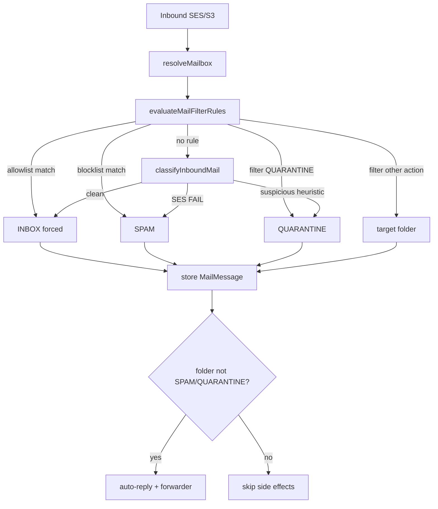
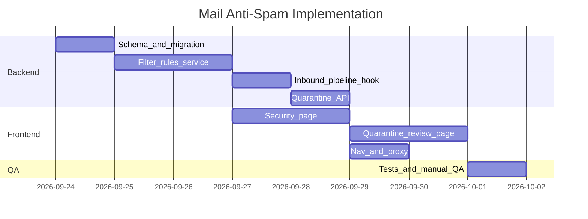

# خطة تنفيذ Anti-Spam: Blocklist, Allowlist, Filters, Quarantine

## القرارات المعتمدة

- **SES spam FAIL** → مجلد `SPAM` مباشرة (بدون مراجعة)
- **Quarantine** → للرسائل المشبوهة فقط: verdicts رمادية، فشل مصادقة جزئي، أو قواعد مخصصة بإجراء `QUARANTINE`
- **إدارة موحدة** → القواعد على مستوى `MailApp` (كل mailboxes)، مع خيار تقييد قاعدة لـ mailbox واحد
- **لا استخدام Jellyfish** — الاعتماد على SES + قواعد Rukny

---

## البنية العامة



**نقطة التمديد الرئيسية:** [`mail-inbound.service.ts`](apps/api/src/domain/mail/mail-inbound.service.ts) — بين `resolveMailbox()` (~459) و `classifyInboundMail()` (~487).

**ترتيب الأولوية:**
1. Allowlist (يتجاوز كل شيء، يفرض INBOX)
2. Blocklist
3. Filter rules (حسب `priority` تصاعدياً)
4. SES classifier
5. Suspicious → QUARANTINE heuristic

---

## المرحلة 1 — قاعدة البيانات والنماذج

### 1.1 إضافة مجلد QUARANTINE

في [`schema.prisma`](apps/api/prisma/schema.prisma):

```prisma
enum MailMessageFolder {
  // ...existing
  QUARANTINE
}
```

Migration جديدة + تحديث كل switch/map للمجلدات في API والواجهة.

### 1.2 نموذج القواعد الموحد `MailFilterRule`

```prisma
enum MailFilterRuleType {
  BLOCKLIST
  ALLOWLIST
  FILTER
}

enum MailFilterMatchField {
  SENDER      // full email
  DOMAIN      // sender domain
  SUBJECT     // contains (case-insensitive)
}

enum MailFilterAction {
  SPAM
  QUARANTINE
  INBOX
  PROMOTIONS
  SOCIAL
  DELETE      // blocklist only — لا تُخزَّن الرسالة
}

model MailFilterRule {
  id         String               @id @default(uuid())
  mailAppId  String
  mailboxId  String?              // null = كل mailboxes في workspace
  ruleType   MailFilterRuleType
  matchField MailFilterMatchField
  pattern    String               // normalized lowercase
  action     MailFilterAction
  priority   Int                  @default(100)
  enabled    Boolean              @default(true)
  createdAt  DateTime             @default(now())
  updatedAt  DateTime             @updatedAt

  mailApp  MailApp      @relation(...)
  mailbox  MailMailbox? @relation(...)

  @@index([mailAppId, enabled, priority])
  @@index([mailboxId])
  @@map("mail_filter_rules")
}
```

### 1.3 إعدادات workspace `MailAppSecuritySettings`

```prisma
model MailAppSecuritySettings {
  mailAppId              String  @id
  quarantineSuspicious   Boolean @default(true)  // GRAY/partial-auth → QUARANTINE
  notifyOnQuarantine     Boolean @default(false)
  mailApp MailApp @relation(...)
}
```

### 1.4 حقول تتبع على الرسالة (اختياري لكن مفيد للمراجعة)

على `MailMessage`:
- `matchedRuleId String?` — القاعدة التي طبّقت
- `quarantineReason String?` — مثل `ses_gray`, `partial_auth`, `rule:uuid`

### 1.5 حدود الباقات

في [`mail-plan-limits.config.ts`](apps/api/src/domain/mail/mail-plan-limits.config.ts):

| Plan | filterRules |
|------|-------------|
| Starter | 10 |
| Standard | 50 |
| Premium | unlimited |

---

## المرحلة 2 — Backend: Rule Engine + API

### 2.1 خدمة التقييم `mail-filter-rules.service.ts`

ملف جديد يتبع نمط [`mail-forwarder.service.ts`](apps/api/src/domain/mail/mail-forwarder.service.ts):

- `listRules(appId, userId)` — كل القواعد للـ workspace
- `createRule`, `updateRule`, `deleteRule`, `toggleRule`
- `evaluateRules(input)` — يُرجع `{ folder?, reject?: boolean, matchedRuleId?, reason? }`

**منطق المطابقة:**
- `SENDER`: تطابق كامل بعد normalize
- `DOMAIN`: `senderDomain === pattern` أو `endsWith(.pattern)`
- `SUBJECT`: `subject.toLowerCase().includes(pattern)`

**نطاق القواعد:** عند التقييم، اجمع قواعد `mailboxId = null` + قواعد `mailboxId = currentMailbox`.

### 2.2 توسيع المصنّف `mail-message-classifier.ts`

دالة جديدة `classifySuspiciousForQuarantine()`:

| الشرط | النتيجة |
|-------|---------|
| spamVerdict = GRAY أو virusVerdict = GRAY | QUARANTINE |
| SPF/DKIM/DMARC: واحد FAIL والباقي PASS/GRAY | QUARANTINE |
| DMARC = NONE + sender جديد | QUARANTINE (اختياري، قابل للتعطيل) |

يُطبَّق فقط إذا `quarantineSuspicious = true` في إعدادات workspace.

### 2.3 تعديل `mail-inbound.service.ts`

```typescript
const ruleResult = await this.filterRules.evaluate({
  mailAppId: mailbox.mailAppId,
  mailboxId: mailbox.id,
  fromAddress, senderDomain, subject,
});
if (ruleResult.reject) return null; // DELETE action
let folder = ruleResult.folder ?? classifyInboundMail({...});
if (!ruleResult.folder && settings.quarantineSuspicious) {
  folder = classifySuspiciousForQuarantine({...}) ?? folder;
}
```

تحديث guard السطر ~596:
```typescript
if (folder !== SPAM && folder !== QUARANTINE) { /* auto-reply + forward */ }
```

### 2.4 Controllers

| Endpoint | الغرض |
|----------|-------|
| `GET/POST/PATCH/DELETE /mail/apps/:appId/filter-rules` | CRUD القواعد |
| `GET/PATCH /mail/apps/:appId/security-settings` | إعدادات Quarantine |
| `GET /mail/apps/:appId/quarantine` | قائمة الرسائل المحتجزة (كل mailboxes) |
| `POST /mail/apps/:appId/quarantine/:messageId/release` | نقل إلى INBOX |
| `POST /mail/apps/:appId/quarantine/:messageId/spam` | نقل إلى SPAM |
| `POST /mail/apps/:appId/quarantine/bulk` | إجراءات جماعية |

**الوصول:** `requireOwnedApp` أو `ADMIN` role عبر [`mail-app-access.service.ts`](apps/api/src/domain/mail/mail-app-access.service.ts).

### 2.5 تحديث `mail-messages.service.ts`

- دعم `folder=QUARANTINE` في العدّ والقائمة
- `INBOX` API يستمر باستثناء SPAM و QUARANTINE

### 2.6 تسجيل في `mail.module.ts` + DTOs في `dto/mail-filter-rule.dto.ts`

---

## المرحلة 3 — واجهة الكونسول

### 3.1 صفحة Security موحدة `/security`

| Layer | Path |
|-------|------|
| Route | [`app/(mail-chrome)/security/page.tsx`](apps/mail/app/(mail-chrome)/security/page.tsx) |
| Component | [`components/app/mail-security-page.tsx`](apps/mail/components/app/mail-security-page.tsx) |
| Client | [`lib/mail-filter-rules-client.ts`](apps/mail/lib/mail-filter-rules-client.ts) |

**تبويبات داخل الصفحة:**
1. **Blocklist** — قائمة مرسلين/نطاقات محظورة، إجراء SPAM أو DELETE
2. **Allowlist** — مرسلين/نطاقات موثوقة (يتجاوزون فلترة SES)
3. **Filter rules** — قواعد متقدمة (مرسل/نطاق/موضوع + إجراء)
4. **Settings** — تفعيل Quarantine للمشبوه، إشعارات

**النمط المرجعي:** [`mail-forwarders-page.tsx`](apps/mail/components/app/mail-forwarders-page.tsx) — `Switch`, `MailboxDropdown` (مع خيار "All mailboxes"), `Chip` للحدود، `MailNotice`.

**Mailbox scope selector:**
```
[ All mailboxes ▼ ]  أو  [ team@domain.com ▼ ]
```

### 3.2 صفحة مراجعة Quarantine `/quarantine`

| Layer | Path |
|-------|------|
| Route | [`app/(mail-chrome)/quarantine/page.tsx`](apps/mail/app/(mail-chrome)/quarantine/page.tsx) |
| Component | [`components/app/mail-quarantine-page.tsx`](apps/mail/components/app/mail-quarantine-page.tsx) |

**النمط المرجعي:** [`mail-email-logs-page.tsx`](apps/mail/components/app/mail-email-logs-page.tsx) — قائمة + فلاتر + pagination.

**كل صف:**
- المرسل، الموضوع، Mailbox المستهدف، السبب (`quarantineReason`)
- أزرار: Release / Spam / Delete
- تحديد متعدد + Bulk actions

### 3.3 تحديث التنقل

في [`mail-nav.ts`](apps/mail/lib/mail-nav.ts):
- `MAIL_PRIMARY_NAV`: إضافة **Filters** أو **Security** (Shield icon)
- `MAIL_SECONDARY_NAV`: إضافة **Quarantine** مع badge للعدد

في [`proxy.ts`](apps/mail/proxy.ts): إضافة `/security` و `/quarantine` إلى `DOMAIN_GATED_PREFIXES` و `SLOTTED_PRODUCT_PREFIXES`.

### 3.4 Inbox (اختياري — مرحلة لاحقة)

لا يُعرض QUARANTINE في webmail للمستخدم العادي — فقط في كونسول المسؤول. هذا يحافظ على فصل "مراجعة المسؤول" عن "بريد المستخدم".

---

## المرحلة 4 — الاختبارات

| ملف | التغطية |
|-----|---------|
| `mail-filter-rules.service.spec.ts` | CRUD، حدود الباقة، مطابقة sender/domain/subject |
| `mail-filter-rules.evaluator.spec.ts` | ترتيب الأولوية: allowlist > blocklist > filter |
| `mail-message-classifier.spec.ts` | `classifySuspiciousForQuarantine` — GRAY، partial auth |
| `mail-inbound.service.spec.ts` | تكامل: قاعدة blocklist تمنع التخزين، quarantine يتخطى forward |

---

## ترتيب التنفيذ المقترح



**المدة التقديرية:** ~7–8 أيام عمل.

---

## ملاحظات تقنية

- **DELETE action:** لا يُنشئ `MailMessage` — يُسجَّل في Email Logs فقط (مثل الرسائل المرفوضة)
- **Allowlist bypass:** يتجاوز SES spam FAIL أيضاً — استخدم بحذر، ووثّق ذلك في UI
- **Realtime:** نشر SSE عند وصول رسالة QUARANTINE لتحديث badge في الشريط الجانبي
- **التسويق:** بعد الإطلاق، تحديث نص "Anti-Spam protection" في [`mail-plans.ts`](apps/mail/lib/mail-plans.ts) وصفحة التسعير لذكر blocklist/quarantine
