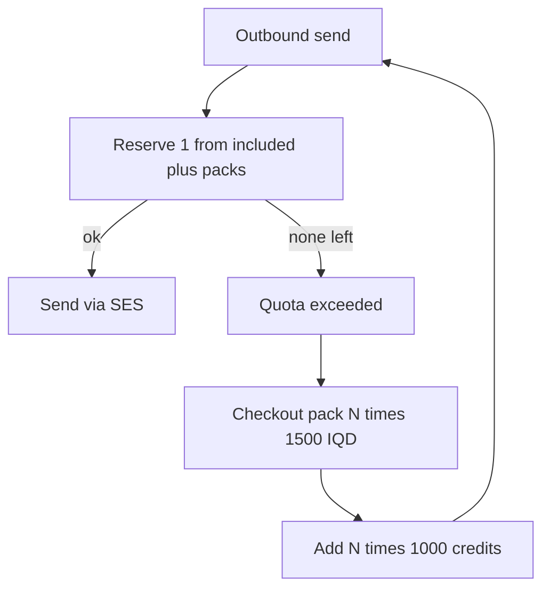

# Starter plan updates + Usage packs

## Decisions

| Item | Before | After |
|------|--------|-------|
| Extra mailbox price | 3,000 IQD/mo | **1,500 IQD/mo** |
| Base price (1 mailbox) | 3,000 IQD/mo | Unchanged |
| Team section | Nav + `/team` upgrade wall | **Not supported** — hide nav and block `/team` for Starter |
| Outbound quota | Marketing-only (5,000) — not enforced | **Enforced** + visible **Usage** |
| Extra emails (Starter) | Estimate catalog ~1,000 IQD/1K (not billed) | **1,500 IQD per 1,000 emails** — user picks quantity |

Keep `consoleMembersIncluded: 0`. API already rejects invites (*Team invites require Standard or Premium*) in [`mail-members.service.ts`](apps/api/src/domain/mail/mail-members.service.ts).

---

## Usage product rules (Starter)

**Included:** 5,000 outbound emails / billing month per MailApp (same ladder as [`MAIL_ESTIMATE_INCLUDED_OUTBOUND.starter`](apps/mail/lib/mail-estimate-catalog.ts)).

**Overage packs (Starter only in this phase):**

- Unit: **1,000 outbound emails = 1,500 IQD**
- User chooses quantity `N` (N ≥ 1 thousands) → charge `N × 1,500` IQD
- Credits add to remaining send allowance for the current subscription period
- Unused purchased credits **carry within the current period**; reset with period rollover together with the included counter (simple period model)

**Enforcement:** On outbound send, atomically reserve 1 from `included + purchased`. If none left → **402 / clear error** with CTA to buy packs (mirror [`EmailEntitlementService`](apps/api/src/domain/email-api/shared/email-entitlement.service.ts)).

**Scope of “email”:** Outbound SES sends only (per recipient / existing send path), not inbound.

**UI:** Usage meter (used / limit) + “Buy more emails” quantity picker on Billing (and soft warning near send when ≥80%). New nav item optional; default = Billing Usage section to avoid nav clutter.



---

## Margin notes (Starter)

**Seat (3,000 IQD):** ~2,545 IQD contribution after light SES use (~85%); ~1,544 IQD if 5K quota exhausted (~51%).

**Pack (1,500 IQD / 1,000 emails):** SES outbound ≈ $0.10 ≈ **130 IQD** → contribution ≈ **1,370 IQD (~91%)** before AI/payments/hosting. Strong protective pricing vs seat-only exhaustion.

Not company net: hosting, AI, Al-Qaseh fees, support still unallocated. [`RUKNY_PROFIT_MODEL.md`](Documents/workspace/RUKNY_PROFIT_MODEL.md) remains stale.

---

## Implementation

### 1) Extra mailbox = 1,500 IQD

Update `priceExtraMailbox` for STARTER in:

- [`apps/api/src/domain/mail/mail-plan-limits.config.ts`](apps/api/src/domain/mail/mail-plan-limits.config.ts)
- [`apps/mail/lib/mail-plans.ts`](apps/mail/lib/mail-plans.ts)
- Marketing compare in [`mail-pricing-marketing-page.tsx`](apps/mail/components/marketing/mail-pricing-marketing-page.tsx)

Align estimate overage for Starter to **1,500 IQD / 1K** in [`mail-estimate-catalog.ts`](apps/mail/lib/mail-estimate-catalog.ts) (today first bracket is 1,000).

### 2) Hide Team for Starter

- Hide Team nav when Starter / `consoleMembersIncluded === 0`
- Redirect `/team` → `/billing` (or `/app`)
- Hide settings/dock shortcuts to Team

### 3) Usage quota model + API

**Config** (Starter first; other plans keep included outbound constants, packs later):

```ts
includedOutboundPerMonth: 5_000
outboundPackEmails: 1_000
outboundPackPriceIqd: 1_500  // Starter
```

**Persistence** (on `MailSubscription` or sibling usage row keyed by `mailAppId` + period):

- `outboundUsed` — incremented on successful reserve
- `outboundPackCredits` — remaining purchased emails
- period bounds aligned with `currentPeriodStart` / `currentPeriodEnd`
- Optional `MailOutboundPackPayment` (or extend `MailSubscriptionPayment` with kind `outbound_pack`) for Al-Qaseh receipts

**Endpoints:**

- `GET .../usage` — used, included, packCredits, remaining, percent, pack unit price
- `POST .../usage/packs/checkout` — `{ thousands: N }` → checkout session (same Al-Qaseh / checkout app path as seats)
- Webhook/confirm: credit `N * 1000` to `outboundPackCredits`

**Send path:** call reserve before SES in [`mail-messages.service.ts`](apps/api/src/domain/mail/mail-messages.service.ts) (or send facade).

### 4) Mail UI — Usage

- Billing page section: meter + remaining + buy form (quantity in thousands, live total `N × 1,500`)
- When over quota: block compose/send with link to buy packs
- Marketing pricing: show Starter overage **1,500 IQD / 1,000 emails**

### 5) Checks

- `mailMonthlyTotal(STARTER, 2) === 4500`
- Pack: `thousands=3` → 4,500 IQD / +3,000 credits
- Starter: Team hidden; send blocked at 0 remaining; pack restores sends
- Standard/Premium: seat/team behavior unchanged; Usage packs Starter-only this phase (other plans show meter with included only, upgrade/message for packs later)

---

## Out of scope for now

- Changing base seat price 3,000 or storage limits
- Standard/Premium pack rates (define when those plans are reviewed)
- Auto top-up / metered postpay without prepaid packs
- Full rewrite of `RUKNY_PROFIT_MODEL.md`
