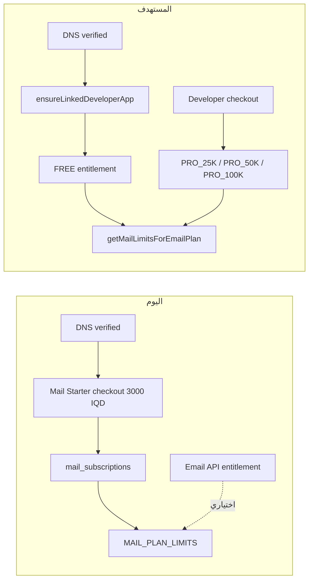
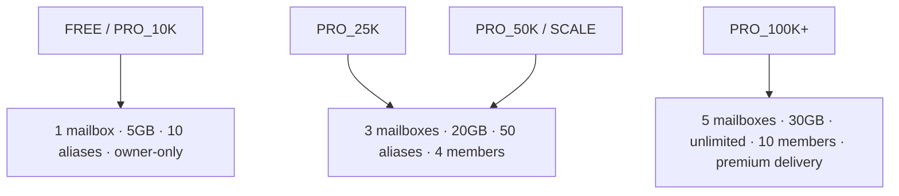
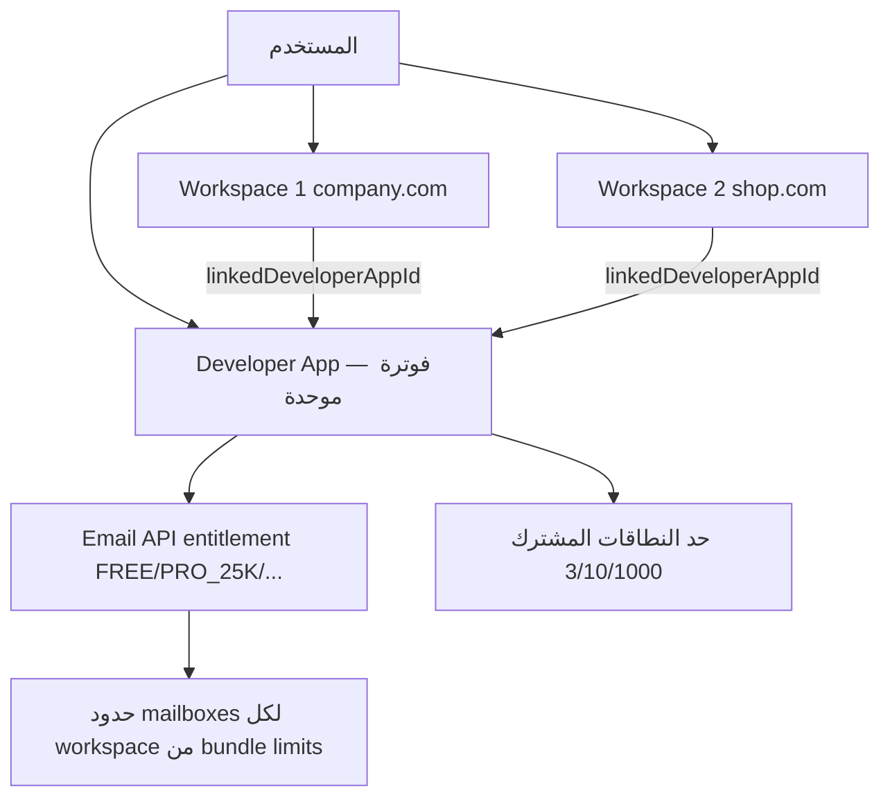

# خطة توحيد تسعير Mail تحت Email API

## الهدف

إلغاء الفوترة المنفصلة لباقات Mailboxes (3,000 / 6,000 / 10,000 د.ع) واستبدالها بباقات Email API الموحدة. بعد التحقق من DNS يُفعَّل workspace تلقائياً على **FREE** (0 د.ع). الترقية تتم عبر developer portal checkout فقط.

## القرارات المؤكدة

- **تفعيل FREE بعد DNS** — بدون checkout إلزامي لـ Starter
- **تعديل الأسعار الآن** — خفض PRO_100K + إضافة PRO_25K كبديل Standard
- **نطاق التنفيذ** — الخطة كاملة بالترتيب: المرحلة 0 → 1 → 2 → 3 → 4
- **Mail Workspace** — يبقى؛ تحديث UX فقط (لا إلغاء)

## البنية الحالية vs المستهدفة



**نقطة مهمة:** المسار الموحد موجود جزئياً في [`mail-unified-entitlement.service.ts`](apps/api/src/domain/mail/mail-unified-entitlement.service.ts) و[`mail-bundle-limits.ts`](packages/email-api-pricing/src/mail-bundle-limits.ts). `getActiveLimitsForApp()` يفضّل unified بالفعل، لكن onboarding ما زال يفرض Starter checkout عبر [`provisionStarterAfterDomainVerified()`](apps/api/src/domain/mail/mail-subscriptions.service.ts).

---

## المرحلة 0: تعديل كتالوج الأسعار (أسبوع 1)

### أسعار مقترحة

| الباقة | الحجم الشهري | السعر | حدود Mailboxes | **النطاقات** | الدور |
|--------|-------------|-------|--------------|-------------|-------|
| FREE | 3,000 | 0 د.ع | 1 صندوق (5 GB) | **3** | بديل Starter |
| **PRO_25K** (جديد) | 25,000 | **10,000 د.ع** | 3 صناديق (20 GB) | **10** | بديل Standard |
| PRO_50K | 50,000 | 16,000 د.ع | 3 صناديق | **10** | نمو / API |
| PRO_100K | 100,000 | **45,000 د.ع** (من 130,000) | 5 صناديق (30 GB) | **1,000** | بديل Premium |

### حدود النطاقات (Domains)

الحد يُحسب **لكل حساب Developer App** (مشترك بين كل Mail workspaces و Email API domains المرتبطة):

| الباقة | نطاقات مشمولة | إضافة |
|--------|--------------|-------|
| FREE | 3 | +100 نطاق = 20,000 د.ع/شهر |
| PRO_25K / PRO_50K | 10 | +100 نطاق = 20,000 د.ع/شهر |
| PRO_100K+ / SCALE / Enterprise | 1,000 | +100 نطاق = 20,000 د.ع/شهر |

**كيف يُحسب:**
- كل Mail workspace = **نطاق واحد** (`primaryDomain`)
- النطاقات تُجمع من كل workspaces + نطاقات Email API على نفس `developerAppId`
- المنطق في [`mail-unified-entitlement.service.ts`](apps/api/src/domain/mail/mail-unified-entitlement.service.ts) → `collectAccountDomains()` + `emailApiDomainLimit()`
- مثال FREE: يكدر يربط **3 نطاقات** = 3 workspaces منفصلة أو مزيج mail + API

**مقارنة Resend:** Free = 1 نطاق، Pro = 10، Scale = 1,000 — Rukny FREE أوسع (3 نطاقات).

**مرجع المنافسة:** Resend Pro 50K ≈ 26,400 د.ع — PRO_50K يبقى أرخص 39%. Resend Pro 100K ≈ 46,200 د.ع — PRO_100K بعد التخفيض منافس.

### ملفات التعديل

| الملف | التغيير |
|-------|---------|
| [`packages/email-api-pricing/src/catalog.ts`](packages/email-api-pricing/src/catalog.ts) | إضافة `PRO_25K` (domainsIncluded: 10)، تخفيض `PRO_100K` إلى 45,000 |
| [`packages/email-api-pricing/src/mail-bundle-limits.ts`](packages/email-api-pricing/src/mail-bundle-limits.ts) | `PRO_25K` → `GROWTH_MAIL_LIMITS` (3 صناديق) |
| [`packages/email-api-pricing/src/plan-labels.ts`](packages/email-api-pricing/src/plan-labels.ts) | tier mapping لـ PRO_25K |
| [`packages/email-api-pricing/src/plan-copy.ts`](packages/email-api-pricing/src/plan-copy.ts) | نصوص البطاقات التسويقية |
| [`apps/api/prisma/schema.prisma`](apps/api/prisma/schema.prisma) | إضافة `PRO_25K` إلى enum `DeveloperEmailPlan` |
| migration SQL جديد | `ALTER TYPE` لإضافة القيمة |
| [`packages/email-api-pricing/src/catalog.test.ts`](packages/email-api-pricing/src/catalog.test.ts) | تحديث الاختبارات |

---

## المرحلة 1: Backend — تفعيل المسار الموحد (أسبوع 2–4)

### 1.1 استبدال Starter checkout بـ FREE activation

في [`mail-apps.service.ts`](apps/api/src/domain/mail/mail-apps.service.ts) (سطر ~579): استبدال `provisionStarterAfterDomainVerified()` بـ:

```
provisionFreeAfterDomainVerified():
  1. ensureLinkedDeveloperApp(mailAppId, userId)  // موجود — يستدعي emailEntitlements.ensureEntitlement()
  2. syncMailDomainToEntitlement()                  // موجود
  3. إرجاع { activated: true, needsCheckout: false }
```

حذف أو deprecate [`provisionStarterAfterDomainVerified()`](apps/api/src/domain/mail/mail-subscriptions.service.ts) وكل استدعاءات checkout Starter.

### 1.2 جعل unified المصدر الوحيد للحدود

في [`mail-subscriptions.service.ts`](apps/api/src/domain/mail/mail-subscriptions.service.ts):

- `getActiveLimitsForApp()`: إزالة fallback إلى `mail_subscriptions` legacy (بعد migration)
- `getPlansOverview()`: إزالة `plans` و`legacyPlans` — إرجاع `unifiedPlans` فقط
- إيقاف: `createCheckoutSession()`, `requestPlan()`, `applyQasehPaymentResult()` لـ mail plans
- الإبقاء على outbound pack logic مؤقتاً أو توجيهه لـ Email API overage

### 1.3 إصلاح فجوة team limits

[`mail-members.service.ts`](apps/api/src/domain/mail/mail-members.service.ts) يقرأ `mail_subscriptions` مباشرة — يجب تحويله لاستخدام `getActiveLimitsForApp()` أو `unifiedEntitlement.getLimitsForMailApp()` لاحترام `consoleMembersIncluded` من bundle limits.

### 1.4 Feature flag للتدرج

```
MAIL_UNIFIED_BILLING_ONLY=true  // في env
```

عند `false`: السلوك القديم (للاختبار). عند `true`: المسار الجديد فقط.

### 1.5 إيقاف mail outbound packs المنفصلة

[`mail-outbound-usage.service.ts`](apps/api/src/domain/mail/mail-outbound-usage.service.ts): كل الإرسال يمر عبر `emailEntitlements.reserveLiveSend()`. إزالة `outboundUsed` / `outboundPackCredits` من `mail_subscriptions` (مرحلة لاحقة).

---

## المرحلة 2: Frontend — تحديث UI (أسبوع 3–5)

### Billing & Console

| الملف | التغيير |
|-------|---------|
| [`mail-billing-settings.tsx`](apps/mail/components/billing/mail-billing-settings.tsx) | إزالة اختيار Starter/Standard/Premium؛ عرض `unifiedPlan` + رابط upgrade لـ developer portal |
| [`mail-pricing-page.tsx`](apps/mail/components/billing/mail-pricing-page.tsx) | حذف أو redirect إلى `/pricing` |
| [`mail-usage-section.tsx`](apps/mail/components/billing/mail-usage-section.tsx) | عرض quota من Email API بدل outbound packs |
| [`mail-plans.ts`](apps/mail/lib/mail-plans.ts) | إزالة `priceMonthly` / `priceExtraMailbox`؛ الإبقاء على types للحدود فقط أو استيراد من `@rukny/email-api-pricing` |
| [`mail-estimate-catalog.ts`](apps/mail/lib/mail-estimate-catalog.ts) | حذف أو إعادة كتابة لاستخدام `email-api-pricing` estimate |
| [`mail-subscription-client.ts`](apps/mail/lib/mail-subscription-client.ts) | إزالة `requestMailPlan`, `payMailPlan` |
| [`mail-checkout.ts`](apps/mail/lib/mail-checkout.ts) | حذف mail checkout sessions |

### Onboarding (DNS → FREE)

| الملف | التغيير |
|-------|---------|
| [`mail-setup-wizard.tsx`](apps/mail/components/app/mail-setup-wizard.tsx) | بعد DNS: "تم التفعيل" بدل redirect checkout |
| [`mail-mailboxes-overview.tsx`](apps/mail/components/app/mail-mailboxes-overview.tsx) | إزالة Starter checkout CTA |
| [`mail-domain-dashboard.tsx`](apps/mail/components/app/mail-domain-dashboard.tsx) | نفس التعديل |

### Marketing

| الملف | التغيير |
|-------|---------|
| [`mail-home-pricing-hub.tsx`](apps/mail/components/marketing/mail-home-pricing-hub.tsx) | تبويب Mailboxes يعرض FREE/Growth/Enterprise من Email API |
| [`mail-resend-pricing-page.tsx`](apps/mail/components/marketing/mail-resend-pricing-page.tsx) | إضافة PRO_25K، تحديث PRO_100K |
| [`mail-pricing-estimate.tsx`](apps/mail/components/marketing/mail-pricing-estimate.tsx) | حذف أو توحيد مع `mail-email-api-pricing-estimate.tsx` |
| [`mail-faqs.ts`](apps/mail/lib/mail-faqs.ts) | تحديث الأسئلة |

### Feature gates (copy فقط — المنطق يأتي من bundle limits)

- [`mail-team-page.tsx`](apps/mail/components/app/mail-team-page.tsx): "يتطلب PRO_25K أو أعلى"
- [`mail-security-page.tsx`](apps/mail/components/app/mail-security-page.tsx): "يتطلب PRO_100K"
- [`mail-nav-scoped.ts`](apps/mail/lib/mail-nav-scoped.ts): إخفاء `/team` عند FREE limits

---

## المرحلة 3: Migration المشتركين الحاليين (أسبوع 5–6)

سكربت: `apps/api/scripts/migrate-mail-to-unified-billing.ts`

| الحالة الحالية | الإجراء |
|----------------|---------|
| Starter ACTIVE | → FREE entitlement (فوري) + إلغاء `mail_subscription` |
| Standard ACTIVE | → PRO_25K entitlement + **grace 3 أشهر** بنفس السعر (6,000 د.ع) |
| Premium ACTIVE | → PRO_50K entitlement + grace 3 أشهر (10,000 د.ع) |
| Pending checkout | → إلغاء + تفعيل FREE |

**آلية grace:** حقل `legacyPriceUntil` في `developerEmailEntitlement` metadata أو subscription note — الفوترة القادمة تستخدم السعر القديم حتى انتهاء الفترة.

**إشعار المستخدمين:** email + in-app banner في `/billing` قبل التحويل.

---

## المرحلة 4: إزالة Legacy (أسبوع 7–8)

### Backend

- إزالة endpoints: `POST /mail/checkout-sessions`, `POST /mail/plan-request`, `POST /mail/pay`
- إزالة [`mail-plan-limits.config.ts`](apps/api/src/domain/mail/mail-plan-limits.config.ts) pricing fields (الإبقاء على limits إن لزم للـ migration)
- إزالة `MailPlan` enum usage من billing flow (الإبقاء في schema للبيانات القديمة)
- تنظيف [`apps/checkout/`](apps/checkout/) من `product=mail` flow

### HQ Admin

- [`mail-app-subscription-panel.tsx`](apps/hq/components/mail/mail-app-subscription-panel.tsx): عرض Email API plan بدل Mail plan
- [`support-ticket-mail-plan-panel.tsx`](apps/hq/components/support-tickets/support-ticket-mail-plan-panel.tsx): deprecate أو redirect

### Schema (اختياري — مرحلة لاحقة)

- `mail_subscriptions` table: read-only archive، لا حذف فوري
- إزالة `outboundUsed`, `outboundPackCredits` columns في migration لاحق

---

## خريطة bundle limits النهائية



تحديث في [`mail-bundle-limits.ts`](packages/email-api-pricing/src/mail-bundle-limits.ts):

```typescript
if (id === FREE || id === PRO_10K) return FREE_MAIL_LIMITS;
if (id === PRO_25K || id === PRO_50K || id.startsWith('SCALE')) return GROWTH_MAIL_LIMITS;
return ENTERPRISE_MAIL_LIMITS; // PRO_100K+
```

---

## الاختبار

| النوع | التغطية |
|-------|---------|
| Unit | `catalog.test.ts`, `mail-bundle-limits`, `mail-unified-entitlement.service.spec.ts` |
| Integration | DNS verify → FREE activation → create mailbox |
| Integration | PRO_25K upgrade → 3 mailboxes + team members |
| Integration | Legacy migration script (dry-run) |
| E2E | Onboarding flow بدون checkout |
| Regression | `mail-members.service` team limits مع unified path |

---

## ترتيب النشر (Rollout)

1. **Deploy Phase 0** (أسعار جديدة) — بدون كسر legacy
2. **Deploy Phase 1** مع `MAIL_UNIFIED_BILLING_ONLY=false` — اختبار داخلي
3. **تشغيل migration script** على staging
4. **تفعيل flag** `MAIL_UNIFIED_BILLING_ONLY=true` في production
5. **Deploy Phase 2** (UI)
6. **إشعار المستخدمين** + grace period
7. **Deploy Phase 4** (cleanup) بعد 3 أشهر

---

## تقدير الجهد

| المرحلة | المدة | الملفات ~ |
|---------|-------|-----------|
| 0 — أسعار | 1 أسبوع | 8 |
| 1 — Backend | 2–3 أسابيع | 12 |
| 2 — Frontend | 2 أسابيع | 15 |
| 3 — Migration | 1 أسبوع | 3 |
| 4 — Cleanup | 1 أسبوع | 10 |
| **الإجمالي** | **7–8 أسابيع** | **~40 ملف** |

---

## المخاطر والتخفيف

| المخاطر | التخفيف |
|---------|---------|
| إساءة استخدام FREE tier | حد 100 رسالة/يوم + rate limiting موجود في entitlement |
| فقدان إيراد Starter (3,000 د.ع/مستخدم) | تعويض بتحويل 6% إلى PRO_25K؛ FREE كقناة اكتساب |
| صدمة سعرية للفرق على Standard | grace 3 أشهر + PRO_25K بـ 10,000 (قريب من 6,000+extras) |
| فجوة team limits | إصلاح `mail-members.service` في Phase 1.3 — blocker |
| فوترة مزدوجة | feature flag + migration script قبل إزالة legacy |

---

## معايير النجاح

- [ ] بعد DNS: mailbox يعمل بدون دفع (FREE)
- [ ] لا يوجد checkout لـ Starter/Standard/Premium في mail app
- [ ] كل الحدود تأتي من `getMailLimitsForEmailPlan()`
- [ ] PRO_25K و PRO_100K الجديدة معروضة في `/pricing`
- [ ] المشتركين الحاليين migrated مع grace period
- [ ] `mail-members` يحترم unified limits

---

## تأثير على Mail Workspace (تطبيق داخل Mail)

### ما هو Mail Workspace؟

**لا يُلغى.** `mailApp` = workspace (نطاق + صناديق + فريق). المسارات: `/apps`, `/apps/creation`, `/u{N}/app`. كل workspace = نطاق واحد (`primaryDomain`).



**قبل التوحيد:** كل workspace له `mail_subscription` منفصل (Starter/Standard/Premium).
**بعد التوحيد:** فوترة واحدة على `developerApp`؛ الحدود (mailboxes، إرسال، نطاقات) مشتركة حسب الباقة.

### ما يتأثر (يحتاج تحديث — لا حذف)

| المكون | التأثير | الإجراء |
|--------|---------|---------|
| [`mail-apps-list-page.tsx`](apps/mail/components/apps/mail-apps-list-page.tsx) | نص "its own plan" يصبح غير صحيح | تحديث copy: "باقة واحدة لكل الحساب" |
| [`mail-app-card.tsx`](apps/mail/components/apps/mail-app-card.tsx) | badge `subscription.plan` per workspace | إزالة badge الباقة من البطاقة؛ أو عرض حالة DNS فقط |
| [`apps/.../open/route.ts`](apps/mail/app/apps/[appId]/open/route.ts) | يفحص `mail_subscriptions.status === ACTIVE` | فحص unified entitlement (FREE = مفعّل) |
| [`mail-first-app-setup.tsx`](apps/mail/components/apps/mail-first-app-setup.tsx) | onboarding مع checkout | إزالة خطوة الدفع؛ DNS → FREE |
| [`mail-developers-page.tsx`](apps/mail/components/app/mail-developers-page.tsx) | يقول Mail و Email API منفصلان | تحديث: "باقة واحدة — mailboxes + API" |
| [`mail-domain-quota-banner.tsx`](apps/mail/components/app/mail-domain-quota-banner.tsx) | موجود ومتوافق | يبقى — يعرض quota مشترك بالفعل |
| [`mail-billing-settings.tsx`](apps/mail/components/billing/mail-billing-settings.tsx) | فوترة per workspace | فوترة على مستوى الحساب + رابط developer portal |
| [`mail-subscription-client.ts`](apps/mail/lib/mail-subscription-client.ts) | `requestMailPlan` per workspace | إزالة؛ upgrade عبر developer checkout |

### ما لا يُلغى

- صفحة `/apps` — قائمة workspaces (تصميم محدث فقط)
- `/apps/creation` — إنشاء workspace جديد (بدون checkout)
- `/u{N}/...` — التنقل بين workspaces
- `linkedDeveloperAppId` — الربط التلقائي بالفوترة الموحدة
- إمكانية workspaces متعددة — محدودة بـ **حد النطاقات** على الباقة (FREE = 3)

### توصية التصميم (إعادة تصميم جزئي — لا إلغاء)

**الخيار الموصى به: تحديث UX وليس إعادة بناء**

1. **صفحة `/apps`** — إضافة banner أعلى القائمة يعرض الباقة الحالية + النطاقات المستخدمة (`2/3 domains · FREE plan`)
2. **بطاقة workspace** — إزالة "Starter · 1 seat"؛ الإبقاء على: الاسم، النطاق، `/u0`، حالة DNS
3. **صفحة Billing** — مستوى حساب (مرة واحدة) وليس per workspace
4. **صفحة Developers** — توحيد الرسالة: "نفس الباقة تغطي mailboxes و API"
5. **لا دمج workspaces** — شركة بـ 3 نطاقات = 3 workspaces منفصلة (واضح للمستخدم)

### مهام إضافية للخطة

- [ ] تحديث `open/route.ts` — gate على unified entitlement بدل `mail_subscriptions`
- [ ] redesign `/apps` header + إزالة per-workspace plan badge من `mail-app-card`
- [ ] تحديث copy في `mail-developers-page` و `mail-apps-list-page`
- [ ] نقل billing UI من per-workspace إلى account-level في `/billing`
