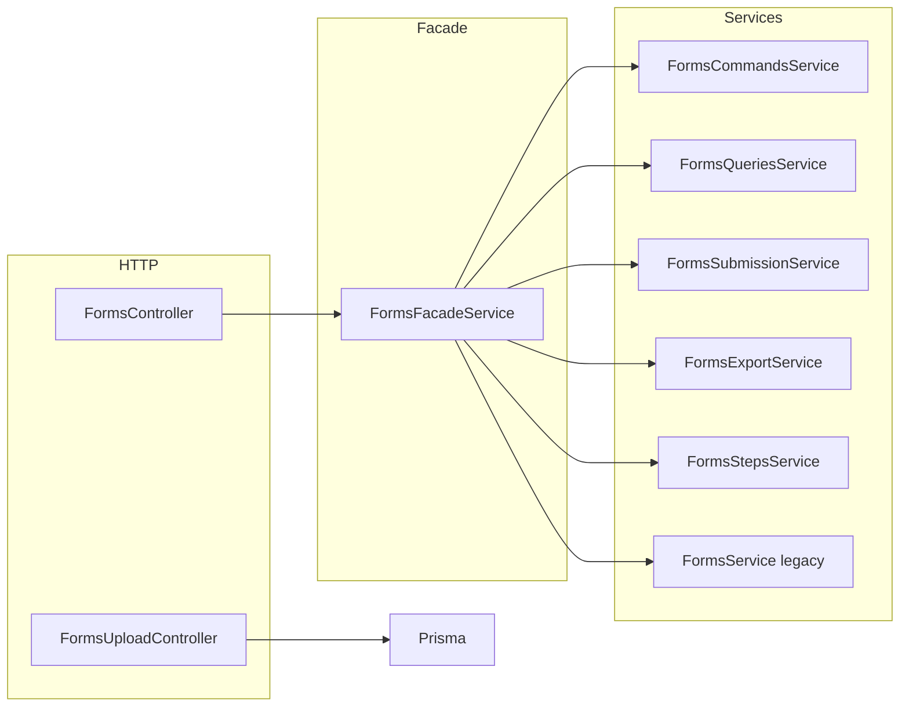

# تحسينات قسم النماذج (Forms) — Rukny.io

**التاريخ:** مايو 2026  
**النطاق:** Backend (NestJS API)، Admin، App، Docker، اختبارات  
**المسار الأساسي للـ API:** `/api/v1/forms`

---

## نظرة عامة

تم تنفيذ مجموعة تحسينات على منصة **Rukny Forms** تغطي الأمان، استقرار الإرسال، المعمارية (CQRS/Facade)، التحليلات، التكاملات، ولوحات الإدارة. الهدف هو جعل الـ backend جاهزاً لمنتج حقيقي مع تقليل الديون التقنية التي كانت موجودة (خدمة ضخمة واحدة، مسارات غير موصولة، جداول تحليلات غير مستخدمة).



---

## 1. تحسينات أولوية عالية (أمان واستقرار)

### 1.1 التحقق من ملكية النموذج عند الرفع

| البند | التفاصيل |
|--------|----------|
| **المشكلة السابقة** | `POST /forms/:id/upload` كان يتحقق فقط من وجود النموذج دون التأكد أن المستخدم الحالي هو المالك. |
| **الحل** | رفض الطلب بـ `403 Forbidden` إذا `form.userId !== req.user.id`. |
| **الملف** | `apps/api/src/domain/forms/forms-upload.controller.ts` |

### 1.2 تفعيل reCAPTCHA على مسار الإرسال الفعلي

| البند | التفاصيل |
|--------|----------|
| **المشكلة السابقة** | التحقق من reCAPTCHA موجود في `FormsSubmissionService` لكن المسار القديم في `FormsService.submitForm` لم يكن يتحقق من التوكن. |
| **الحل** | دالة مشتركة `verifySubmissionRecaptcha` في `utils/form-submission.validator.ts`: |
| | • إذا وُجد حقل من نوع `RECAPTCHA` في النموذج → التوكن **إلزامي**. |
| | • التحقق عبر `RecaptchaEnterpriseService` بإجراء `FORM_SUBMIT`. |
| | • إزالة `recaptchaToken` من بيانات الإرسال بعد النجاح. |
| **المسار** | كل الإرسالات تمر عبر `FormsSubmissionService.submitForm` (عبر Facade). |

### 1.3 حفظ كامل لبيانات الحقول عند الإنشاء/التحديث

| البند | التفاصيل |
|--------|----------|
| **المشكلة السابقة** | `buildFormFieldRow` لم يكن يحفظ `conditionalLogic`, `validationRules`, `defaultValue`, `minLabel`, `maxLabel`. |
| **الحل** | Mapper موحّد `mapFormFieldData` في `utils/form-field.mapper.ts` يُستخدم من Commands و Legacy service. |

**الحقول المحفوظة الآن:**

- `label`, `description`, `type`, `order`, `required`, `placeholder`
- `defaultValue`, `options`, `validationRules`, `conditionalLogic`
- `minValue`, `maxValue`, `minLabel`, `maxLabel`
- `allowedFileTypes`, `maxFileSize`, `maxFiles`

### 1.4 قيود الإرسال المكتملة

دالة مشتركة: `assertFormAcceptsSubmission` في `utils/form-submission.validator.ts`.

| القيد | السلوك |
|--------|--------|
| `status !== PUBLISHED` | رفض الإرسال |
| `opensAt` / `closesAt` | نافذة زمنية للفتح والإغلاق |
| `closeAfterDate` + `closesAt` | إغلاق إضافي بعد التاريخ |
| `maxSubmissions` | حد أقصى لعدد الإرسالات |
| `submissionLimit` | حد إضافي (كان في Schema دون تطبيق) |
| `requiresAuthentication` | يتطلب مستخدماً مسجّل الدخول |
| `allowMultipleSubmissions` | منع التكرار لنفس `userId` |
| `oneResponsePerUser` | رد واحد فقط لكل مستخدم |

---

## 2. تحسينات أولوية متوسطة (معمارية وجودة)

### 2.1 نمط Facade + خدمات CQRS

| المكوّن | المسؤولية |
|---------|-----------|
| `FormsFacadeService` | طبقة رفيعة توجّه الطلبات HTTP |
| `FormsCommandsService` | إنشاء، تحديث، حذف، تكرار |
| `FormsQueriesService` | قراءة، قوائم، نماذج عامة |
| `FormsSubmissionService` | إرسال، pagination، حذف إرسال |
| `FormsExportService` | تصدير CSV، تحليلات مبسطة |
| `FormsStepsService` | خطوات النماذج متعددة المراحل |
| `FormsService` | دوال legacy: `resolveFormId`, `getSubmissionsSummary`, إلخ |

**`FormsController`** يعتمد على `FormsFacadeService` بدلاً من استدعاء `FormsService` مباشرة لمعظم العمليات.

### 2.2 فرض حدود الخطة (Plans)

| Endpoint | Decorator |
|----------|-----------|
| `GET /forms/:id/steps` | `@CheckFeature('multiStepForms')` + `PlanGuard` |
| `PUT /forms/:id/steps` | `@CheckFeature('multiStepForms')` + `PlanGuard` |
| `POST /forms` | `@CheckLimit('forms')` (موجود سابقاً) |

> **ملاحظة:** فرض `conditionalLogic` و`googleSheets` ديناميكياً على مستوى الحقول عند الحفظ لم يُفعّل بعد لتجنب كسر العملاء الحاليين — يمكن إضافته لاحقاً.

### 2.3 تكرار النموذج مع الخطوات

| البند | التفاصيل |
|--------|----------|
| **المشكلة السابقة** | `duplicateForm` كان ينسخ الحقول فقط دون `form_steps`. |
| **الحل** | `duplicateFormStructure` في `utils/duplicate-form.helper.ts`: نسخ الخطوات، ربط حقول كل خطوة بـ `stepId` جديد، ونسخ الحقول الجذرية (`stepId = null`). |

### 2.4 تنظيف ملفات الرفع العامة

| المكوّن | الوظيفة |
|---------|---------|
| `FormsUploadCleanupService` | Cron يومي (3 صباحاً) لحذف ملفات `uploads/forms/temp/*` الأقدم من 48 ساعة |
| `trackPublicUpload` | تتبع في Redis لكل ملف مرفوع عبر `POST public/:slug/upload` |

---

## 3. تحسينات استراتيجية (منتج وتحليلات)

### 3.1 كتابة جداول التحليلات (Prisma)

**الخدمة:** `FormAnalyticsTrackerService`

| الحدث | الجداول |
|--------|---------|
| مشاهدة نموذج عام | `form_analytics` (views++)، `form_device_analytics` |
| إرسال نموذج | `form_analytics` (submissions++, completionRate)، `form_device_analytics`، `form_field_analytics` (responses/skipped لكل حقل) |

يُستدعى من:

- `FormsQueriesService.incrementViewCount`
- `FormsSubmissionService` بعد إنشاء الإرسال

### 3.2 التحقق من البريد داخل النموذج

**الخدمة:** `FormsEmailVerificationService`

| Endpoint | الوصف | Rate limit |
|----------|--------|------------|
| `POST /forms/public/:slug/verify-email/send` | إرسال رمز 6 أرقام للبريد | 5/دقيقة |
| `POST /forms/public/:slug/verify-email/confirm` | تأكيد الرمز | 10/دقيقة |

- التخزين المؤقت في Redis (TTL 10 دقائق للرمز، 60 دقيقة لحالة «تم التحقق»).
- يتطلب حقل `EMAIL` موجوداً في النموذج المنشور.

**DTOs:** `SendVerificationCodeDto`, `VerifyEmailCodeDto` — مُصدَّرة من `dto/index.ts`.

### 3.3 Google Sheets تلقائي عند الإنشاء

عند إنشاء نموذج مع `enableGoogleSheets: true` في الـ body:

- استدعاء غير متزامن لـ `GoogleSheetsService.createSpreadsheet(formId, userId)`.
- يعمل في `FormsCommandsService` و`FormsService` (legacy create).

### 3.4 Webhooks مع إعادة المحاولة (Bull Queue)

| البند | التفاصيل |
|--------|----------|
| **الطابور** | `form-webhook` |
| **المعالج** | `FormWebhookProcessor` |
| **الخدمة** | `FormWebhookQueueService` |
| **المحاولات** | 5 مع backoff أسي (يبدأ 3 ثوانٍ) |
| **الأمان** | فحص SSRF وHMAC عبر `WebhookService` (كما كان) |

يُستخدم عند الإرسال بدلاً من استدعاء webhook متزامن فقط.

### 3.5 تحسين مسار الإرسال (`FormsSubmissionService`)

بالإضافة إلى التحقق وreCAPTCHA، يشمل الآن بشكل موحّد:

- إشعار WebSocket للمالك (`FORM_SUBMISSION`)
- بريد إشعار للمالك (`notifyOnSubmission`)
- رد تلقائي (`autoResponseEnabled`)
- مزامنة Google Sheets
- إبطال cache لوحة التحكم
- تسجيل التحليلات اليومية

---

## 4. واجهات API جديدة أو مُحدَّثة

### 4.1 نماذج — عامة

| Method | Path | ملاحظات |
|--------|------|---------|
| `POST` | `/forms/public/:slug/verify-email/send` | **جديد** |
| `POST` | `/forms/public/:slug/verify-email/confirm` | **جديد** |
| `GET` | `/forms/:id/submissions` | دعم `cursor` و`search` (pagination بالمؤشر) |

**Query parameters لـ submissions:**

```
?page=1&limit=50          ← ترقيم تقليدي (عبر legacy)
?cursor=sub_xxx&limit=50  ← pagination بالمؤشر
?search=keyword           ← مع cursor
```

### 4.2 إدارة المنصة (Admin)

| Method | Path | الصلاحية |
|--------|------|----------|
| `GET` | `/admin/forms/stats` | `Role.ADMIN` |
| `GET` | `/admin/forms` | `Role.ADMIN` — قائمة مع `page`, `limit`, `search`, `status` |

**الملفات:**

- `apps/api/src/domain/admin/forms/forms.controller.ts`
- `apps/api/src/domain/admin/forms/forms.service.ts`

---

## 5. الواجهات الأمامية والنشر

### 5.1 لوحة Admin

| المسار | الوصف |
|--------|--------|
| `/dashboard/forms` | صفحة إحصائيات وقائمة النماذج على مستوى المنصة |

**الملف:** `apps/admin/src/app/(dashboard)/dashboard/forms/page.tsx`

### 5.2 تطبيق App (نقطة دخول Builder)

| المسار | الوصف |
|--------|--------|
| `/forms` | صفحة تعريف + رابط إلى `NEXT_PUBLIC_FORMS_URL` |
| `/forms/[id]` | صفحة تفاصيل + رابط تحرير في تطبيق Forms |

**الملفات:**

- `apps/app/app/forms/page.tsx`
- `apps/app/app/forms/[id]/page.tsx`

> **تنبيه:** محرر النماذج الكامل ما زال في `apps/forms` (مكتبة مكونات + Storybook). هذه الصفحات scaffold وليست builder كاملاً.

### 5.3 Docker — خدمة Forms

| الملف | التغيير |
|--------|---------|
| `apps/forms/Dockerfile` | بناء Next.js production (standalone) |
| `apps/forms/next.config.ts` | `output: "standalone"` |
| `docker-compose.yml` | خدمة `forms` على المنفذ `3007` |

```yaml
# مثال من docker-compose.yml
forms:
  build:
    context: ./apps/forms
  ports:
    - "127.0.0.1:3007:3007"
  depends_on:
    - api
```

---

## 6. ملفات جديدة في المشروع

```
apps/api/src/domain/forms/
├── utils/
│   ├── form-field.mapper.ts
│   ├── form-submission.validator.ts
│   └── duplicate-form.helper.ts
├── services/
│   ├── form-analytics-tracker.service.ts
│   ├── forms-email-verification.service.ts
│   ├── form-webhook-queue.service.ts
│   └── forms-upload-cleanup.service.ts
├── processors/
│   └── form-webhook.processor.ts
└── forms-facade.service.ts          (مُحدَّث)

apps/api/src/domain/admin/forms/
├── forms.controller.ts
└── forms.service.ts

apps/api/test/
└── forms.e2e-spec.ts

apps/admin/src/app/(dashboard)/dashboard/forms/
└── page.tsx

apps/app/app/forms/
├── page.tsx
└── [id]/page.tsx

apps/forms/
├── Dockerfile
└── next.config.ts                 (standalone)
```

---

## 7. تسجيل الوحدات (FormsModule)

**مقدّمو الخدمات الجدد:**

- `FormAnalyticsTrackerService`
- `FormsEmailVerificationService`
- `FormWebhookQueueService`
- `FormWebhookProcessor`
- `FormsUploadCleanupService`
- `AnalyticsService` (كـ `FormInsightsService` — مسجّل في الـ module)

**طابور Bull:**

```typescript
BullModule.registerQueueAsync({ name: 'form-webhook', ... })
```

---

## 8. الاختبارات

| الملف | الغرض |
|--------|--------|
| `apps/api/test/forms.e2e-spec.ts` | اختبار E2E أساسي: `GET /forms/public/{slug}` يعيد 404 لـ slug غير موجود |

**تشغيل (بعد `prisma generate` وإعداد DB):**

```bash
cd apps/api
npm run test:e2e -- forms.e2e-spec
```

---

## 9. متطلبات التشغيل بعد التحديث

1. **Redis** — مطلوب لـ:
   - طابور `form-webhook`
   - رموز التحقق بالبريد
   - تتبع الرفع المؤقت

2. **Prisma**

   ```bash
   cd apps/api
   npm install
   npx prisma generate
   ```

3. **متغيرات بيئة** (إن وُجدت سابقاً لـ reCAPTCHA / Resend / Google):

   - `RECAPTCHA_*` — للتحقق عند الإرسال
   - `RESEND_API_KEY` — لرسائل التحقق بالبريد
   - OAuth Google — لـ Sheets

4. **إعادة تشغيل API** بعد النشر.

5. **Forms app في Docker** (اختياري):

   ```bash
   docker compose build forms
   docker compose up -d forms
   ```

---

## 10. ما لم يُنفَّذ أو يبقى للمرحلة التالية

| البند | السبب / الحالة |
|--------|----------------|
| فرض `conditionalLogic` حسب الخطة عند `POST/PUT` forms | يحتاج فحص ديناميكياً للحقول — مؤجّل |
| Builder UI كامل في `apps/app` | ما زال في `apps/forms` كمكتبة مكونات |
| كتابة `form_geographic_analytics` | يحتاج GeoIP من IP الإرسال |
| إزالة `FormsService` الضخم بالكامل | ما زال مستخدماً لعمليات legacy محددة |
| `@CheckFeature('conditionalLogic')` على endpoints | غير مُضاف بعد |

---

## 11. ملخص سريع للمطور

| الفئة | العدد التقريبي |
|--------|----------------|
| Endpoints جديدة (عام + admin) | 4 |
| خدمات جديدة | 5+ |
| Utils مشتركة | 3 |
| صفحات frontend جديدة | 3 |
| إصلاحات أمان حرجة | 2 (رفع + reCAPTCHA) |
| قيود إرسال مُفعَّلة | 2 (`submissionLimit`, `closeAfterDate`) |

**الخلاصة:** مسار الإرسال والتحليلات والـ webhooks أصبحوا أكثر اكتمالاً وأماناً؛ الـ HTTP layer موحّد عبر Facade؛ الإدارة والنشر أصبحا يدعمان `forms.rukny.io` في Docker.

---

## مراجع ذات صلة

- [api_documentation.md](./api_documentation.md) — توثيق API عام
- [SUBSCRIPTION_PLANS.md](./SUBSCRIPTION_PLANS.md) — حدود الخطط (`multiStepForms`, `conditionalLogic`, `googleSheets`)
- [home_server_deploy.md](./home_server_deploy.md) — نشر Docker محلي

---

*آخر تحديث للمستند: مايو 2026*
