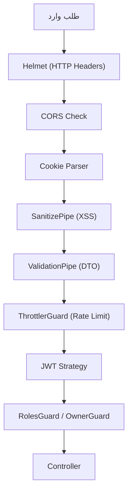

# 📘 توثيق شامل لـ `apps/api` — Rukny.io Backend

> [!NOTE]
> هذا المستند يشرح بنية الـ API Backend لمنصة Rukny.io المبني بإطار **NestJS v11** مع **TypeScript** و **Prisma ORM** و **PostgreSQL**.

---

## 📋 نظرة عامة

| العنصر | القيمة |
|--------|--------|
| **الإطار** | NestJS 11 (Express) |
| **اللغة** | TypeScript 5.7 |
| **قاعدة البيانات** | PostgreSQL (Neon) عبر Prisma 7.4 |
| **التخزين المؤقت** | Redis (ioredis) |
| **المنفذ** | 3001 |
| **API Prefix** | `/api/v1/` |
| **التوثيق** | Swagger على `/api/docs` |
| **Docker** | Node 20 Alpine (multi-stage) |
| **النشر** | Railway + Docker |

---

## 🗂️ هيكل المجلدات الرئيسي

```
apps/api/
├── prisma/              # مخطط قاعدة البيانات والترحيلات
├── src/
│   ├── core/            # البنية الأساسية (DB, Cache, Health, Guards, Pipes)
│   ├── domain/          # وحدات الأعمال (Auth, Users, Events, Stores...)
│   ├── infrastructure/  # طبقة البنية التحتية (Security, Upload, Queue...)
│   ├── integrations/    # تكاملات خارجية (Google, Telegram, WhatsApp...)
│   ├── modules/         # وحدات إضافية (Upload presign)
│   ├── shared/          # أدوات وثوابت مشتركة
│   ├── services/        # خدمات عامة (S3)
│   ├── dev/             # أدوات التطوير
│   ├── main.ts          # نقطة الدخول
│   └── app.module.ts    # الوحدة الجذرية
├── scripts/             # سكربتات مساعدة
├── test/                # اختبارات E2E
├── docs/                # وثائق الأداء
├── Dockerfile           # بناء Docker
└── package.json         # التبعيات والأوامر
```

---

## 🚀 نقطة الدخول — `main.ts`

ملف [main.ts](file:///c:/Users/lenovo/Documents/RuknyGroup/Rukny.io/apps/api/src/main.ts) يقوم بـ:

1. **Request ID** — إضافة معرف فريد `X-Request-ID` لكل طلب
2. **Compression** — ضغط الاستجابات أكبر من 1KB (توفير 60-80%)
3. **Body Parser** — حد أقصى 25MB للرفع
4. **Cookie Parser** — تحليل الكوكيز
5. **JWT Validation** — التحقق من أن `JWT_SECRET` آمن (32+ حرف)
6. **Helmet** — رؤوس HTTP الأمنية (HSTS, CSP, Referrer Policy)
7. **Static Assets** — تقديم `/uploads/` مع تخزين مؤقت سنة
8. **API Versioning** — `/api/v1/` (URI versioning)
9. **CORS** — السماح لنطاقات Rukny + بيئة التطوير
10. **Validation Pipes** — `SanitizePipe` (XSS) + `ValidationPipe` (DTO)
11. **Swagger** — توثيق تفاعلي (معطل في الإنتاج افتراضياً)

---

## 🏛️ الوحدة الجذرية — `app.module.ts`

ملف [app.module.ts](file:///c:/Users/lenovo/Documents/RuknyGroup/Rukny.io/apps/api/src/app.module.ts) يسجل:

- **ThrottlerModule** — 100 طلب/دقيقة (إنتاج) أو 200 (تطوير)
- **ScheduleModule** — مهام مجدولة (Cron)
- **APP_GUARD** — `ThrottlerUserGuard` للإنتاج (rate limit حسب user ID)
- **APP_FILTER** — `HttpExceptionFilter` معالجة أخطاء موحدة
- **APP_INTERCEPTOR** — `PerformanceInterceptor` لمراقبة الأداء

---

## 🧱 طبقة Core — البنية الأساسية

### 1. Database (`core/database/`)
- **PrismaModule/Service** — اتصال PostgreSQL عبر Prisma
- `cleanup.service.ts` — تنظيف الجلسات المنتهية
- `database.constants.ts` — ثوابت قاعدة البيانات
- `query.helpers.ts` — مساعدات الاستعلام (Pagination, Filtering)

### 2. Cache (`core/cache/`)
- **RedisModule/Service** — اتصال Redis
- `cache.manager.ts` — إدارة التخزين المؤقت
- `cache.decorator.ts` — Decorator للتخزين المؤقت التلقائي
- `cache.constants.ts` — مفاتيح وأوقات التخزين المؤقت

### 3. Health (`core/health/`)
- فحص صحة API + DB + Redis على `/api/v1/health`

### 4. Config (`core/config/`)
- `env.validation.ts` — التحقق من متغيرات البيئة

### 5. Common (`core/common/`)

| النوع | الملفات | الوصف |
|-------|---------|-------|
| **Guards** | `roles.guard`, `owner.guard`, `plan.guard`, `csrf.guard`, `throttler-user.guard` | حماية الصلاحيات والملكية والخطط |
| **Pipes** | `sanitize.pipe`, `file-validation.pipe`, `input-length.pipe` | تنظيف XSS + تحقق الملفات + طول المدخلات |
| **Interceptors** | `performance`, `bigint`, `csrf`, `request-id`, `request-timeout` | مراقبة الأداء + تحويل BigInt + CSRF + timeout |
| **Filters** | `http-exception.filter` | معالجة أخطاء HTTP موحدة |
| **Decorators** | `auth/` decorators | decorators للمصادقة |

---

## 🏢 طبقة Domain — وحدات الأعمال

### 1. Auth (`domain/auth/`) — المصادقة 🔐
أكبر وحدة وأكثرها تعقيداً:

| الملف | الوصف |
|-------|-------|
| `auth.controller.ts` (26KB) | تسجيل دخول/خروج، نسيت كلمة المرور، OAuth |
| `auth.service.ts` | منطق المصادقة الأساسي |
| `quicksign.controller.ts` (39KB) | تسجيل سريع (QuickSign SSO) |
| `quicksign.service.ts` | منطق QuickSign |
| `token.service.ts` (25KB) | إنشاء/تحقق JWT + إدارة الجلسات |
| `two-factor.controller.ts` (24KB) | المصادقة الثنائية (2FA) |
| `two-factor.service.ts` | منطق TOTP + رموز احتياطية |
| `cookie.config.ts` | إعدادات الكوكيز (SameSite, Secure) |
| `account-linking` | ربط حسابات OAuth |
| `account-lockout` | قفل الحساب بعد محاولات فاشلة |
| `identity-verification` | توثيق الهوية |
| `ip-verification.service.ts` | التحقق من IP |
| `oauth-code.service.ts` | أكواد OAuth |
| `redis-oauth-code.service.ts` | تخزين أكواد OAuth في Redis |
| `websocket-token.service.ts` | توكنات WebSocket |

**الاستراتيجيات** (`strategies/`): `jwt.strategy`, `google.strategy`, `linkedin.strategy`

### 2. Users (`domain/users/`) — المستخدمين 👤
- `user.controller.ts` (18KB) — CRUD + إعدادات المستخدم
- `user.service.ts` (27KB) — منطق إدارة المستخدمين
- `dashboard.controller/service` — لوحة تحكم المستخدم

### 3. Profiles (`domain/profiles/`) — الملفات الشخصية 📋
- إنشاء وتعديل الملفات الشخصية العامة
- إدارة الخصوصية والثيمات

### 4. Events (`domain/events/`) — الفعاليات 📅
- `events.service.ts` (30KB) — إنشاء وإدارة الفعاليات
- `events.gateway.ts` — WebSocket للتحديثات الحية
- `registrations` — التسجيل في الفعاليات
- `categories` — تصنيفات الفعاليات
- `event-organizers` — إدارة المنظمين
- `event-reviews` — تقييمات الفعاليات

### 5. Forms (`domain/forms/`) — النماذج 📝
- `forms.service.ts` (**75KB** — أكبر ملف!) — بناء نماذج ديناميكية
- `forms-upload.controller.ts` — رفع ملفات النماذج
- `forms-facade.service.ts` — واجهة مبسطة
- دعم نماذج متعددة الخطوات والتحقق الشرطي

### 6. Stores (`domain/stores/`) — المتاجر 🏪
أكثر وحدة غنى بالملفات (36 ملف + 8 مجلدات):

| القسم | الوصف |
|-------|-------|
| `stores` | إنشاء وإدارة المتاجر |
| `products` | إدارة المنتجات + رفع صور |
| `product-variants` | متغيرات المنتجات (ألوان، أحجام) |
| `product-attributes` | سمات المنتجات |
| `product-categories` | تصنيفات المنتجات |
| `orders` (38KB) | إدارة الطلبات |
| `order-tracking` | تتبع الطلبات |
| `cart` | سلة التسوق |
| `coupons` | كوبونات الخصم |
| `reviews` | تقييمات المنتجات |
| `wishlists` | قوائم الأمنيات |
| `addresses` | عناوين التوصيل |
| `digital-assets` | أصول رقمية |
| `checkout-auth` | مصادقة الدفع |
| `account-upgrade` | ترقية الحساب التجاري |

### 7. Social (`domain/social/`) — التواصل الاجتماعي 💬
- **Follow** — متابعة/إلغاء المتابعة
- **Posts** — إنشاء ومشاركة المنشورات
- **Share** — مشاركة المحتوى

### 8. Links (`domain/links/`) — الروابط 🔗
- **Social Links** — روابط التواصل الاجتماعي في الملف الشخصي
- **URL Shortener** — اختصار الروابط
- **Link Groups** — تجميع الروابط

### 9. Analytics (`domain/analytics/`) — التحليلات 📊
- إحصائيات الزيارات والنقرات والتفاعلات

### 10. Notifications (`domain/notifications/`) — الإشعارات 🔔
- `notifications.gateway.ts` — WebSocket للإشعارات الحية
- إشعارات داخلية + بريد إلكتروني

### 11. Subscriptions (`domain/subscriptions/`) — الاشتراكات 💎
- `plan-limits.config.ts` — حدود كل خطة (Basic, Premium, Pro)
- إدارة اشتراكات المستخدمين

### 12. Admin (`domain/admin/`) — لوحة الإدارة 🛡️
- **Dashboard** — إحصائيات عامة
- **Users** — إدارة المستخدمين
- **Stores** — إدارة المتاجر
- **Products** — إدارة المنتجات
- **Orders** — إدارة الطلبات
- **Verification** — توثيق الهويات
- **Wallpapers** — إدارة الخلفيات

### 13. Storage (`domain/storage/`) — التخزين ☁️
- `storage.service.ts` (43KB) — رفع وإدارة الملفات على S3
- `files.controller.ts` — إدارة ملفات المستخدم
- `storage-cleanup.service.ts` — تنظيف الملفات غير المستخدمة

### 14. Developer (`domain/developer/`) — بوابة المطورين 🧑‍💻
- **API Keys** — إنشاء وإدارة مفاتيح API
- **Apps** — تطبيقات المطورين
- **Contacts** — جهات الاتصال
- **Subscriptions** — اشتراكات المطورين
- **Usage** — تتبع الاستخدام
- **Wallet** — محفظة المطور (IQD)
- **Webhooks** — إشعارات Webhook

### 15. WhatsApp Provider (`domain/whatsapp-provider/`) — مزود واتساب 📱
- **Accounts** — حسابات واتساب للأعمال
- **Messaging** — إرسال الرسائل
- **Phone Numbers** — إدارة الأرقام
- **Templates** — قوالب الرسائل
- **Webhooks** — استقبال الأحداث

### 16. Utils (`domain/utils/`) — أدوات مساعدة 🔧
- `url-metadata` — استخراج بيانات الروابط (عنوان، صورة، وصف)

---

## 🏗️ طبقة Infrastructure — البنية التحتية

### 1. Security (`infrastructure/security/`)
| الملف | الوصف |
|-------|-------|
| `anomaly-detection.service.ts` | كشف السلوك غير الطبيعي |
| `brute-force.service.ts` | حماية من هجمات القوة الغاشمة |
| `detector.service.ts` | كشف التهديدات الأمنية |
| `threat-alert.service.ts` | تنبيهات التهديدات |
| `session-fingerprint.service.ts` | بصمة الجلسة |
| `log.service.ts` | سجل الأمان |
| `audit-export.service.ts` | تصدير سجلات التدقيق |
| `cleanup.service.ts` | تنظيف السجلات القديمة |
| `recaptcha-enterprise.service.ts` | Google reCAPTCHA Enterprise |
| `security.gateway.ts` | WebSocket للأمان |

### 2. Upload (`infrastructure/upload/`)
- `upload.service.ts` (18KB) — رفع الملفات
- `image-optimization.service.ts` — تحسين الصور (Sharp)
- `chunked-upload.service.ts` — رفع مجزأ للملفات الكبيرة
- `cdn.service.ts` — خدمة CDN
- `watermark.service.ts` — علامات مائية

### 3. Persistence (`infrastructure/persistence/`)
- `backup.service.ts` — نسخ احتياطي
- `database-health.service.ts` — صحة قاعدة البيانات
- `query-cache.service.ts` — تخزين الاستعلامات مؤقتاً
- `soft-delete.service.ts` — حذف ناعم
- `repositories/` — Repository pattern

### 4. Queue (`infrastructure/queue/`)
- `queue.service.ts` — إدارة الطوابير (Bull + Redis)
- `processors/` — معالجات المهام الخلفية

### 5. Notifications (`infrastructure/notifications/`)
- `notifications.gateway.ts` — WebSocket
- `notifications.service.ts` — إرسال إشعارات متعددة القنوات

### 6. Rate Limiting (`infrastructure/rate-limiting/`)
- `rate-limiting.service.ts` — تحديد معدل الطلبات
- `rate-limit.guard.ts` — Guard مخصص

### 7. Monitoring (`infrastructure/monitoring/`)
- `metrics.service.ts` — مقاييس الأداء
- `monitoring.service.ts` — مراقبة النظام
- `health.controller.ts` — فحوصات الصحة

---

## 🔌 طبقة Integrations — التكاملات الخارجية

| التكامل | الوصف |
|---------|-------|
| **Google Calendar** | مزامنة الفعاليات مع تقويم Google |
| **Google Sheets** | تصدير بيانات النماذج إلى Sheets |
| **Google Drive** | تخزين الملفات |
| **Telegram** | إشعارات عبر بوت تيليجرام |
| **WhatsApp** | إشعارات الطلبات عبر واتساب |
| **WhatsApp Business** | OTP عبر Meta Cloud API |
| **Instagram** | ربط حساب انستجرام + عرض Grid/Feed |
| **YouTube** | ربط قناة يوتيوب + عرض فيديوهات |
| **LinkedIn** | ربط حساب + بطاقة الملف الشخصي |
| **Qaseh Payment** | بوابة دفع القاصح (عراقية) |
| **Email (Resend)** | إرسال بريد عبر Resend API |
| **Push Notifications** | إشعارات متصفح (معطّل حالياً) |

---

## 🗄️ قاعدة البيانات — Prisma Schema

ملف [schema.prisma](file:///c:/Users/lenovo/Documents/RuknyGroup/Rukny.io/apps/api/prisma/schema.prisma) يحتوي **2,724 سطر** و **21 ترحيل (migration)**.

### الجداول الرئيسية:

| النموذج | الوصف |
|---------|-------|
| `User` | المستخدم الأساسي (100 سطر من العلاقات!) |
| `Profile` | الملف الشخصي العام |
| `Session` | جلسات المصادقة (refresh tokens) |
| `SecurityLog` | سجل الأمان |
| `Store` | المتاجر |
| `products` | المنتجات |
| `orders` | الطلبات |
| `Event` | الفعاليات |
| `EventRegistration` | تسجيلات الفعاليات |
| `EventTicket` | تذاكر (QR Code) |
| `Form` | النماذج الديناميكية |
| `FormField` | حقول النماذج |
| `SocialLink` | روابط التواصل |
| `LinkGroup` | مجموعات الروابط |
| `Subscription` | اشتراكات المستخدمين |
| `IdentityVerification` | توثيق الهوية |
| `InstagramConnection/Block` | ربط انستجرام |
| `YouTubeConnection/Block` | ربط يوتيوب |
| `LinkedInConnection/Block` | ربط لينكدإن |
| `DeveloperApp` | تطبيقات المطورين |
| `DeveloperApiKey` | مفاتيح API |
| `DeveloperWallet` | محفظة المطور |
| `WalletTransaction` | معاملات المحفظة |

---

## 🔐 الأمان



### طبقات الحماية:
1. **HSTS** — إجبار HTTPS لمدة سنة
2. **CSP** — Content Security Policy في الإنتاج
3. **CORS** — نطاقات محددة فقط
4. **Rate Limiting** — 100 طلب/دقيقة لكل مستخدم
5. **XSS Sanitization** — تنظيف جميع المدخلات النصية
6. **DTO Validation** — `whitelist + forbidNonWhitelisted`
7. **JWT** — توكنات مع Refresh Token Rotation
8. **2FA** — مصادقة ثنائية (TOTP)
9. **Account Lockout** — قفل بعد محاولات فاشلة
10. **Brute Force Protection** — كشف ومنع القوة الغاشمة
11. **Anomaly Detection** — كشف السلوك غير الطبيعي
12. **Session Fingerprinting** — بصمة الجلسة

---

## 🐳 Docker & النشر

ملف [Dockerfile](file:///c:/Users/lenovo/Documents/RuknyGroup/Rukny.io/apps/api/Dockerfile) يستخدم **multi-stage build**:

1. **deps** — تثبيت التبعيات + Prisma generate
2. **builder** — بناء التطبيق (`nest build`)
3. **runner** — صورة الإنتاج (مستخدم `nestjs` غير root)

```
CMD: prisma migrate deploy → node dist/main
PORT: 3001
```

---

## 📦 التبعيات الرئيسية

| الفئة | المكتبات |
|-------|----------|
| **Framework** | NestJS 11 (Core, Config, JWT, Passport, Swagger, Throttler, Schedule, WebSockets) |
| **Database** | Prisma 7.4, pg |
| **Cache/Queue** | ioredis, Bull, cache-manager |
| **Auth** | passport, passport-jwt, passport-google-oauth20, passport-linkedin-oauth2, bcryptjs, otplib |
| **Storage** | AWS S3 SDK, Sharp, multer |
| **Email** | Resend, nodemailer, @nestjs-modules/mailer, handlebars |
| **Docs** | pdfkit, exceljs, qrcode |
| **Security** | helmet, zod, class-validator |
| **Real-time** | socket.io, @socket.io/redis-adapter |
| **Utils** | axios, cheerio, nanoid, date-fns, blurhash, ua-parser-js |
| **Payment** | Qaseh Payment Gateway integration |

---

## 📜 أوامر التشغيل

```bash
# تطوير
npm run start:dev         # تشغيل مع مراقبة التغييرات
npm run start:dev:lowmem  # تشغيل بذاكرة محدودة (2GB)

# إنتاج
npm run build             # بناء المشروع
npm run start:prod        # تشغيل الإنتاج
npm run deploy            # ترحيل DB + تشغيل

# قاعدة البيانات
npm run migrate           # تطبيق الترحيلات
npm run db:seed           # بذر البيانات الأولية

# أخرى
npm run lint              # فحص الكود
npm run test              # تشغيل الاختبارات
npm run cleanup:sessions  # تنظيف الجلسات المنتهية
```

---

## 🌐 متغيرات البيئة الرئيسية

| المتغير | الوصف |
|---------|-------|
| `DATABASE_URL` | رابط PostgreSQL (Neon) |
| `JWT_SECRET` | مفتاح JWT (32+ حرف) |
| `REDIS_URL` | رابط Redis |
| `GOOGLE_CLIENT_ID/SECRET` | OAuth Google |
| `LINKEDIN_CLIENT_ID/SECRET` | OAuth LinkedIn |
| `AWS_ACCESS_KEY_ID/SECRET` | تخزين S3 |
| `RESEND_API_KEY` | خدمة البريد |
| `TELEGRAM_BOT_TOKEN` | بوت تيليجرام |
| `QASEH_CLIENT_ID/SECRET` | بوابة الدفع |
| `WHATSAPP_*` | إعدادات واتساب |
| `COOKIE_DOMAIN/SECURE` | إعدادات الكوكيز |

---

> [!IMPORTANT]
> هذا الـ API يخدم عدة تطبيقات أمامية: `app.rukny.io`، `accounts.rukny.io`، `business.rukny.io`، `developers.rukny.io`، و `admin` — جميعها تتصل بنفس الـ API على المنفذ 3001.
