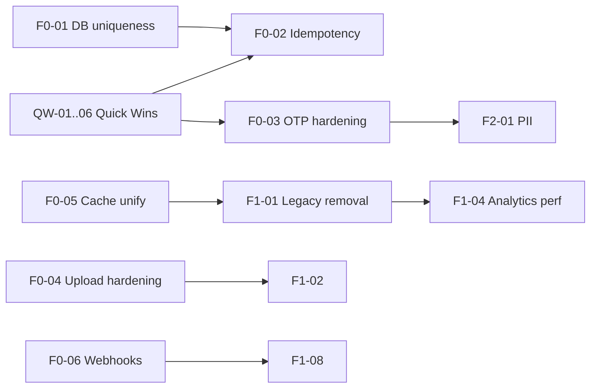

# Forms Backend — خطة تنفيذ TODO (مستند كامل)

> **المرجع:** `FORMS_BACKEND_IMPROVEMENTS_SECURITY.md`  
> **النطاق:** `apps/api/src/domain/forms` + Prisma + Redis + Bull + تكاملات مرتبطة  
> **آخر تحديث:** 2026-06-02  
> **حالة المستند:** جاهز للتنفيذ — جميع المهام تبدأ بحالة `TODO`

---

## كيف تستخدم هذا المستند

| العمود | المعنى |
|--------|--------|
| **ID** | معرّف ثابت للمهمة (للتتبع في Git/Linear/Jira) |
| **P** | الأولوية: P0 عاجل، P1 مهم، P2 مستقبلي |
| **Effort** | S ≈ 0.5–1 يوم، M ≈ 2–3 أيام، L ≈ 4–6 أيام، XL ≈ أسبوع+ |
| **Depends** | مهام يجب إنجازها قبلها |
| **Files** | ملفات رئيسية للتعديل |
| **DoD** | Definition of Done — معايير القبول |

**حالات المهمة:** `TODO` → `IN_PROGRESS` → `REVIEW` → `DONE` | `BLOCKED` | `CANCELLED`

---

## ملخص تنفيذي

| الأولوية | عدد المهام | الهدف |
|----------|------------|--------|
| P0 | 14 | أمان + اتساق بيانات + منع تكرار الإرسال |
| P1 | 16 | معمارية + أداء + صيانة |
| P2 | 8 | خصوصية + توسع + منصة |
| Quick Wins | 6 | تحسينات سريعة (يمكن دمجها مع P0) |
| **المجموع** | **44** | |

**تقدير إجمالي تقريبي:** 10–14 أسبوع عمل لمطوّر واحد (مع تنفيذ متوازٍ يمكن ضغط P0+P1 إلى ~6 أسابيع).

---

## خريطة الاعتماديات (مختصرة)



---

# القسم A — Quick Wins (ابدأ هنا)

| ID | العنوان | P | Effort | Status |
|----|---------|---|--------|--------|
| QW-01 | حد أقصى موحّد لـ `limit` في كل قوائم Forms | P0 | S | DONE |
| QW-02 | حد حجم body للإرسال والرفع | P0 | S | DONE |
| QW-03 | تخزين OTP كـ hash فقط في Redis | P0 | S | DONE |
| QW-04 | `Idempotency-Key` على submit (public + auth) | P0 | M | DONE |
| QW-05 | `X-Webhook-Event-Id` في كل تسليم webhook | P0 | S | DONE |
| QW-06 | توثيق Swagger لرؤوس الأمان الجديدة | P1 | S | DONE |

---

### QW-01 — حد أقصى موحّد لـ `limit`

**المشكلة:** بعض endpoints تقبل `limit` بدون سقف صارم (مثلاً submissions قد تصل 100 في cursor path لكن list forms افتراضي 20).

**Files:**
- `forms.controller.ts`
- `forms-facade.service.ts` / `forms-queries.service.ts`
- `forms-submission.service.ts`

**خطوات التنفيذ:**
1. إنشاء ثابت `FORMS_MAX_PAGE_LIMIT = 100` (أو 50 حسب السياسة) في `forms/constants.ts` جديد.
2. تطبيق `Math.min(limit ?? default, MAX)` في:
   - `GET /forms`
   - `GET /forms/:id/submissions`
   - أي list داخل domain forms.
3. إرجاع `400` إذا `limit < 1`.

**DoD:**
- [ ] لا endpoint في Forms يعيد أكثر من `FORMS_MAX_PAGE_LIMIT` سجلًا.
- [ ] اختبار وحدة أو e2e لطلب `limit=9999` يُقصّ إلى الحد.

**Depends:** —  
**Effort:** S

---

### QW-02 — حد حجم body للإرسال والرفع

**المشكلة:** `SubmitFormDto.data` قد يحمل base64 ضخم (ملفات/توقيع) بدون سقف واضح على مستوى الـ API.

**Files:**
- `main.ts` (global body parser limit إن وُجد)
- `forms.controller.ts`
- `forms-upload.controller.ts`
- `submit-form.dto.ts`

**خطوات التنفيذ:**
1. تعريف `FORMS_MAX_SUBMIT_BODY_BYTES` (مثلاً 2–5 MB للـ JSON؛ ملفات عبر presign منفصل).
2. Middleware أو pipe يتحقق من `Content-Length` قبل المعالجة.
3. رسالة خطأ موحّدة: `PAYLOAD_TOO_LARGE`.

**DoD:**
- [ ] طلب submit أكبر من الحد يُرفض بـ `413`.
- [ ] Swagger يذكر الحد الأقصى.

**Depends:** —  
**Effort:** S

---

### QW-03 — OTP كـ hash في Redis

**المشكلة:** `forms-email-verification.service.ts` يخزّن الكود plaintext في Redis.

**Files:**
- `services/forms-email-verification.service.ts`
- `utils/form-email-otp.util.ts` (جديد: hash + compare + timing-safe)

**خطوات التنفيذ:**
1. `hashOtp(code, pepper)` باستخدام `scrypt` أو `HMAC-SHA256` مع salt لكل `(formId, email)`.
2. عند التحقق: compare آمن (`timingSafeEqual`).
3. عدم تسجيل الكود في اللوجات.

**DoD:**
- [ ] Redis يحتوي hash فقط، لا أرقام OTP واضحة.
- [ ] التحقق يعمل كما قبل للمستخدم.
- [ ] اختبار: كود خاطئ 6 مرات → lockout (يرتبط بـ F0-03).

**Depends:** — (يمكن دمج QW-03 مع F0-03)  
**Effort:** S

---

### QW-04 — Idempotency-Key على submit

**المشكلة:** إعادة المحاولة من الشبكة تُنشئ `form_submissions` مكررة.

**Files:**
- `forms.controller.ts` (`POST .../submit`)
- `services/forms-submission.service.ts`
- `utils/form-idempotency.service.ts` (جديد)
- Redis أو جدول Prisma `form_submission_idempotency`

**خطوات التنفيذ:**
1. قراءة هيدر `Idempotency-Key` (UUID v4، طول 8–128).
2. مفتاح Redis: `form:idempotency:{formId}:{key}` → `submissionId`، TTL 24h.
3. إذا المفتاح موجود: إرجاع `200/201` مع نفس `submission` بدون insert جديد.
4. داخل transaction: set key بعد نجاح الإنشاء (أو استخدام unique في DB — انظر F0-02).

**DoD:**
- [ ] نفس المفتاح + نفس form = استجابة واحدة فقط.
- [ ] مفتاح مختلف = إرسال جديد (ما لم تمنعه سياسة one-response).
- [ ] يعمل على `public/:slug/submit` و `:id/submit`.

**Depends:** F0-02 (موصى به للضمان الكامل)  
**Effort:** M

---

### QW-05 — معرّف حدث لكل webhook

**Files:**
- `services/webhook.service.ts`
- `services/form-webhook-queue.service.ts`
- `processors/form-webhook.processor.ts`

**خطوات التنفيذ:**
1. توليد `eventId = uuid` لكل job.
2. إضافة هيدرات: `X-Webhook-Event-Id`, `X-Webhook-Timestamp`.
3. تضمين `eventId` في structured log.

**DoD:**
- [ ] كل محاولة تسليم لها `eventId` فريد في اللوج والهيدر.
- [ ] المستلم يمكنه ربط retries بنفس `eventId` (اختياري في payload).

**Depends:** —  
**Effort:** S

---

### QW-06 — توثيق Swagger

**Files:**
- `forms.controller.ts`
- `dto/submit-form.dto.ts`

**DoD:**
- [ ] `@ApiHeader` لـ `Idempotency-Key` على submit.
- [ ] وصف OTP وحدود الرفع في العمليات العامة.

**Depends:** QW-04, QW-02  
**Effort:** S

---

# القسم B — P0 (أمان واتساق — أسبوع 1–2)

| ID | العنوان | Effort | Status |
|----|---------|--------|--------|
| F0-01 | قيود DB لمنع الإرسال المكرر | M | DONE |
| F0-02 | Idempotency كامل (DB + Redis) | M | DONE |
| F0-03 | تقوية OTP (محاولات، cooldown، lockout) | M | DONE |
| F0-04 | رفع عام: جلسات + حصص + S3 | L | DONE |
| F0-05 | توحيد طبقة الكاش لـ Forms | M | DONE |
| F0-06 | Webhooks: توقيع HMAC + timestamp + سجلات | M | DONE |
| F0-07 | إصلاح تزامن `submissionCount` | M | DONE |
| F0-08 | ربط تحقق الإيميل بمسار submit | S | DONE |
| F0-09 | فرض reCAPTCHA على مستوى النموذج (اختياري) | M | DONE |
| F0-10 | تحقق MIME/محتوى للملفات (magic bytes) | M | DONE |
| F0-11 | سياسة فشل آمنة لحدود `maxSubmissions` | S | DONE |
| F0-12 | مراجعة SSRF لـ webhook URLs (تدقيق) | S | DONE |
| F0-13 | عدم تسريب `webhookSecret` في API responses | S | DONE |
| F0-14 | اختبارات e2e لمسار submit العام | L | DONE |

---

### F0-01 — قيود DB لمنع الإرسال المكرر

**السياق:** `assertFormAcceptsSubmission` في `utils/form-submission.validator.ts` يفحص قبل الإدراج؛ تحت التزامن يمكن طلبان يمران.

**Files:**
- `apps/api/prisma/schema.prisma` (`form_submissions`)
- migration جديدة
- `forms-submission.service.ts`

**خطوات التنفيذ:**
1. **للمستخدم المسجّل + `oneResponsePerUser` أو `!allowMultipleSubmissions`:**
   - Partial unique index: `UNIQUE (formId, userId) WHERE userId IS NOT NULL`  
   - أو جدول `form_submission_user_lock (formId, userId)` مع FK.
2. **للحد الأقصى للنموذج:** اعتبار `maxSubmissions` عبر transaction `SELECT COUNT ... FOR UPDATE` أو عداد ذري.
3. معالجة `P2002` → `400` برسالة واضحة (`ALREADY_SUBMITTED`).

**DoD:**
- [ ] طلبان متزامنان لنفس `(formId, userId)` → واحد فقط ينجح.
- [ ] لا كسر لنماذج `allowMultipleSubmissions: true`.
- [ ] migration مطبّقة على dev/staging.

**Depends:** —  
**Effort:** M

---

### F0-02 — Idempotency كامل

**يتوسّع QW-04** بجدول اختياري للتدقيق:

```prisma
model FormSubmissionIdempotency {
  id           String   @id @default(uuid())
  formId       String
  idempotencyKey String
  submissionId String
  createdAt    DateTime @default(now())
  expiresAt    DateTime

  @@unique([formId, idempotencyKey])
  @@index([expiresAt])
}
```

**DoD:**
- [ ] Redis + DB متسقان (DB مصدر حقيقة بعد انتهاء TTL Redis).
- [ ] Cron يحذف سجلات منتهية.

**Depends:** F0-01 (موصى به)  
**Effort:** M

---

### F0-03 — تقوية OTP

**Files:**
- `forms-email-verification.service.ts`
- `forms.controller.ts` (public verify endpoints)

**خطوات:**
1. بعد QW-03: hash OTP.
2. Redis keys:
   - `form:otp:attempts:{formId}:{email}` — max 5 / 15 min
   - `form:otp:resend:{formId}:{email}` — cooldown 60s
   - `form:otp:lock:{formId}:{email}` — 30 min بعد 5 فشل
3. Rate limit إضافي على IP (استخدام throttler أو Redis).

**DoD:**
- [ ] brute-force 6 محاولات → locked
- [ ] resend أسرع من 60s → `429`
- [ ] لا تسريب إن كان الحساب موجودًا (نفس رسالة عامة)

**Depends:** QW-03  
**Effort:** M

---

### F0-04 — رفع عام (جلسات + حصص + S3)

**السياق:** `forms-upload.controller.ts` — `uploadFilesPublic` يكتب على `uploads/forms/temp/{slug}`.

**Files:**
- `forms-upload.controller.ts`
- `services/forms-upload-cleanup.service.ts`
- `services/forms-public-upload.service.ts` (جديد)
- S3 presign (نمط موجود في `upload/presign`)

**خطوات:**
1. **جلسة رفع:** `POST /forms/public/:slug/upload/session` → `{ sessionToken, expiresAt, maxBytes, maxFiles }`.
2. الرفع عبر presigned PUT إلى `forms/public/{formId}/{sessionId}/{uuid}`.
3. **حصص:** Redis `form:upload:quota:ip:{ip}:{day}` و `form:upload:quota:form:{formId}:{day}`.
4. عند submit: التحقق أن الملفات مرتبطة بجلسة صالحة و`form.status === PUBLISHED`.
5. إهمال disk temp تدريجيًا (احتفظ بـ cleanup cron حتى إفراغ القديم).

**DoD:**
- [ ] لا رفع عام بدون session token
- [ ] تجاوز الحصة → `429`
- [ ] ملفات temp القديمة تُحذف (cron موجود — تحديث المسارات)

**Depends:** F0-10  
**Effort:** L

---

### F0-05 — توحيد الكاش

**السياق:** `forms-queries.service.ts` يستخدم `redisService.get/set` مع `JSON.stringify` يدوي؛ `forms.service.ts` يستخدم `CacheManager`؛ `forms-commands` يحذف `dashboard:stats:{userId}` فقط.

**Files:**
- `core/cache/cache.constants.ts` (مفاتيح forms)
- `domain/forms/services/forms-cache.service.ts` (جديد — wrapper واحد)
- `forms-queries.service.ts`, `forms-commands.service.ts`, `forms-submission.service.ts`

**خطوات:**
1. كل read/write عبر `FormsCacheService.get<T>(key)` / `set` / `invalidate(tags)`.
2. بادئة إصدار: `form:v2:slug:{slug}`.
3. قائمة invalidation موحّدة عند create/update/delete/submit.

**DoD:**
- [ ] لا استدعاء Redis مباشر من forms services (ما عدا الـ wrapper).
- [ ] بعد update form، `GET public/:slug` لا يعيد بيانات قديمة > TTL المتوقع.

**Depends:** —  
**Effort:** M

---

### F0-06 — Webhooks ناضجة

**السياق:** `webhook.service.ts` لديه `X-Webhook-Signature` وSSRF check؛ ينقص timestamp/nonce وسجل تسليم.

**Files:**
- `webhook.service.ts`
- `form-webhook-queue.service.ts`
- Prisma: `form_webhook_deliveries` (جديد)
- `processors/form-webhook.processor.ts`

**خطوات:**
1. توقيع: `HMAC-SHA256(secret, "${timestamp}.${nonce}.${body}")`.
2. هيدرات: `X-Webhook-Signature`, `X-Webhook-Timestamp`, `X-Webhook-Nonce`, `X-Webhook-Event-Id`.
3. رفض إرسال إذا URL غير آمن (موجود — مراجعة F0-12).
4. جدول deliveries: status, attempt, latencyMs, responseCode, error.
5. Circuit breaker: بعد N فشل متتالي → تعطيل مؤقت `webhookEnabled` أو flag `webhookPausedUntil`.

**DoD:**
- [ ] المستلم يمكنه التحقق من التوقيع + نافذة ±5 دقائق
- [ ] لوحة/endpoint للمالك: آخر 50 تسليم (P1 يمكن تأجيل UI)

**Depends:** QW-05  
**Effort:** M

---

### F0-07 — اتساق `submissionCount`

**السياق:** increment في `forms-submission.service.ts`، decrement عند الحذف؛ لا transaction مع insert.

**خيارات (اختر واحدًا في التذييل):**
- **A:** إزالة الحقل والاعتماد على `COUNT(*)` في القوائم (أبطأ قليلًا — indexes موجودة).
- **B:** تحديث داخل نفس transaction مع `create`/`delete`.
- **C:** Job يومي `reconcileSubmissionCounts()`.

**Files:**
- `forms-submission.service.ts`
- `forms.service.ts` (legacy delete path)
- `core/database/cleanup.service.ts` أو cron جديد

**DoD:**
- [ ] بعد 1000 submit/delete عشوائي، `submissionCount === COUNT(submissions)`.

**Depends:** F0-01  
**Effort:** M

---

### F0-08 — ربط OTP بـ submit

**المشكلة:** `FormsEmailVerificationService.isEmailVerified` موجود لكن لا يُستدعى في `submitForm`.

**Files:**
- `forms-submission.service.ts`
- `form-submission.validator.ts` أو validator جديد

**خطوات:**
1. إذا الحقل `EMAIL` و`validationRules.requireVerification === true` (أو flag في options):
   - التحقق من `isEmailVerified(formId, email)`.
2. بعد submit ناجح: حذف مفتاح verified.

**DoD:**
- [ ] submit بدون verify → `400 EMAIL_NOT_VERIFIED`
- [ ] بعد verify → submit ينجح

**Depends:** F0-03  
**Effort:** S

---

### F0-09 — reCAPTCHA على مستوى النموذج

**Files:**
- `schema.prisma` — `requireRecaptchaOnSubmit Boolean @default(false)` (اختياري)
- `create-form.dto.ts` / `update-form.dto.ts`
- `form-submission.validator.ts` — استدعاء `verifySubmissionRecaptcha` حتى بدون حقل RECAPTCHA

**DoD:**
- [ ] عند تفعيل الخيار، كل submit عام يتطلب token
- [ ] توافق مع الحقول الحالية

**Depends:** —  
**Effort:** M

---

### F0-10 — magic bytes للملفات

**Files:**
- `core/common/pipes/file-validation.pipe.ts`
- `forms-upload.controller.ts`
- مكتبة `file-type` أو equivalent

**DoD:**
- [ ] رفع `.jpg` بمحتوى exe → مرفوض
- [ ] متوافق مع presign flow (فحص post-upload أو عند confirm)

**Depends:** —  
**Effort:** M

---

### F0-11 — حدود maxSubmissions ذرية

**السياق:** count قبل insert في validator — race ممكن.

**خطوات:** دمج مع F0-01 عبر transaction أو قفل صف `Form`.

**DoD:**
- [ ] طلبان متزامنان عند الحد الأخير → واحد فقط ينجح

**Depends:** F0-01  
**Effort:** S

---

### F0-12 — تدقيق SSRF webhooks

**Files:** `webhook.service.ts`

**خطوات:** مراجعة `isSafeWebhookUrl` — DNS rebinding، IPv6، redirects؛ اختبارات وحدة.

**DoD:**
- [ ] قائمة عناوين محظورة موثّقة + tests

**Effort:** S

---

### F0-13 — إخفاء `webhookSecret` من responses

**Files:** `forms-queries.service.ts`, `getDetailInclude`, أي select للـ Form

**DoD:**
- [ ] `GET /forms/:id` لا يعيد `webhookSecret` (أو masked فقط عند endpoint إعدادات مخصص)

**Effort:** S

---

### F0-14 — اختبارات e2e submit

**Files:** `apps/api/test/forms/` (جديد)

**سيناريوهات:**
- submit ناجح عام
- form مغلق / غير منشور
- idempotency
- one response per user
- recaptcha fail

**DoD:**
- [ ] CI يشغّل suite forms e2e

**Depends:** F0-01, F0-02, QW-04  
**Effort:** L

---

# القسم C — P1 (متانة وأداء — أسبوع 3–4)

| ID | العنوان | Effort | Status |
|----|---------|--------|--------|
| F1-01 | إنهاء اعتماد Facade على `FormsService` | L | TODO |
| F1-02 | معالجة وسائط async (Bull queue) | L | TODO |
| F1-03 | تحقق JSON عميق للـ DTOs (conditionalLogic, theme) | M | TODO |
| F1-04 | تحليلات: aggregates + snapshots | L | TODO |
| F1-05 | Audit log لتغييرات حساسة | M | TODO |
| F1-06 | توحيد pagination (cursor فقط للـ submissions) | M | TODO |
| F1-07 | نقل `getSubmissionsSummary` إلى Export service | S | TODO |
| F1-08 | Admin: replay webhook + عرض deliveries | M | TODO |
| F1-09 | تحسين `FormsStepsService` لاستخدام `mapFormFieldData` | S | TODO |
| F1-10 | إزالة تكرار `processCoverImage` بين commands/legacy | M | TODO |
| F1-11 | فهرسة Prisma إضافية لتحليلات التاريخ | S | TODO |
| F1-12 | Rate limit per-form على submit | M | TODO |
| F1-13 | Honeypot field type دعم backend | S | TODO |
| F1-14 | توحيد مسار حذف submission (legacy vs new) | S | TODO |
| F1-15 | Metrics Prometheus لـ forms | M | TODO |
| F1-16 | Structured logging بـ requestId في forms | S | TODO |

---

### F1-01 — إزالة Legacy `FormsService`

**السياق:** `forms-facade.service.ts` يستدعي `legacy` لـ:
- `resolveFormId`
- `getFormSubmissions` (offset)
- `getSubmissionsSummary`

**Files:**
- `forms-facade.service.ts`
- `forms.service.ts` (حذف تدريجي أو تفريغ)
- `forms-queries.service.ts`, `forms-export.service.ts`

**خطوات:**
1. نقل `resolveFormId` → `FormsQueriesService`.
2. نقل `getSubmissionsSummary` → `FormsExportService`.
3. جعل offset pagination deprecated؛ redirect إلى cursor.
4. إزالة `FormsService` من `forms.module.ts` providers بعد نقل exports.

**DoD:**
- [ ] لا import لـ `FormsService` من facade
- [ ] حجم `forms.service.ts` = 0 أو محذوف

**Depends:** F0-05, F1-06  
**Effort:** L

---

### F1-02 — Bull queue لمعالجة الصور/الملفات

**Files:**
- `forms.module.ts` — queue `form-media`
- `processors/form-media.processor.ts`
- `forms-commands.service.ts` — لا sharp داخل transaction

**DoD:**
- [ ] create form بصورة كبيرة → 202 + `mediaStatus: processing` أو انتظار متزامن محدود
- [ ] فشل المعالجة لا يلغي إنشاء النموذج (cover nullable)

**Depends:** F0-04  
**Effort:** L

---

### F1-03 — تحقق JSON عميق

**Files:**
- `dto/conditional-logic.dto.ts`
- `dto/create-form.dto.ts` — `@ValidateNested` لـ theme, validationRules

**DoD:**
- [ ] conditional logic غير صالح → `400` قبل DB

**Effort:** M

---

### F1-04 — تحليلات بأداء أفضل

**السياق:** `forms-export.service.ts` يحمّل كل submissions.

**خطوات:**
1. جدول `form_analytics_daily` (formId, date, views, submissions, avgTime).
2. `FormAnalyticsTrackerService` يحدّث async (موجود جزئيًا).
3. endpoint `GET analytics` يقرأ snapshot + آخر 7 أيام live.

**Files:**
- `services/analytics.service.ts`
- `services/form-analytics-tracker.service.ts`
- migration

**DoD:**
- [ ] نموذج 50k submission: analytics < 500ms p95

**Depends:** F1-11  
**Effort:** L

---

### F1-05 — Audit log

**أحداث:** publish/close form, تغيير webhook URL, export CSV, حذف submission جماعي (مستقبلي).

**Files:**
- `domain/audit/` أو جدول `audit_logs`
- decorators على commands

**DoD:**
- [ ] كل حدث حساس يُسجّل: userId, action, formId, ip, metadata

**Effort:** M

---

### F1-06 — Pagination موحّدة

**DoD:**
- [ ] `GET submissions` يدعم cursor فقط في API docs
- [ ] `page` query deprecated مع تحذير header

**Depends:** F1-01  
**Effort:** M

---

### F1-07 — Summary في Export service

**Effort:** S — نقل من legacy فقط.

---

### F1-08 — Admin webhook replay

**Files:**
- `domain/admin/forms/` توسيع
- `form-webhook-queue.service.ts`

**DoD:**
- [ ] `POST /admin/forms/:id/webhooks/replay/:deliveryId` — Role ADMIN

**Depends:** F0-06  
**Effort:** M

---

### F1-09 — Steps + `mapFormFieldData`

**السياق:** `forms-steps.service.ts` يستخدم `formFieldRow` محلي بدل `mapFormFieldData`.

**DoD:**
- [ ] نفس شكل الحقول بين create/update/steps

**Effort:** S

---

### F1-10 — Media helper مشترك

**استخراج:** `processCoverImage`, `processBannerImages`, presign URL transform → `forms-media.helper.ts`.

**Effort:** M

---

### F1-11 — Index `(formId, completedAt)` — موجود؛ إضافة `(formId, completedAt DESC)` cover إن لزم.

**Effort:** S

---

### F1-12 — Rate limit per-form

Redis: `form:submit:rate:{formId}:{ip}` — مثلاً 30/ساعة للنماذج العامة.

**Effort:** M

---

### F1-13 — Honeypot

إذا field type `HIDDEN` + name `_honeypot` وقيمة غير فارغة → رفض صامت أو 400.

**Effort:** S

---

### F1-14 — حذف submission موحّد

**Effort:** S

---

### F1-15 — Metrics

Counters: `forms_submissions_total`, `forms_webhook_failures`, histogram لوقت submit.

**Effort:** M

---

### F1-16 — Structured logs

استخدام `request-id` من interceptor في Logger forms.

**Effort:** S

---

# القسم D — P2 (نضج المنصة — أسبوع 5+)

| ID | العنوان | Effort | Status |
|----|---------|--------|--------|
| F2-01 | metadata حساسية الحقول (PII) | L | TODO |
| F2-02 | تشفير at-rest لحقول حساسة في `data` JSON | L | TODO |
| F2-03 | Redaction في notifications/webhooks/logs | M | TODO |
| F2-04 | retention + حذف تلقائي للـ submissions | L | TODO |
| F2-05 | تصدير: سجل + watermark + حد معدل | M | TODO |
| F2-06 | malware scan pipeline (ClamAV / cloud) | XL | TODO |
| F2-07 | abuse detection per-tenant | XL | TODO |
| F2-08 | event-driven analytics (queue → warehouse) | XL | TODO |

---

### F2-01 — PII metadata

**Files:** `FormField` — `sensitivity Enum?` في schema + DTO.

**DoD:**
- [ ] واجهة البناء ترسل الحساسية؛ API يخزنها

---

### F2-02 — تشفير الحقول

Envelope encryption per form أو per user؛ مفتاح من KMS/env.

**DoD:**
- [ ] PII fields مشفرة في DB؛ فك فقط لمالك النموذج

**Depends:** F2-01

---

### F2-03 — Redaction

عند `sendNotification` / webhook / logs: استبدال قيم PII بـ `[REDACTED]`.

**Depends:** F2-01

---

### F2-04 — Retention

`Form.retentionDays` — cron يحذف submissions أقدم من X.

**Depends:** F2-01, قانوني/سياسة خصوصية

---

### F2-05 — Export controls

Audit + rate limit 5 exports/ساعة + optional OTP للمالك.

---

### F2-06 — Malware scan

بعد F0-04: ملفات في quarantine حتى PASS scan.

**Effort:** XL

---

### F2-07 — Abuse scoring

إشارات: IP, velocity, recaptcha score → flag tenant.

**Effort:** XL

---

### F2-08 — Analytics pipeline

أحداث `form.viewed`, `form.submitted` → queue → BigQuery/ClickHouse.

**Effort:** XL

---

# القسم E — جدول Sprint مقترح (6 أسابيع)

## Sprint 1 (أسبوع 1)

| المهام | الهدف |
|--------|--------|
| QW-01, QW-02, QW-03, QW-05 | حدود سريعة + OTP hash + webhook event id |
| F0-03, F0-08 | OTP كامل + ربط submit |
| F0-13 | إخفاء secrets |

**مخرجات:** أمان OTP وحدود API أوضح.

---

## Sprint 2 (أسبوع 2)

| المهام | الهدف |
|--------|--------|
| F0-01, F0-11, QW-04, F0-02 | لا تكرار submit |
| F0-07 | عداد submissions |
| F0-12 | SSRF audit |
| F0-14 (بدء) | tests |

**مخرجات:** إرسال موثوق تحت التزامن.

---

## Sprint 3 (أسبوع 3)

| المهام | الهدف |
|--------|--------|
| F0-04, F0-10 | رفع عام آمن |
| F0-05 | كاش موحّد |
| F0-06 | webhooks |
| F0-09 | recaptcha اختياري |

**مخرجات:** ملفات + webhooks production-grade.

---

## Sprint 4 (أسبوع 4)

| المهام | الهدف |
|--------|--------|
| F1-01, F1-06, F1-07, F1-09, F1-10, F1-14 | تنظيف legacy |
| F1-05 | audit |
| F0-14 (إنهاء) | e2e |

**مخرجات:** كود أسهل صيانة.

---

## Sprint 5 (أسبوع 5)

| المهام | الهدف |
|--------|--------|
| F1-04, F1-11, F1-15, F1-16 | تحليلات + مراقبة |
| F1-02 (بدء) | media queue |
| F2-01, F2-03 (بدء) | PII أساسي |

---

## Sprint 6 (أسبوع 6)

| المهام | الهدف |
|--------|--------|
| F1-08, F1-12, F1-13 | admin + rate + honeypot |
| F2-04, F2-05 | retention + export |
| QW-06 | swagger |

---

# القسم F — قائمة تحقق اختبار (عامة)

قبل إغلاق أي مهمة P0/P1:

- [ ] Unit tests للمنطق الجديد
- [ ] لا regression على `POST /forms` و `GET /forms/public/:slug`
- [ ] Prisma migrate على بيئة dev
- [ ] مراجعة أمنية: لا secrets في logs/responses
- [ ] تحديث `FORMS_BACKEND_API_EXPLANATION.md` إذا تغيّر سلوك API
- [ ] Load test خفيف على submit (اختياري لـ P0)

---

# القسم G — قرارات معمارية مفتوحة (يُحدَّث عند الاختيار)

| # | السؤال | الخيارات | التوصية |
|---|--------|----------|---------|
| D1 | `submissionCount` | A: حذف الحقل / B: transaction / C: reconcile job | **B + C** (transaction + reconcile أسبوعي) |
| D2 | Idempotency storage | Redis only / DB only / Both | **Both** |
| D3 | Public uploads | Disk temp / S3 presign only | **S3 presign only** بعد F0-04 |
| D4 | إزالة FormsService | Big bang / تدريجي | **تدريجي** (F1-01) |

---

# القسم H — تتبع الحالة (نموذج للنسخ)

```markdown
## تحديث YYYY-MM-DD
- F0-01: DONE — migration 20260602_form_submission_unique
- F0-02: IN_PROGRESS — @dev-name
- F0-04: BLOCKED — بانتظار قرار D3
```

---

# ملحق — ربط الملفات الحالية

| مكوّن | مسار |
|--------|------|
| Controller | `apps/api/src/domain/forms/forms.controller.ts` |
| Upload | `apps/api/src/domain/forms/forms-upload.controller.ts` |
| Facade | `apps/api/src/domain/forms/forms-facade.service.ts` |
| Legacy | `apps/api/src/domain/forms/forms.service.ts` |
| Commands | `services/forms-commands.service.ts` |
| Queries | `services/forms-queries.service.ts` |
| Submissions | `services/forms-submission.service.ts` |
| Export/Analytics | `services/forms-export.service.ts` |
| Steps | `services/forms-steps.service.ts` |
| Email OTP | `services/forms-email-verification.service.ts` |
| Webhook | `services/webhook.service.ts`, `form-webhook-queue.service.ts` |
| Validator | `utils/form-submission.validator.ts` |
| Schema | `apps/api/prisma/schema.prisma` (`Form`, `form_submissions`, `FormField`) |
| Cache keys | `apps/api/src/core/cache/cache.constants.ts` |

---

**المستندات المرتبطة:**
- `FORMS_BACKEND_API_EXPLANATION.md` — الوضع الحالي
- `FORMS_BACKEND_IMPROVEMENTS_SECURITY.md` — التحليل والتوصيات
- `FORMS_PACKAGES_OVERVIEW.md` — UI packages للفرونت

---

## تحديث 2026-06-02 (تنفيذ Quick Wins + جزء P0)

### منجز في الكود (`apps/api`)
- **QW-01:** `forms.constants.ts` + `parsePageLimit()` — تحقق من `limit` رقم موجب وسقف 100.
- **QW-02:** `SubmitContentLengthGuard` + `bodyParser` verify في `main.ts` لمسارات submit (5MB).
- **QW-03:** OTP hash عبر `FORMS_OTP_PEPPER` (أو JWT_SECRET في dev فقط) — بدون fallback ثابت.
- **QW-04:** Idempotency مع `setNx` lock + نتيجة 24h في Redis + تحقق شكل المفتاح.
- **QW-05:** `eventId` ثابت لكل job في queue؛ هيدرات `X-Webhook-Event-Id` / `X-Webhook-Timestamp` + توقيع `X-Webhook-Signature-V2`.
- **QW-06:** `@ApiHeader` لـ Idempotency-Key ووصف 5MB في Swagger.
- **F0-03:** محاولات OTP (5)، lockout 30 دقيقة، cooldown إعادة الإرسال 60 ثانية.
- **F0-08:** تحقق `EMAIL_NOT_VERIFIED` عند `requireVerification` في `validationRules` / `options`.
- **F0-07 (جزئي):** `submissionCount` + إنشاء submission داخل `$transaction`؛ فحص حدود داخل الـ transaction.
- **F0-13:** إزالة `webhookSecret` من استجابات `findById` / `findBySlug` (بما فيها الكاش).

### ملفات جديدة
- `forms.constants.ts`, `guards/submit-content-length.guard.ts`
- `utils/form-email-otp.util.ts`, `form-idempotency.util.ts`, `forms-pagination.util.ts`, `form-email-verification-check.util.ts`
- `RedisService.setNx`, `incr`, `expire`

## تحديث 2026-06-02 (Sprint 2 + 3 — إغلاق P0)

### Sprint 2
- **F0-01:** `form_submission_slots` + قيد فريد `(formId, slotKey)`.
- **F0-02:** `form_submission_idempotency` + claim في DB قبل المعالجة.
- **F0-04:** `POST .../upload/session` + `.../presign` (S3)؛ الرفع على القرص → 410.
- **F0-06:** `form_webhook_deliveries` + `GET /forms/:id/webhook-deliveries`.
- **F0-14:** `test/forms.e2e-spec.ts` (submit، idempotency، upload، duplicate user).

### Sprint 3
- **F0-05:** `FormsCacheService` (مفاتيح `v2`) + invalidation من `forms-commands`.
- **F0-09:** `requireRecaptchaOnSubmit` على `Form` + migration.
- **F0-11:** `SELECT ... FOR UPDATE` على صف النموذج قبل فحص الحدود.
- **F0-12:** توسيع `isSafeWebhookUrl` (`.local`, CGNAT, IPv6 ULA, …).

### migrations
- `20260602120000_forms_sprint2_p0`
- `20260602140000_form_require_recaptcha`

### التالي (P1)
- **F1-01:** إنهاء اعتماد Facade على `FormsService`.
- **F1-04:** تحليلات aggregates.
- **F0-06 (اختياري):** circuit breaker لتعطيل webhook مؤقتًا بعد فشل متكرر.
