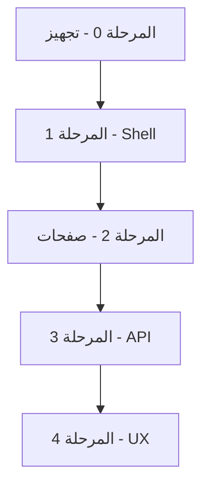

# Forms Dashboard UI — خطة تنفيذ TODO

> **المرجع:** تصميم `apps/app/app/dashboard` + `apps/app/components/app`  
> **UI:** `@heroui/react` / `@heroui/styles` — [FORMS_PACKAGES_OVERVIEW.md](./FORMS_PACKAGES_OVERVIEW.md)  
> **Auth:** [ui/FORMS_AUTH_SSO_INTEGRATION.md](./ui/FORMS_AUTH_SSO_INTEGRATION.md)  
> **API (لاحقاً):** [FORMS_BACKEND_API_EXPLANATION.md](./FORMS_BACKEND_API_EXPLANATION.md)  
> **النطاق:** `apps/forms` — مسار محمي `/app/*`  
> **آخر تحديث:** 2026-06-03  
> **حالة المستند:** جاهز للتنفيذ — المهام تبدأ بحالة `TODO`

---

## كيف تستخدم هذا المستند

| العمود | المعنى |
|--------|--------|
| **ID** | معرّف ثابت (مثال: `FD-01`) |
| **P** | P0 = هيكل لوحة التحكم، P1 = صفحات + API، P2 = تحسينات |
| **Effort** | S ≈ نصف يوم، M ≈ 1–2 يوم، L ≈ 3–5 أيام |
| **Depends** | مهام سابقة مطلوبة |
| **Files** | ملفات رئيسية |
| **DoD** | معايير القبول |

**حالات المهمة:** `TODO` → `IN_PROGRESS` → `REVIEW` → `DONE` | `BLOCKED` | `CANCELLED`

---

## قرارات معمارية (مُعتمدة للخطة)

| القرار | الاختيار |
|--------|----------|
| مسار لوحة التحكم | الإبقاء على **`/app`** (لا إعادة تسمية إلى `/dashboard`) |
| عرض المحتوى الرئيسي | **`max-w-5xl`** (جداول النماذج والاستجابات) |
| صفحة القوالب | **`/app/templates` placeholder** من المرحلة 2 |
| معاينة جانبية | **لا** في المرحلة 1 — `FormLivePreviewPanel` في المرحلة 4 |
| إشعارات Nav | **مؤجّلة** حتى وجود API |
| المرجع البصري | `AppDashboardShell` + `Sidebar` + `DashboardNav` + `MobileDock` |

---

## ملخص تنفيذي

| المرحلة | عدد المهام | الهدف | تقدير |
|---------|------------|--------|--------|
| 0 — تجهيز | 6 | dependencies + theme + utils + DAL | ~0.5 يوم |
| 1 — Shell | 8 | Sidebar + Nav + Shell + layout + home | ~1–2 يوم |
| 2 — صفحات هيكلية | 7 | routes + placeholders + nav labels | ~1–2 يوم |
| 3 — ربط API | 8 | قائمة نماذج، تفاصيل، استجابات، تحليلات | ~2–4 أيام |
| 4 — UX متقدم | 5 | معاينة حية، toast، i18n | ~2–3 أيام |
| **المجموع** | **34** | | **~7–12 يوم** |

---

## خريطة الاعتماديات



---

## هيكل الملفات المستهدف

```
apps/forms/
├── components/app/
│   ├── forms-dashboard-context.tsx
│   ├── forms-dashboard-shell.tsx
│   ├── sidebar.tsx
│   ├── dashboard-nav.tsx
│   ├── mobile-dock.tsx
│   └── shared/
│       └── form-live-preview.tsx          # مرحلة 4
├── lib/
│   ├── utils.ts
│   ├── dal.ts
│   └── forms-api.ts                       # مرحلة 3
├── app/app/
│   ├── layout.tsx                         # Server layout
│   ├── page.tsx
│   ├── forms/page.tsx
│   ├── forms/new/page.tsx
│   ├── forms/[id]/page.tsx
│   ├── forms/[id]/submissions/page.tsx
│   ├── forms/[id]/analytics/page.tsx
│   ├── templates/page.tsx
│   ├── integrations/page.tsx
│   ├── analytics/page.tsx
│   ├── settings/page.tsx
│   └── help/page.tsx
└── app/providers.tsx
```

---

# المرحلة 0 — تجهيز البنية التحتية

| ID | العنوان | P | Effort | Depends | Status |
|----|---------|---|--------|---------|--------|
| FD-00-01 | إضافة `lucide-react`, `next-themes`, `tailwind-merge`, `clsx` | P0 | S | — | DONE |
| FD-00-02 | إنشاء `lib/utils.ts` (`cn`) | P0 | S | FD-00-01 | DONE |
| FD-00-03 | `ThemeProvider` في `app/providers.tsx` + `suppressHydrationWarning` على `<html>` | P0 | S | FD-00-01 | DONE |
| FD-00-04 | إنشاء `lib/dal.ts` — قراءة المستخدم (headers middleware أو `fetch` server) | P0 | S | — | DONE |
| FD-00-05 | التأكد من `public/rukny-logo.svg` واستخدامه في Sidebar | P0 | S | — | DONE |
| FD-00-06 | توثيق متغيرات env للـ API في تعليق أو `.env.example` (مرحلة 3) | P1 | S | — | TODO |

### FD-00-01 — Dependencies

**Files:** `apps/forms/package.json`

**DoD:**
- [ ] `npm install` ينجح
- [ ] `lucide-react` متاح في مكونات `components/app`
- [ ] `next-themes` يعمل مع تبديل السمة في Nav

---

### FD-00-04 — DAL المستخدم

**Files:** `apps/forms/lib/dal.ts`, `apps/forms/middleware.ts` (مراجعة headers)

**DoD:**
- [ ] `getDashboardUser()` يعيد `{ id, email, name?, username?, avatar?, role }`
- [ ] يعمل في Server Component داخل `app/app/layout.tsx`
- [ ] fallback آمن عند غياب headers (redirect أو null)

---

# المرحلة 1 — هيكل لوحة التحكم (Shell)

| ID | العنوان | P | Effort | Depends | Status |
|----|---------|---|--------|---------|--------|
| FD-01-01 | `forms-dashboard-context.tsx` | P0 | S | FD-00-02 | DONE |
| FD-01-02 | `forms-dashboard-shell.tsx` | P0 | M | FD-01-01 | DONE |
| FD-01-03 | `sidebar.tsx` — تنقل `/app/*` | P0 | M | FD-00-05 | DONE |
| FD-01-04 | `dashboard-nav.tsx` — breadcrumb + theme + external link | P0 | M | FD-01-01, FD-00-03 | DONE |
| FD-01-05 | `mobile-dock.tsx` — تنقل جوال + drawer | P0 | M | FD-01-03 | DONE |
| FD-01-06 | إعادة كتابة `app/app/layout.tsx` (Server + Sidebar + Shell) | P0 | M | FD-01-02, FD-01-03, FD-00-04 | DONE |
| FD-01-07 | حذف الهيدر القديم من layout (client header البسيط) | P0 | S | FD-01-06 | DONE |
| FD-01-08 | تحديث `app/app/page.tsx` — لوحة رئيسية + بطاقات إحصائية | P0 | M | FD-01-06 | DONE |

### FD-01-02 — Forms Dashboard Shell

**مرجع:** `apps/app/components/app/app-dashboard-shell.tsx`

**Files:** `apps/forms/components/app/forms-dashboard-shell.tsx`

**DoD:**
- [ ] إطار `rounded-4xl` + `border` + `bg-[var(--surface)]`
- [ ] `main` بـ `pt-14`, `max-w-5xl`, `mx-auto`, scroll مخفي للشريط
- [ ] `MobileDock` خارج الـ shell عبر `MobileDockGate`
- [ ] **بدون** `CollapsiblePhonePreview`

---

### FD-01-03 — Sidebar

**مرجع:** `apps/app/components/app/sidebar.tsx`

**Files:** `apps/forms/components/app/sidebar.tsx`

**روابط أساسية:**

| href | label |
|------|-------|
| `/app` | لوحة التحكم |
| `/app/forms` | نماذجي |
| `/app/templates` | قوالب (placeholder) |
| `/app/integrations` | تكاملات |
| `/app/analytics` | تحليلات |
| `/app/settings` | الإعدادات |
| `/app/help` | المساعدة |

**DoD:**
- [ ] pill جانبي + tooltips RTL
- [ ] حالة نشطة صحيحة لكل مسار
- [ ] logout عبر `useFormsAuth` أو `/api/auth/logout`
- [ ] avatar من `user.avatar` أو حرف أول

---

### FD-01-04 — Dashboard Nav

**مرجع:** `apps/app/components/app/dashboard-nav.tsx`

**Files:** `apps/forms/components/app/dashboard-nav.tsx`

**DoD:**
- [ ] Breadcrumb: `ركني Forms / {pageLabel}`
- [ ] تبديل ثيم (Sun/Moon) بعد mount
- [ ] **لا** زر إشعارات في هذه المرحلة
- [ ] `PAGE_LABELS` لكل segment تحت `/app`

---

### FD-01-06 — Layout

**Files:** `apps/forms/app/app/layout.tsx`

**DoD:**
- [ ] `dir="rtl"` + `h-dvh` + `bg-[var(--background)]`
- [ ] `sm:ms-[82px]` لمحتوى Shell
- [ ] children داخل `FormsDashboardShell`
- [ ] `npm run build` ينجح

---

### FD-01-08 — الصفحة الرئيسية

**مرجع:** `apps/app/app/dashboard/page.tsx`

**Files:** `apps/forms/app/app/page.tsx`

**مكونات HeroUI:** `Card`, `Button`, `Skeleton` (اختياري)

**DoD:**
- [ ] عنوان + وصف
- [ ] 3 بطاقات إحصائية (placeholder: 0)
- [ ] بطاقتا CTA: «نماذجي» → `/app/forms`, «إنشاء» → `/app/forms/new`
- [ ] لا يعتمد على الهيدر القديم

---

# المرحلة 2 — صفحات هيكلية (Placeholders)

| ID | العنوان | P | Effort | Depends | Status |
|----|---------|---|--------|---------|--------|
| FD-02-01 | `/app/forms` — قائمة (EmptyState + زر إنشاء) | P0 | S | FD-01-06 | DONE |
| FD-02-02 | `/app/forms/new` — إنشاء نموذج (placeholder) | P1 | S | FD-02-01 | DONE |
| FD-02-03 | `/app/forms/[id]` — تفاصيل/محرر (placeholder) | P1 | S | FD-02-01 | DONE |
| FD-02-04 | `/app/forms/[id]/submissions` | P1 | S | FD-02-03 | DONE |
| FD-02-05 | `/app/forms/[id]/analytics` | P1 | S | FD-02-03 | DONE |
| FD-02-06 | `/app/templates`, `/app/integrations`, `/app/analytics` | P1 | S | FD-01-06 | DONE |
| FD-02-07 | `/app/settings`, `/app/help` | P1 | S | FD-01-06 | DONE |

### FD-02-01 — قائمة النماذج (هيكل)

**مكونات HeroUI:** `EmptyState`, `Button`, `Card`

**DoD:**
- [ ] رسالة «لا توجد نماذج بعد»
- [ ] زر «إنشاء نموذج» → `/app/forms/new`
- [ ] `pageLabel` في Nav = «نماذجي»

---

### FD-02-03 — مسار النموذج الواحد

**DoD:**
- [ ] Sub-nav أو breadcrumb يتضمن: تحرير | استجابات | تحليلات
- [ ] Dock الجوال يعرض روابط فرعية عند `pathname` يطابق `/app/forms/[id]`

---

# المرحلة 3 — ربط API

> **خطة تفصيلية لقسم النماذج:** [FORMS_SECTION_IMPLEMENTATION_PLAN.md](./FORMS_SECTION_IMPLEMENTATION_PLAN.md) (مهام `FF-*`)

| ID | العنوان | P | Effort | Depends | Status |
|----|---------|---|--------|---------|--------|
| FD-03-01 | `lib/forms-api.ts` — عميل authenticated | P1 | M | FD-00-06 | TODO |
| FD-03-02 | BFF أو proxy `/api/forms/*` (cookies) إن لزم | P1 | M | FD-03-01 | TODO |
| FD-03-03 | `/app/forms` — `GET /forms` + `Table` + pagination | P1 | L | FD-03-02, FD-02-01 | TODO |
| FD-03-04 | `/app/forms/new` — `POST /forms` | P1 | M | FD-03-02 | TODO |
| FD-03-05 | `/app/forms/[id]` — `GET /forms/:id` | P1 | M | FD-03-02 | TODO |
| FD-03-06 | `/app/forms/[id]/submissions` — قائمة + حذف | P1 | L | FD-03-05 | TODO |
| FD-03-07 | `/app/forms/[id]/analytics` — `GET :id/analytics` | P1 | M | FD-03-05 | TODO |
| FD-03-08 | إحصائيات الصفحة الرئيسية من API | P2 | M | FD-03-03 | TODO |

### FD-03-01 — Forms API client

**مرجع API:** `apps/api/src/domain/forms/forms.controller.ts`

**Endpoints أساسية:**

| Method | Path | استخدام UI |
|--------|------|------------|
| GET | `/forms` | قائمة |
| POST | `/forms` | إنشاء |
| GET | `/forms/:id` | تفاصيل |
| DELETE | `/forms/:id` | حذف |
| GET | `/forms/:id/submissions` | استجابات |
| GET | `/forms/:id/analytics` | تحليلات |
| POST | `/forms/:id/duplicate` | نسخ |

**DoD:**
- [ ] معالجة أخطاء موحّدة
- [ ] credentials: include
- [ ] types لـ Form / Submission (minimal)

---

### FD-03-03 — جدول النماذج

**مكونات HeroUI:** `Table`, `Chip`, `Dropdown`, `Pagination`, `Spinner`, `Skeleton`

**DoD:**
- [ ] أعمدة: الاسم، الحالة، الاستجابات، تاريخ التحديث، إجراءات
- [ ] حالات: loading, empty, error
- [ ] حد `limit` متوافق مع backend

---

# المرحلة 4 — تحسينات UX (اختياري)

| ID | العنوان | P | Effort | Depends | Status |
|----|---------|---|--------|---------|--------|
| FD-04-01 | `FormLivePreviewPanel` في Shell (desktop) | P2 | L | FD-01-02, FD-03-05 | TODO |
| FD-04-02 | `Toast` للعمليات (إنشاء، حذف، نسخ) | P2 | S | FD-03-03 | TODO |
| FD-04-03 | زر «معاينة عامة» في Nav (`/f/[slug]`) | P2 | S | FD-03-05 | TODO |
| FD-04-04 | i18n — `messages/ar.json` لنصوص Dashboard | P2 | M | FD-01-08 | TODO |
| FD-04-05 | إشعارات Nav + panel (عند توفر API) | P2 | L | FD-01-04 | TODO |

---

## ربط مكونات HeroUI بالشاشات

| الشاشة | مكونات `@heroui/react` |
|--------|-------------------------|
| Layout / Shell | tokens من `@heroui/styles` |
| Nav / Sidebar actions | `Button` |
| Home stats | `Card`, `Skeleton` |
| قائمة نماذج | `Table`, `Chip`, `EmptyState`, `Pagination` |
| محرر (لاحقاً) | `Tabs`, `Input`, `Textarea`, `Switch`, `Select`, `Modal`, `Drawer` |
| استجابات | `Table`, `Dropdown` |
| feedback | `Alert`, `Toast`, `Spinner` |

**Storybook:** `apps/forms/packages/storybook` — مراجعة حالات المكون قبل الدمج.

---

## معايير قبول عامة (Global DoD)

- [ ] `/app` يطابق إحساس `apps/app` dashboard (sidebar + shell + nav)
- [ ] الجوال: `MobileDock` يعمل لكل روابط `/app/*`
- [ ] RTL صحيح
- [ ] light/dark عبر `next-themes`
- [ ] logout يعمل
- [ ] لا كسر لـ `/`, `/login`, `/callback`, `/f/*`
- [ ] `npm run build` في `apps/forms` ينجح
- [ ] `npm run lint` بدون أخطاء جديدة حرجة

---

## قائمة تحقق يدوية (QA)

| # | سيناريو | متوقع |
|---|---------|--------|
| 1 | زائر غير مسجل → `/app` | redirect إلى `/login?next=...` |
| 2 | مسجل → `/app` | sidebar + shell + home |
| 3 | تغيير ثيم | يحفظ ويُطبَّق على Shell |
| 4 | عرض جوال `< sm` | dock ظاهر، sidebar مخفي |
| 5 | عرض desktop `≥ sm` | sidebar ظاهر، dock مخفي |
| 6 | logout | redirect login + مسح الجلسة |
| 7 | `/app/forms` | EmptyState أو جدول (بعد FD-03) |

---

## ما خارج النطاق (هذا المستند)

- محرر نماذج كامل (drag-and-drop builder)
- package مشترك `ui-shell` بين `apps/app` و `apps/forms`
- تغيير مسار `/app` → `/dashboard`
- نسخ `notifications-panel` من App
- Backend tasks — راجع [FORMS_BACKEND_IMPLEMENTATION_TODO.md](./FORMS_BACKEND_IMPLEMENTATION_TODO.md)

---

## ترتيب التنفيذ الموصى به

1. **FD-00-*** → **FD-01-*** (Shell كامل)
2. مراجعة بصرية
3. **FD-02-*** (صفحات placeholder)
4. **FD-03-*** (API)
5. **FD-04-*** حسب الأولوية

---

## سجل التغييرات

| التاريخ | التغيير |
|---------|---------|
| 2026-06-03 | إنشاء المستند — خطة Dashboard UI من جلسة التصميم |
| 2026-06-03 | تنفيذ المراحل 0–2: Shell, Sidebar, Nav, Dock, صفحات placeholder |
