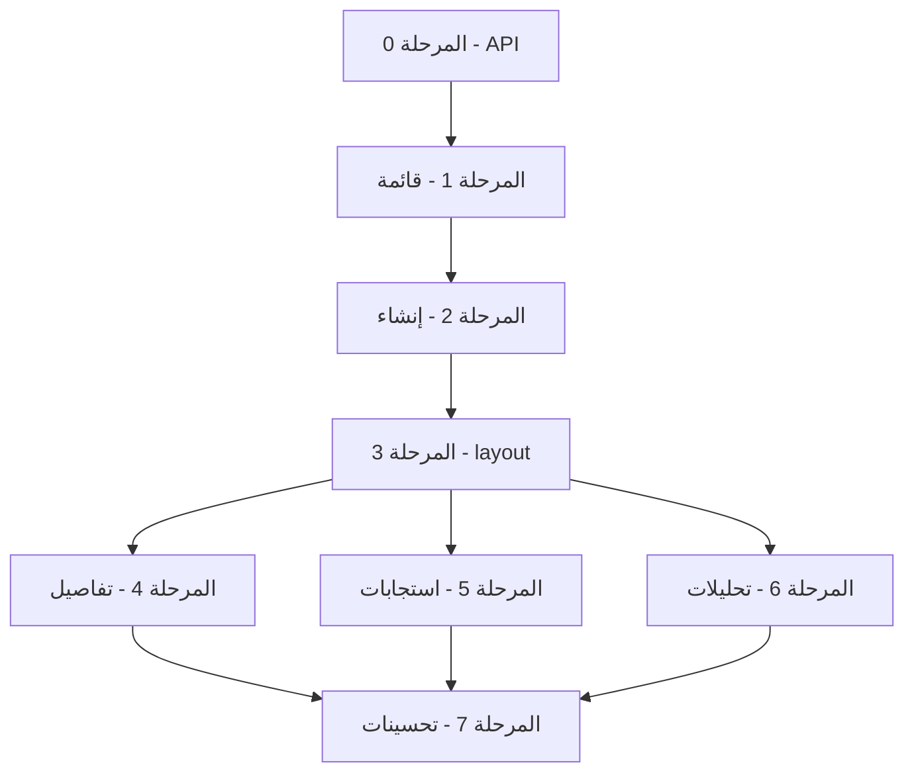

# قسم النماذج — خطة تنفيذ كاملة

> **النطاق:** `apps/forms/app/app/forms` وملحقاته (مكوّنات، hooks، API client)  
> **UI:** `@heroui/react` / `@heroui/styles` — [FORMS_PACKAGES_OVERVIEW.md](./FORMS_PACKAGES_OVERVIEW.md)  
> **API:** [FORMS_BACKEND_API_EXPLANATION.md](./FORMS_BACKEND_API_EXPLANATION.md)  
> **لوحة التحكم (Shell):** [FORMS_DASHBOARD_UI_IMPLEMENTATION_TODO.md](./FORMS_DASHBOARD_UI_IMPLEMENTATION_TODO.md) (المراحل 0–2 **منجزة**)  
> **Auth:** [ui/FORMS_AUTH_SSO_INTEGRATION.md](./ui/FORMS_AUTH_SSO_INTEGRATION.md)  
> **آخر تحديث:** 2026-06-03  
> **حالة المستند:** **أرشيف** — التنفيذ والتدقيق من **[FORMS_SECTION_AUDIT_AND_PLAN_V2.md](./FORMS_SECTION_AUDIT_AND_PLAN_V2.md)**

---

## كيف تستخدم هذا المستند

| العمود | المعنى |
|--------|--------|
| **ID** | معرّف ثابت (مثال: `FF-01`) — **F**orms **F**eature |
| **P** | P0 = أساسي، P1 = وظائف أساسية، P2 = تحسينات |
| **Effort** | S ≈ نصف يوم، M ≈ 1–2 يوم، L ≈ 3–4 أيام |
| **Depends** | مهام سابقة مطلوبة |
| **Files** | ملفات رئيسية |
| **DoD** | معايير القبول |

**حالات المهمة:** `TODO` → `IN_PROGRESS` → `REVIEW` → `DONE` | `BLOCKED` | `CANCELLED`

---

## ملخص تنفيذي

| المرحلة | عدد المهام | الهدف | تقدير |
|---------|------------|--------|--------|
| 0 — بنية API | 4 | `forms-api` + توسيع العميل | ~0.5 يوم |
| 1 — قائمة النماذج | 5 | `/app/forms` + جدول + pagination | ~1–2 يوم |
| 2 — إنشاء نموذج | 4 | `/app/forms/new` + `POST /forms` | ~1 يوم |
| 3 — Layout النموذج | 4 | `[id]/layout` + تبويبات + Dock | ~0.5–1 يوم |
| 4 — تفاصيل/تحرير | 6 | `/app/forms/[id]` MVP | ~2–3 أيام |
| 5 — الاستجابات | 5 | submissions + حذف | ~2 يوم |
| 6 — التحليلات | 3 | analytics من API | ~1 يوم |
| 7 — تحسينات | 5 | Toast، تأكيدات، QA | ~1 يوم |
| **المجموع** | **36** | | **~9–12 يوم** |

---

## الوضع الحالي (قبل التنفيذ)

### مسارات موجودة

| المسار | الحالة |
|--------|--------|
| `/app/forms` | واجهة ثابتة — `EmptyState` دائماً بدون API |
| `/app/forms/new` | `PlaceholderPage` |
| `/app/forms/[id]` | placeholder + روابط نصية |
| `/app/forms/[id]/submissions` | placeholder |
| `/app/forms/[id]/analytics` | placeholder |

### بنية تحتية جاهزة

| العنصر | الملف / الملاحظة |
|--------|------------------|
| Shell + Sidebar + Nav + Dock | `components/app/*` — **DONE** |
| Proxy API | `next.config.ts` → `/api/v1/*` → backend |
| API client | `lib/api-client.ts` — `get`, `patch`, `delete` (ينقص `post`, `put`) |
| CSRF + refresh | نفس نمط `apps/app` |
| إحصائيات الرئيسية | `lib/forms-dashboard-data.ts` — **DONE** |
| إشعارات | AlertDialog (جوال) + لوحة جانبية (كمبيوتر) — **DONE** |

### ما ينقص لقسم النماذج

- `lib/forms-api.ts` + أنواع TypeScript
- مكوّنات `components/forms/*`
- `app/app/forms/[id]/layout.tsx`
- ربط حقيقي بجميع الصفحات الخمس

---

## قرارات معمارية (مُعتمدة)

| القرار | الاختيار |
|--------|----------|
| مسار القسم | `/app/forms` (بدون تغيير) |
| عرض المحتوى | `max-w-5xl` داخل Shell |
| مصدر البيانات | `fetch` عبر `/api/v1` (rewrite موجود) — **لا BFF منفصل** في v1 |
| إنشاء نموذج | نموذج **صفحة واحدة** (ليس wizard متعدد الخطوات في v1) |
| محرّر الحقول v1 | **عرض** الحقول + تعديل **بيانات وصفية** (عنوان، slug، حالة، وصف) — بدون drag-and-drop |
| إضافة/حذف حقول من UI | **خارج v1** — مرحلة لاحقة (`PUT /forms/:id` مع `fields[]`) |
| القوالب | `/app/templates` يبقى placeholder — لا ربط في هذا المستند |
| معاينة عامة | رابط `/f/[slug]` — زر في header النموذج (مرحلة 4 أو 7) |
| Pagination قائمة | `page` + `limit` (افتراضي backend: 20، سقف عبر `parsePageLimit`) |
| Pagination استجابات | دعم `page`/`limit` و`cursor` حسب ما يعيده API |

---

## نطاق العمل

### داخل النطاق (MVP)

- قائمة نماذج حقيقية مع pagination وفلتر حالة
- إنشاء نموذج (title, slug, type, description اختياري)
- layout مشترك للنموذج الواحد + تبويبات فرعية
- صفحة تفاصيل: metadata، نشر/مسودة، رابط عام
- قائمة استجابات + حذف
- تحليلات أساسية من `GET /forms/:id/analytics`
- Toast + AlertDialog للحذف

### خارج النطاق

- محرّر نماذج كامل (builder، سحب وإفلات)
- إدارة خطوات multi-step من الواجهة
- رفع ملفات cover/banner من لوحة التحكم
- تكامل Google Sheets / webhooks من UI
- تصدير CSV من الواجهة (API موجود: `GET .../export` — لاحقاً)
- تعديل `theme` JSON من واجهة مرئية
- Backend tasks — [FORMS_BACKEND_IMPLEMENTATION_TODO.md](./FORMS_BACKEND_IMPLEMENTATION_TODO.md)

---

## خريطة الاعتماديات



**Sprint 1 موصى به:** `FF-00-*` → `FF-01-*` → `FF-02-*` → `FF-03-*`  
بعدها: تفاصيل → استجابات → تحليلات → تحسينات.

---

## هيكل الملفات المستهدف

```
apps/forms/
├── lib/
│   ├── api-client.ts              # إضافة post + put
│   ├── forms-api.ts               # جديد
│   └── forms-format.ts            # تواريخ، Chip حالة (اختياري)
├── hooks/
│   ├── use-forms-list.ts
│   ├── use-form-detail.ts
│   └── use-form-submissions.ts
├── components/forms/
│   ├── forms-list-table.tsx
│   ├── forms-list-toolbar.tsx
│   ├── create-form-form.tsx
│   ├── form-workspace-nav.tsx
│   ├── form-detail-header.tsx
│   ├── form-settings-panel.tsx
│   ├── form-fields-readonly-list.tsx
│   ├── submissions-table.tsx
│   ├── submission-detail-drawer.tsx
│   └── form-analytics-summary.tsx
└── app/app/forms/
    ├── page.tsx
    ├── new/page.tsx
    └── [id]/
        ├── layout.tsx             # جديد
        ├── page.tsx
        ├── submissions/page.tsx
        └── analytics/page.tsx
```

---

## مرجع API (Authenticated)

**Controller:** `apps/api/src/domain/forms/forms.controller.ts`  
**Guards:** `JwtAuthGuard`، `PlanGuard` على `POST /forms` (`@CheckLimit('forms')`)

| Method | Path | استخدام UI | ملاحظات |
|--------|------|------------|---------|
| GET | `/forms` | قائمة | Query: `page`, `limit`, `status`, `type` |
| POST | `/forms` | إنشاء | Body: `CreateFormDto` — `fields` اختياري |
| GET | `/forms/:id` | تفاصيل | يقبل id أو slug |
| PUT | `/forms/:id` | تحديث | `UpdateFormDto` |
| PUT | `/forms/:id/status` | نشر/إغلاق | Body: `status` enum |
| DELETE | `/forms/:id` | حذف | 204 |
| POST | `/forms/:id/duplicate` | نسخ | |
| GET | `/forms/:id/submissions` | استجابات | `page`, `limit`, `cursor` |
| GET | `/forms/:id/submissions/summary` | ملخص | اختياري |
| DELETE | `/forms/:id/submissions/:submissionId` | حذف استجابة | 204 |
| GET | `/forms/:id/analytics` | تحليلات | انظر شكل الاستجابة أدناه |
| GET | `/forms/:id/export` | CSV | خارج v1 |

### شكل `GET /forms` (مختصر)

```json
{
  "forms": [
    {
      "id": "uuid",
      "title": "...",
      "slug": "...",
      "status": "DRAFT",
      "type": "FEEDBACK",
      "createdAt": "...",
      "updatedAt": "...",
      "_count": { "fields": 3, "submissions": 12 }
    }
  ],
  "pagination": { "total": 1, "page": 1, "limit": 20, "pages": 1 }
}
```

### شكل `GET /forms/:id/analytics` (مختصر)

```json
{
  "summary": {
    "totalViews": 0,
    "totalSubmissions": 0,
    "completionRate": 0,
    "avgTimeToComplete": 0,
    "firstSubmission": null,
    "lastSubmission": null
  },
  "submissionsByDay": [],
  "fieldAnalytics": [],
  "dropOffRate": []
}
```

### `CreateFormDto` — حقول واجهة الإنشاء (v1)

| حقل | مطلوب | تحقق |
|-----|--------|------|
| `title` | نعم | max 200 |
| `slug` | نعم | `^[a-z0-9-]+$` |
| `type` | نعم | enum `FormType` |
| `description` | لا | max 2000 |
| `status` | لا | افتراضي DRAFT |
| `fields` | لا | يُؤجّل — إنشاء نموذج فارغ أو بحقل افتراضي لاحقاً |

---

# المرحلة 0 — بنية API

| ID | العنوان | P | Effort | Depends | Status |
|----|---------|---|--------|---------|--------|
| FF-00-01 | توسيع `api-client`: `post`, `put` | P0 | S | — | TODO |
| FF-00-02 | `lib/forms-api.ts` — دوال + types | P0 | M | FF-00-01 | TODO |
| FF-00-03 | `lib/forms-format.ts` — حالات، تواريخ عربية | P1 | S | FF-00-02 | TODO |
| FF-00-04 | `.env.example` — `API_BACKEND_URL` / `API_URL` | P1 | S | — | TODO |

### FF-00-02 — `forms-api.ts`

**DoD:**
- [ ] `listForms`, `getForm`, `createForm`, `updateForm`, `updateFormStatus`, `deleteForm`, `duplicateForm`
- [ ] `listSubmissions`, `deleteSubmission`, `getFormAnalytics`
- [ ] `credentials: 'include'` عبر `api-client`
- [ ] معالجة `ApiException` ورسائل عربية للأخطاء الشائعة (401, 403, 404, 409)

---

# المرحلة 1 — قائمة النماذج `/app/forms`

| ID | العنوان | P | Effort | Depends | Status |
|----|---------|---|--------|---------|--------|
| FF-01-01 | `use-forms-list` hook | P0 | S | FF-00-02 | TODO |
| FF-01-02 | `forms-list-toolbar` — فلتر status | P1 | S | FF-01-01 | TODO |
| FF-01-03 | `forms-list-table` — Table + Chip + إجراءات | P0 | M | FF-01-01 | TODO |
| FF-01-04 | تحديث `app/app/forms/page.tsx` | P0 | S | FF-01-03 | TODO |
| FF-01-05 | `AlertDialog` تأكيد حذف + `duplicate` | P1 | S | FF-01-03 | TODO |

### FF-01-03 — أعمدة الجدول

| العمود | المصدر |
|--------|--------|
| الاسم | `title` + `slug` فرعي |
| الحالة | `status` → Chip ملوّن |
| الاستجابات | `_count.submissions` |
| آخر تحديث | `updatedAt` |
| إجراءات | فتح، نسخ، حذف، معاينة (`/f/slug`) |

### FF-01-04 — حالات الصفحة

- [ ] `loading` — Skeleton
- [ ] `error` — رسالة + إعادة محاولة
- [ ] `empty` — EmptyState + زر إنشاء
- [ ] `data` — جدول + Pagination

**مكونات HeroUI:** `Table`, `Chip`, `Button`, `EmptyState`, `Skeleton`, `Spinner`, `AlertDialog`

---

# المرحلة 2 — إنشاء نموذج `/app/forms/new`

| ID | العنوان | P | Effort | Depends | Status |
|----|---------|---|--------|---------|--------|
| FF-02-01 | `create-form-form.tsx` | P0 | M | FF-00-02 | TODO |
| FF-02-02 | توليد slug من العنوان (اختياري) | P1 | S | FF-02-01 | TODO |
| FF-02-03 | `new/page.tsx` — استبدال placeholder | P0 | S | FF-02-01 | TODO |
| FF-02-04 | معالجة خطأ حد الخطة (`PlanGuard`) | P1 | S | FF-02-03 | TODO |

### FF-02-03 — تدفق النجاح

1. `POST /forms`
2. `redirect` → `/app/forms/[id]`
3. (لاحقاً) Toast «تم إنشاء النموذج»

**مكونات HeroUI:** `Input`, `Textarea`, `Select`, `Button`, `Label`, `FieldError`

---

# المرحلة 3 — Layout النموذج `/app/forms/[id]/*`

| ID | العنوان | P | Effort | Depends | Status |
|----|---------|---|--------|---------|--------|
| FF-03-01 | `app/app/forms/[id]/layout.tsx` | P0 | M | FF-00-02 | TODO |
| FF-03-02 | `form-workspace-nav.tsx` — تبويبات | P0 | S | FF-03-01 | TODO |
| FF-03-03 | `form-detail-header.tsx` — عنوان + Chip | P1 | S | FF-03-01 | TODO |
| FF-03-04 | Dock جوال — روابط فرعية عند `/app/forms/[id]` | P1 | M | FF-03-02 | TODO |

### FF-03-02 — التبويبات

| التبويب | المسار |
|---------|--------|
| تحرير | `/app/forms/[id]` |
| الاستجابات | `/app/forms/[id]/submissions` |
| التحليلات | `/app/forms/[id]/analytics` |

**DoD:**
- [ ] Breadcrumb: نماذجي → `{title}`
- [ ] `resolvePageLabel` يعرض اسم النموذج أو «تفاصيل النموذج»
- [ ] التبويب النشط يطابق `pathname`

---

# المرحلة 4 — تفاصيل وتحرير `/app/forms/[id]`

| ID | العنوان | P | Effort | Depends | Status |
|----|---------|---|--------|---------|--------|
| FF-04-01 | `use-form-detail` hook | P0 | S | FF-00-02 | TODO |
| FF-04-02 | `form-settings-panel` — title, description, slug | P0 | M | FF-04-01 | TODO |
| FF-04-03 | نشر / مسودة / إغلاق — `PUT .../status` | P0 | S | FF-04-01 | TODO |
| FF-04-04 | `form-fields-readonly-list` | P1 | M | FF-04-01 | TODO |
| FF-04-05 | أزرار: نسخ، حذف، معاينة عامة | P1 | S | FF-04-01 | TODO |
| FF-04-06 | تحديث `[id]/page.tsx` | P0 | S | FF-04-02–05 | TODO |

### FF-04-02 — نطاق التحرير v1

| يُحرَّر | لا يُحرَّر في v1 |
|---------|------------------|
| `title`, `description` | `fields[]` (builder) |
| `slug` (مع تحذير) | `steps`, `theme`, integrations |
| `status` عبر FF-04-03 | |

**DoD:**
- [ ] تحميل النموذج بـ `GET /forms/:id`
- [ ] حفظ الإعدادات بـ `PUT /forms/:id`
- [ ] 404 إذا النموذج غير موجود أو غير مملوك

---

# المرحلة 5 — الاستجابات `/app/forms/[id]/submissions`

| ID | العنوان | P | Effort | Depends | Status |
|----|---------|---|--------|---------|--------|
| FF-05-01 | `use-form-submissions` hook | P0 | M | FF-00-02 | TODO |
| FF-05-02 | `submissions-table.tsx` | P0 | M | FF-05-01 | TODO |
| FF-05-03 | `submission-detail-drawer` — عرض JSON | P1 | M | FF-05-02 | TODO |
| FF-05-04 | حذف استجابة + تأكيد | P0 | S | FF-05-02 | TODO |
| FF-05-05 | تحديث `submissions/page.tsx` | P0 | S | FF-05-02 | TODO |

### FF-05-02 — أعمدة مقترحة

| العمود | المصدر |
|--------|--------|
| التاريخ | `completedAt` / `createdAt` |
| المعرّف | `id` مختصر |
| ملخص | أول حقلين نصيين من `data` |

**DoD:**
- [ ] Pagination (offset أو cursor)
- [ ] empty: «لا توجد استجابات بعد»
- [ ] loading / error

---

# المرحلة 6 — التحليلات `/app/forms/[id]/analytics`

| ID | العنوان | P | Effort | Depends | Status |
|----|---------|---|--------|---------|--------|
| FF-06-01 | `form-analytics-summary.tsx` — بطاقات summary | P0 | M | FF-00-02 | TODO |
| FF-06-02 | عرض `submissionsByDay` (جدول أو قائمة بسيطة) | P1 | M | FF-06-01 | TODO |
| FF-06-03 | تحديث `analytics/page.tsx` | P0 | S | FF-06-01 | TODO |

### FF-06-01 — بطاقات

| البطاقة | الحقل |
|---------|--------|
| المشاهدات | `summary.totalViews` |
| الاستجابات | `summary.totalSubmissions` |
| معدل الإكمال | `summary.completionRate` |
| متوسط وقت الإكمال | `summary.avgTimeToComplete` |

**ملاحظة:** يمكن إعادة استخدام `DashboardMetricCard` أو Card من HeroUI.

---

# المرحلة 7 — تحسينات UX

| ID | العنوان | P | Effort | Depends | Status |
|----|---------|---|--------|---------|--------|
| FF-07-01 | `Toast` — إنشاء، حذف، نسخ، حفظ | P2 | S | FF-01–06 | TODO |
| FF-07-02 | إعادة جلب القائمة عند العودة من `[id]` | P2 | S | FF-01-04 | TODO |
| FF-07-03 | نسخ رابط `/f/[slug]` للحافظة | P2 | S | FF-04-05 | TODO |
| FF-07-04 | تحديث `FORMS_DASHBOARD_UI_IMPLEMENTATION_TODO` — FD-03 → DONE تدريجياً | P2 | S | — | TODO |
| FF-07-05 | QA يدوي — قائمة التحقق أدناه | P2 | S | FF-01–06 | TODO |

---

## ربط مكونات HeroUI بالشاشات

| الشاشة | مكونات `@heroui/react` |
|--------|-------------------------|
| قائمة نماذج | `Table`, `Chip`, `Button`, `EmptyState`, `Pagination`, `Skeleton`, `Dropdown` |
| إنشاء | `Input`, `Textarea`, `Select`, `Button`, `Label`, `FieldError` |
| تفاصيل | `Card`, `Switch`, `Chip`, `Separator`, `Tabs` (في nav) |
| استجابات | `Table`, `Drawer` أو `Modal`, `AlertDialog` |
| تحليلات | `Card`, `Skeleton` |
| feedback | `Toast`, `Alert`, `Spinner` |

**Storybook:** `apps/forms/packages/storybook` — مراجعة المكون قبل الدمج.

---

## معايير قبول عامة (Global DoD)

- [ ] جميع مسارات `/app/forms/*` تعرض بيانات حقيقية أو حالات empty/error صحيحة
- [ ] RTL + `next-themes` light/dark
- [ ] CSRF على طلبات الكتابة
- [ ] 401 → redirect login مع `next`
- [ ] `npm run build` في `apps/forms` ينجح
- [ ] `npm run lint` بدون أخطاء حرجة جديدة
- [ ] لا كسر `/f/*` (النماذج العامة)
- [ ] لا كسر Shell / إشعارات / لوحة التحكم الرئيسية

---

## قائمة تحقق يدوية (QA)

| # | سيناريو | متوقع |
|---|---------|--------|
| 1 | `/app/forms` بدون نماذج | EmptyState + زر إنشاء |
| 2 | إنشاء نموذج صالح | redirect إلى `[id]` |
| 3 | slug غير صالح | رسالة خطأ تحقق |
| 4 | حد الخطة (PlanGuard) | رسالة واضحة |
| 5 | قائمة بعد إنشاء عدة نماذج | جدول + pagination |
| 6 | حذف من القائمة | يختفي + تأكيد |
| 7 | نسخ نموذج | نموذج جديد في القائمة |
| 8 | تبويبات `[id]` | تنقل سلس |
| 9 | نشر → PUBLISHED | يظهر في `/f/slug` |
| 10 | استجابات بعد submit عام | صفوف في الجدول |
| 11 | حذف استجابة | تختفي من الجدول |
| 12 | تحليلات | بطاقات summary صحيحة |
| 13 | جوال | Dock + تبويبات النموذج |
| 14 | جلسة منتهية أثناء التحرير | redirect login |

---

## ترتيب التنفيذ الموصى به

1. **FF-00-*** — API client كامل  
2. **FF-01-*** — قائمة تعمل end-to-end  
3. **FF-02-*** — إنشاء + redirect  
4. **FF-03-*** — layout + تبويبات  
5. **FF-04-*** → **FF-05-*** → **FF-06-*** (يمكن 5 و 6 بالتوازي بعد 3)  
6. **FF-07-*** — تحسينات  

---

## علاقة بمستند Dashboard TODO

| مهمة Dashboard | مهمة قسم النماذج |
|----------------|------------------|
| FD-03-01 `forms-api.ts` | FF-00-02 |
| FD-03-02 BFF/proxy | **ملغاة** — rewrite كافٍ |
| FD-03-03 قائمة + Table | FF-01-* |
| FD-03-04 إنشاء POST | FF-02-* |
| FD-03-05 تفاصيل GET | FF-04-* |
| FD-03-06 استجابات | FF-05-* |
| FD-03-07 تحليلات | FF-06-* |

عند إكمال كل مرحلة هنا، يُحدَّث `FORMS_DASHBOARD_UI_IMPLEMENTATION_TODO.md` (FD-03-xx → DONE).

---

## أسئلة مفتوحة (للمراجعة مع المنتج)

| # | السؤال | افتراضي في الخطة |
|---|--------|------------------|
| 1 | هل ننشئ نموذجاً **بدون حقول** أم بحقل افتراضي (مثلاً EMAIL)؟ | بدون حقول — يحرّر لاحقاً |
| 2 | هل نسمح بتعديل `slug` بعد الإنشاء؟ | نعم مع تحذير |
| 3 | هل نعرض `fieldAnalytics` في v1؟ | لا — summary + submissionsByDay فقط |
| 4 | تصدير CSV من UI في نفس السبرنت؟ | لا — مرحلة لاحقة |

---

## سجل التغييرات

| التاريخ | التغيير |
|---------|---------|
| 2026-06-03 | إنشاء المستند — خطة كاملة لقسم `/app/forms` |
