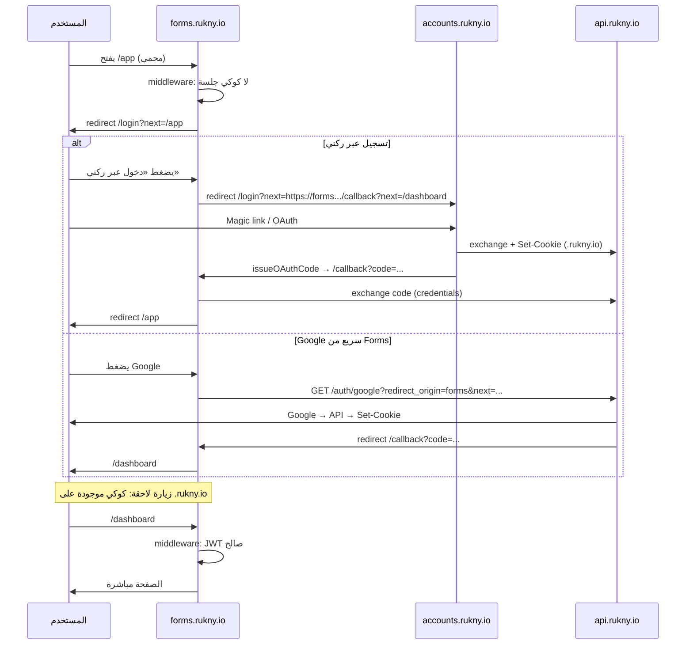

# Forms — تكامل تسجيل الدخول مع Accounts و `@rukny/auth`

> **النطاق:** `apps/forms` · `apps/accounts` · `packages/auth` · `apps/api` (auth/cookies)  
> **التاريخ:** 2026-06-02  
> **الحالة:** **منفّذ (مرحلة 1)** — مسارات `/app`، `/login`، `/callback`، middleware، BFF auth

---

## 1. الهدف

بناء تجربة دخول موحّدة لمنصة **Forms** بحيث:

1. إذا سجّل المستخدم الدخول في **accounts.rukny.io** (أو نطاق التطوير المكافئ)، يدخل **Forms** دون إعادة تسجيل (SSO عبر كوكيز مشتركة).
2. إذا لم يكن مسجّلاً ووصل لمسار محمي في Forms، يُوجَّه إلى **صفحة دخول داخل Forms** (`/login`) وليس مباشرة إلى Accounts (تجربة مخصّصة للمنتج).
3. من صفحة الدخول في Forms:
   - **تسجيل الدخول عبر ركني** → يفتح Accounts مع `next=` للعودة إلى Forms بعد النجاح.
   - **تسجيل دخول سريع بـ Google** → نفس مسار OAuth الحالي في المنصة (تسجيل/ربط حساب كامل في النظام).

---

## 2. الوضع الحالي (تدقيق المستودع)

### 2.1 `apps/forms`

| البند | الحالة |
|--------|--------|
| إطار العمل | Next.js 16 (`next dev -p **3007**`) |
| واجهة | HeroUI v3 (`@heroui/react`) — صفحة تجريبية فقط |
| مصادقة | **منفّذ** — `middleware.ts`، `/login`، `/callback`، `/app` |
| متغيرات بيئة | `.env.example` |
| BFF `/api/auth` | **منفّذ** — `app/api/auth/[...path]/route.ts` |
| `@rukny/auth` | `COOKIE_NAMES` + منفذ 3007؛ التحقق في `lib/middleware-auth.ts` |

الملف الوحيد للتطبيق حالياً: `app/page.tsx` (عرض مكونات HeroUI).

### 2.2 `apps/accounts`

| البند | الحالة |
|--------|--------|
| تسجيل الدخول | Magic link (QuickSign)، Google، LinkedIn، Facebook |
| Middleware | مخصّص (ليس `@rukny/auth`) — يقرأ `access_token` / `__Secure-access_token` |
| OAuth callback | `exchangeCode` + عند الحاجة `issueOAuthCode` لنقل الجلسة لتطبيق آخر |
| معامل `next` | مدعوم — تخزين في `localStorage` + `getSafeRedirectUrl` (قائمة نطاقات مسموحة) |
| Proxy API | `app/api/auth/[...path]/route.ts` → يمرّر الكوكيز للـ API |

### 2.3 `packages/auth` (`@rukny/auth`)

| البند | الحالة |
|--------|--------|
| الحزمة | جاهزة نظرياً: `createFormsMiddleware`, `SharedAuthProvider`, hooks |
| الربط الفعلي | **لا يوجد تطبيق في `apps/*` يستورد `@rukny/auth` حالياً** |
| منفذ Forms الافتراضي في الحزمة | `http://localhost:**3006**` — **لا يطابق** `apps/forms` (3007) |
| SSO | يفترض كوكيز على `COOKIE_DOMAIN=.rukny.io` في الإنتاج |

### 2.4 `apps/api`

| البند | الحالة |
|--------|--------|
| كوكيز الجلسة | `cookie.config.ts` — `SameSite=lax`, domain `.rukny.io` في الإنتاج |
| CORS | `credentials: true` — في التطوير يسمح بكل `localhost` |
| CORS إنتاج | **لا يظهر** `https://forms.rukny.io` صراحة في القائمة الثابتة (يُفضّل إضافته) |
| OAuth | `/api/v1/auth/google?redirect_origin=&next=` (نفس نمط Accounts) |

---

## 3. هل البيئة جاهزة؟

### جاهزية عامة

| المتطلب | الإنتاج (نطاقات فرعية) | التطوير المحلي |
|---------|------------------------|----------------|
| SSO عبر كوكيز مشتركة | ✅ مع `COOKIE_DOMAIN=.rukny.io` | ⚠️ **محدود** — `localhost:3005` و `localhost:3007` أصلان مختلفان |
| OAuth Google | ✅ إذا مفاتيح Google مضبوطة في API | ✅ مع `redirect_origin` صحيح |
| Magic link عبر Accounts | ✅ | ✅ |
| نقل جلسة بين التطبيقات | ✅ عبر `issueOAuthCode` + `/callback` على Forms | ✅ نفس الآلية |
| Forms مربوط بالكود | ❌ لم يُنفَّذ بعد | ❌ |

**الخلاصة:** البنية التحتية للمنصة **جاهزة بنسبة ~75%**؛ تطبيق Forms نفسه **غير جاهز** (0% مصادقة). يلزم ضبط بيئة + تنفيذ صفحات/middleware.

### فجوات يجب إصلاحها قبل الإنتاج

1. **توحيد المنفذ:** `NEXT_PUBLIC_FORMS_URL` = `http://localhost:3007` (وليس 3006) في:
   - `packages/auth/src/config/config.ts`
   - `apps/accounts/middleware.ts` (`getRedirectByRole`)
2. **CORS API:** إضافة `https://forms.rukny.io` و `FORMS_FRONTEND_URL` في `apps/api/src/main.ts`.
3. **Docker Forms:** إضافة متغيرات وقت التشغيل: `NEXT_PUBLIC_ACCOUNTS_URL`, `NEXT_PUBLIC_API_URL`, `NEXT_PUBLIC_FORMS_URL`.
4. **بناء `@rukny/auth`:** `pnpm --filter @rukny/auth build` قبل ربط Forms.
5. **Monorepo dependency:** إضافة `"@rukny/auth": "workspace:*"` في `apps/forms/package.json`.

---

## 4. المعمارية المقترحة (موصى بها)

### 4.1 نموذج «صفحة دخول في Forms + مركزية Accounts»



### 4.2 مسارات Forms المقترحة

| المسار | النوع | الوظيفة |
|--------|--------|---------|
| `/` | عام | صفحة ترحيب + روابط للدخول |
| `/app` | محمي | لوحة التحكم (الاسم المعتمد للمنتج) |
| `/login` | عام (auth page) | واجهة دخول Forms (ركني + Google) |
| `/callback` | عام | استلام `code` من OAuth / نقل جلسة من Accounts |
| `/app/**` | محمي | لوحة التحكم — بناء النماذج، القوائم، الإعدادات |
| `/f/**` | عام | تعبئة نموذج عام (بدون دخول) — استثناء من الحماية |
| `/api/auth/[...path]` | BFF | proxy اختياري لـ `/auth/me`, `refresh` (نفس Accounts) |

### 4.3 ماذا لا نفعل (تجنّب)

- **لا** نعيد تنفيذ منطق Magic link داخل Forms — نعيد استخدام Accounts.
- **لا** نخزّن JWT في `localStorage` — الاعتماد على **httpOnly cookies** من API.
- **لا** نوجّه كل الزوار غير المسجّلين مباشرة لـ Accounts بدون `/login` محلي — يضعف هوية منتج Forms.

---

## 5. تدفقات المستخدم التفصيلية

### 5.1 مستخدم لديه جلسة من Accounts

1. الكوكي `access_token` (أو `__Secure-access_token`) موجودة على النطاق الأب `.rukny.io`.
2. `middleware` في Forms يفك JWT ويمرّر الطلب.
3. `SharedAuthProvider` يستدعي `GET /api/v1/auth/me` بـ `credentials: 'include'` للحصول على بيانات المستخدم.

### 5.2 مستخدم غير مسجّل — مسار محمي

1. `createFormsMiddleware` (أو middleware مخصّص بنفس القواعد) يوجّه إلى:
   ```
   /login?next=${encodeURIComponent(fullUrl)}
   ```

### 5.3 زر «تسجيل الدخول عبر ركني»

```ts
const accounts = process.env.NEXT_PUBLIC_ACCOUNTS_URL!;
const returnTo = `${window.location.origin}/callback?next=${encodeURIComponent(nextPath)}`;
window.location.href = `${accounts}/login?next=${encodeURIComponent(returnTo)}`;
```

بعد اكتمال الدخول في Accounts، الكود الحالي في `accounts/app/callback/page.tsx` إن كان `targetOrigin !== accountsOrigin` يستدعي `issueOAuthCode()` ويعيد التوجيه إلى `https://forms.../callback?code=...`.

### 5.4 زر Google من Forms

نفس نمط Accounts (`login/page.tsx`):

```ts
const API_BASE = process.env.NEXT_PUBLIC_API_URL!; // http://localhost:3001/api/v1
const params = new URLSearchParams({
  redirect_origin: window.location.origin,
});
if (next) params.set('next', next);
window.location.href = `${API_BASE}/auth/google?${params}`;
```

يعيد API التوجيه بعد النجاح؛ Forms تحتاج `/callback` لاستبدال `code` بجلسة (نسخ منطق `exchangeCode` من `accounts/lib/api.ts`).

### 5.5 تسجيل حساب جديد عبر Google

مسار OAuth في API ينشئ/يربط المستخدم في قاعدة البيانات؛ إن `needsProfileCompletion` يوجّه Accounts إلى `/complete-profile` — يمكن لاحقاً دعم `next` يعود إلى Forms بعد الإكمال (تحسين P1).

---

## 6. تحسينات سريعة موصى بها (Quick Wins)

| # | التحسين | الجهد | الأثر |
|---|---------|-------|--------|
| 1 | إضافة `@rukny/auth` + `middleware.ts` في Forms | S | حماية `/dashboard` فوراً |
| 2 | صفحة `/login` بسيطة (HeroUI) — زرّان فقط | S | تجربة المنتج |
| 3 | نسخ `/callback` + `lib/api.ts` (مختصر) من Accounts | M | OAuth ونقل الجلسة |
| 4 | `.env.example` لـ Forms | S | onboarding فريق |
| 5 | تصحيح منفذ 3006 → 3007 في auth package و accounts middleware | S | تقليل أخطاء redirect |
| 6 | `forms.rukny.io` في CORS + `FORMS_FRONTEND_URL` | S | إنتاج |
| 7 | BFF `app/api/auth/[...path]` في Forms | M | طلبات same-origin لـ `/auth/me` |
| 8 | توحيد `getSafeRedirectUrl` — استيراد من `@rukny/auth` أو util مشترك | S | أمان Open Redirect |

### تحسينات P1 (بعد الأساس)

- مزامنة تصميم `/login` مع `AuthLayout` في Accounts (أو مكوّن مشترك `@rukny/ui-auth`).
- دعم `session=expired` في redirect من middleware.
- زر LinkedIn/Facebook اختياري على صفحة Forms.
- Role `FORMS` في JWT وتوجيه role-based من accounts middleware (موجود جزئياً).
- i18n (`next-intl`) مثل Accounts.

---

## 7. متغيرات البيئة — `apps/forms`

أنشئ `apps/forms/.env.local` (مثال تطوير):

```env
# ─── Forms App ───
NEXT_PUBLIC_FORMS_URL=http://localhost:3007
NEXT_PUBLIC_ACCOUNTS_URL=http://localhost:3005
NEXT_PUBLIC_API_URL=http://localhost:3001/api/v1

# اختياري: للـ BFF proxy
API_BACKEND_URL=http://localhost:3001

# يجب أن تطابق إعداد API في التطوير
# COOKIE_DOMAIN غير مضبوط على localhost → كوكي per-port
```

إنتاج (Docker / Vercel):

```env
NEXT_PUBLIC_FORMS_URL=https://forms.rukny.io
NEXT_PUBLIC_ACCOUNTS_URL=https://accounts.rukny.io
NEXT_PUBLIC_API_URL=https://api.rukny.io/api/v1
NODE_ENV=production
```

وفي **API** (`apps/api/.env`):

```env
COOKIE_DOMAIN=.rukny.io
# إضافة في CORS أو:
FORMS_FRONTEND_URL=https://forms.rukny.io
```

---

## 8. هيكل ملفات مقترح للتنفيذ

```text
apps/forms/
├── middleware.ts                 # createFormsMiddleware من @rukny/auth
├── .env.example
├── lib/
│   ├── api.ts                    # exchangeCode, auth/me (credentials)
│   └── auth-redirect.ts          # getLoginUrl, getAccountsLoginUrl
├── app/
│   ├── login/page.tsx            # واجهة دخول Forms
│   ├── callback/page.tsx         # استلام code
│   ├── app/
│   │   ├── layout.tsx            # شريط علوي + خروج
│   │   └── page.tsx              # لوحة التحكم (محمي)
│   └── api/auth/[...path]/route.ts  # BFF proxy
└── package.json                  # + "@rukny/auth": "workspace:*"
```

---

## 9. ربط `@rukny/auth` (مقتطف مرجعي)

### middleware.ts

```typescript
import { createFormsMiddleware } from '@rukny/auth/middleware';

export const middleware = createFormsMiddleware({
  protectedPaths: ['/app'],
  authPages: ['/login', '/callback'],
  publicPaths: ['/_next', '/api', '/f'], // f = public form fill
  defaultRedirect: '/app',
});

export const config = {
  matcher: ['/((?!_next/static|_next/image|favicon.ico).*)'],
};
```

> **ملاحظة:** راجع تصدير الحزمة — قد تحتاج `createMiddleware({ app: 'forms', ... })` من `factory.ts` حسب الإصدار المبني.

### layout + Provider

```tsx
import { SharedAuthProvider } from '@rukny/auth';

export default function RootLayout({ children }) {
  return (
    <SharedAuthProvider apiBaseUrl={process.env.NEXT_PUBLIC_API_URL}>
      {children}
    </SharedAuthProvider>
  );
}
```

---

## 10. SSO على localhost — توقعات واقعية

| السيناريو | النتيجة |
|-----------|---------|
| دخول على `:3005` ثم فتح `:3007` | **لن تُشارك الكوكي تلقائياً** (منافذ مختلفة) |
| دخول على `forms.rukny.io` بعد `accounts.rukny.io` | **يعمل** مع `COOKIE_DOMAIN=.rukny.io` |
| OAuth من Forms مع `redirect_origin=http://localhost:3007` | **يعمل** — API يضبط الكوكي ثم `/callback` على 3007 |
| «دخول عبر ركني» من Forms | يعمل عبر `issueOAuthCode` + `/callback` حتى على localhost |

**توصية للفريق:** في التطوير اليومي اعتمد على **OAuth/Google من Forms** أو **ركني مع callback**؛ لا تعتمد على «فتح التطبيق بعد الدخول في Accounts فقط» بدون `callback` على نفس منفذ Forms.

**تحسين اختياري للتطوير:** reverse proxy واحد (مثلاً `local.rukny.test`) يوجّه:
- `/accounts` → 3005  
- `/forms` → 3007  
مع `COOKIE_DOMAIN=.local.rukny.test`

---

## 11. قرار التصميم: صفحة دخول Forms vs إعادة توجيه كاملة لـ Accounts

| الخيار | مزايا | عيوب |
|--------|-------|------|
| **A — إعادة توجيه مباشرة لـ Accounts** | أقل كود | فقدان هوية Forms، المستخدم «يغادر» المنتج |
| **B — `/login` في Forms (موصى به)** | UX موحّد، زر Google محلي، زر ركني واضح | صفحة إضافية + `/callback` |
| **C — iframe Accounts** | نادراً ما يُنصح به | مشاكل كوكيز/third-party |

**التوصية النهائية: B** — يطابق طلبك حرفياً.

---

## 12. خطة تنفيذ (مراحل)

### المرحلة 0 — تجهيز البيئة (نصف يوم)

- [ ] `.env.example` + تصحيح المنافذ في `packages/auth` و `accounts/middleware`
- [ ] CORS: `forms.rukny.io` + `localhost:3007`
- [ ] `pnpm --filter @rukny/auth build`
- [ ] إضافة dependency في `apps/forms`

### المرحلة 1 — حماية + دخول أساسي (1–2 يوم)

- [ ] `middleware.ts`
- [ ] `/login` (ركني + Google)
- [ ] `/callback` + `exchangeCode`
- [ ] `/dashboard` placeholder

### المرحلة 2 — تجربة منتج (2–3 أيام)

- [ ] `SharedAuthProvider` + شريط مستخدم / logout
- [ ] BFF `/api/auth` (اختياري لكن مفيد)
- [ ] HeroUI + توحيد بصري مع Accounts

### المرحلة 3 — إنتاج (1 يوم)

- [ ] اختبار E2E: دخول → dashboard → logout
- [ ] Docker env كاملة
- [ ] مراجعة `getSafeRedirectUrl` لـ `forms.rukny.io`

---

## 13. قائمة تحقق الجاهزية (Checklist)

```markdown
### API
- [ ] Google OAuth credentials مفعّلة
- [ ] COOKIE_DOMAIN=.rukny.io في الإنتاج
- [ ] forms.rukny.io مسموح في CORS

### Accounts
- [ ] NEXT_PUBLIC_FORMS_URL يشير للمنفذ/النطاق الصحيح
- [ ] issueOAuthCode يعمل من callback

### Forms (التطبيق)
- [ ] @rukny/auth مثبت ومبني
- [ ] middleware + /login + /callback
- [ ] NEXT_PUBLIC_* الثلاثة مضبوطة

### اختبار يدوي
- [ ] Google من Forms → dashboard
- [ ] ركني من Forms → dashboard
- [ ] logout يمسح الجلسة
- [ ] next= يعيد للمسار الصحيح دون open redirect
```

---

## 14. المستندات المرتبطة

| مستند | المحتوى |
|--------|---------|
| [FORMS_PACKAGES_OVERVIEW.md](../FORMS_PACKAGES_OVERVIEW.md) | HeroUI / مكونات الواجهة |
| [FORMS_BACKEND_API_EXPLANATION.md](../FORMS_BACKEND_API_EXPLANATION.md) | API النماذج بعد تسجيل الدخول |
| `packages/auth/README.md` | مرجع الحزمة المشتركة |
| `apps/accounts/CLAUDE.md` | تدفقات Accounts إن وُجدت |

---

## 15. الخلاصة التنفيذية

| السؤال | الجواب |
|--------|--------|
| **هل الأفضل ربط Forms الآن؟** | نعم — قبل بناء لوحة النماذج الكاملة. |
| **هل البيئة جاهزة؟** | **المنصة نعم جزئياً**؛ **تطبيق Forms لا**. |
| **أفضل نهج؟** | صفحة `/login` في Forms + SSO عبر كوكيز + `callback` + Accounts لـ Magic link. |
| **تحسين سريع الأهم؟** | middleware + `/login` + `/callback` + تصحيح المنافذ وCORS. |

الخطوة التالية العملية في الكود: **المرحلة 0 + 1** أعلاه — يمكن تنفيذها في جلسة واحدة مركّزة دون انتظار اكتمال كل ميزات Forms.
