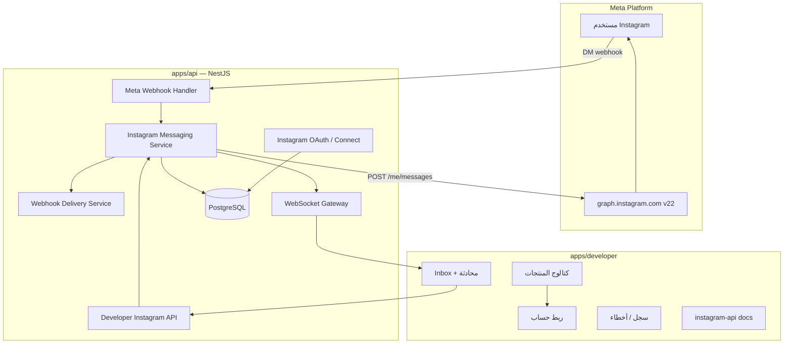

# 📸 خطة منتج Instagram Direct — لوحة المطوّر (Rukny Developers)

> **الهدف:** تمكين مطوّري ركني من تثبيت منتج **Instagram** على تطبيقهم، ربط حساب Instagram Professional، والرد على رسائل **Instagram Direct** (والتعليقات لاحقاً) من لوحة واحدة — مع API وWebhooks للتكامل البرمجي.

> **الحالة:** `coming_soon` في كتالوج المنتجات — **غير مُنفَّذ** كمنتج مطوّر (أبريل–أغسطس 2026)

> **مرتبط بـ:** `Documents/21/INSTAGRAM_BUSINESS_PLAN.md` (Business Hub)، `Documents/21/implementation_plan-INDEX` (Inbox موحّد)

---

## 📑 فهرس المحتويات

1. [نظرة عامة والرؤية](#1-نظرة-عامة-والرؤية)
2. [الوضع الحالي في الكود (As-Is)](#2-الوضع-الحالي-في-الكود-as-is)
3. [متطلبات Meta الإلزامية](#3-متطلبات-meta-الإلزامية)
4. [المميزات المستهدفة](#4-المميزات-المستهدفة)
5. [البنية المعمارية (To-Be)](#5-البنية-المعمارية-to-be)
6. [قاعدة البيانات](#6-قاعدة-البيانات)
7. [API Backend](#7-api-backend)
8. [Webhooks — Meta و المطوّر](#8-webhooks--meta-و-المطوّر)
9. [Developers Portal — الواجهة](#9-developers-portal--الواجهة)
10. [Instagram API للمطوّرين (مستقبلي)](#10-instagram-api-للمطوّرين-مستقبلي)
11. [التقنيات والبيئة](#11-التقنيات-والبيئة)
12. [الأمان والامتثال](#12-الأمان-والامتثال)
13. [إعادة استخدام نمط WhatsApp](#13-إعادة-استخدام-نمط-whatsapp)
14. [العلاقة مع المنتجات الأخرى](#14-العلاقة-مع-المنتجات-الأخرى)
15. [مراحل التنفيذ والتحسين](#15-مراحل-التنفيذ-والتحسين)
16. [هيكل الملفات المستهدف](#16-هيكل-الملفات-المستهدف)
17. [مخاطر وقرارات معلقة](#17-مخاطر-و-قرارات-معلقة)
18. [مراجع](#18-مراجع)

---

## 1. نظرة عامة والرؤية

### ما يقوله كتالوج المنتجات اليوم

في `apps/developer`، منتج **Instagram** موصوف بـ:

- **العربي:** «الرد على رسائل Instagram Direct من لوحة واحدة»
- **الإنجليزي:** «Reply to Instagram Direct messages from a single workspace»
- **الحالة:** `coming_soon` — لا يمكن التثبيت

### الرؤية كمنتج مطوّر

```
1. المطوّر ينشئ تطبيقاً على developers.rukny.io
2. يثبّت منتج Instagram من صفحة المنتجات
3. يربط حساب Instagram Professional (Business/Creator) عبر OAuth
4. يفتح Inbox داخل التطبيق ويرد على Direct
5. (لاحقاً) يرسل/يستقبل برمجياً عبر REST API + Webhooks
6. (لاحقاً) يدمج مع WhatsApp في لوحة موحّدة للقنوات
```

### الفرق بين «لوحة واحدة» و«تطبيق مطوّر»

| المفهوم | الوصف |
|---------|--------|
| **لوحة واحدة** | UX: كل محادثات IG (وحسابات متعددة) في مكان واحد دون التبديل بين تطبيقات Meta |
| **تطبيق مطوّر** | Tenancy: الربط والرسائل مرتبطة بـ `DeveloperApp` + `appId`، وليس بحساب Rukny الشخصي فقط |

المنتج المستهدف هنا هو **Instagram على `DeveloperApp`** (مثل WhatsApp Business)، وليس توسيع link-in-bio فقط.

---

## 2. الوضع الحالي في الكود (As-Is)

### ما هو مبني ويعمل

| المكوّن | المسار | النطاق | ملاحظات |
|---------|--------|--------|---------|
| Instagram OAuth + tokens | `apps/api/src/integrations/instagram/` | **User** (`userId`) | Instagram Login، Graph `v22.0` |
| REST API | `GET/POST /api/v1/integrations/instagram/*` | User | connections، media، blocks |
| تعليقات | sync + reply + webhook `comments` | User | جزئي |
| Webhook HMAC | `instagram-webhook.guard.ts` | Meta | تحقق توقيع |
| Link-in-bio | `apps/app/lib/links/instagram-oauth.ts` | User | profile_card / media_grid |
| Embed عام | `apps/public/.../instagram-rich-link.tsx` | Public | عرض بروفايل IG |
| أيقونة منتج | `apps/developer/public/products/instagram.svg` | Catalog | placeholder فقط |

**Scopes مطلوبة في OAuth الحالي:**

- `instagram_business_basic`
- `instagram_business_manage_messages` ← **مُطلب لكن غير مستخدم للـ DM**
- `instagram_business_manage_comments`
- `instagram_business_content_publish`

### ما هو غير مبني (الفجوة)

| المكوّن | الحالة |
|---------|--------|
| منتج قابل للتثبيت (`available`) | ❌ `coming_soon` |
| `/apps/[appId]/instagram/**` | ❌ لا توجد صفحات |
| `DeveloperInstagramAccount` | ❌ لا يوجد في Schema |
| Webhook حقل `messages` | ❌ غير معالج |
| إرسال DM (`POST /me/messages`) | ❌ لا يوجد |
| Inbox UI | ❌ مخطط في الوثائق فقط |
| API Keys + scopes `instagram:*` | ❌ |
| Dev webhooks `instagram.message.*` | ❌ |
| حزمة `@rukny/instagram` | ❌ |
| `apps/business` Instagram Hub | ❌ مخطط فقط |

### مشاكل تقنية يجب إصلاحها قبل التوسع

1. **`InstagramComment` في Prisma بدون migration** — الكود يفترض جدول `instagram_comments` قد لا يكون موجوداً على DB جديدة.
2. **OAuth redirect** يوجّه افتراضياً إلى `/app/instagram` — الصفحة **غير موجودة** في `apps/app`.
3. **`handleDeauthorize` / `data-deletion`** — stubs؛ غير كافية لمنتج messaging في App Review.
4. **Tenancy خاطئ للمنتج** — `InstagramConnection.userId` ≠ `DeveloperApp.id`.

### مقارنة سريعة: Instagram vs WhatsApp (المطوّر)

| | WhatsApp Business | Instagram (مستهدف) |
|--|-------------------|----------------------|
| حالة المنتج | `available` | `coming_soon` |
| نموذج الربط | WABA + Embedded Signup | Instagram Business Login OAuth |
| معرّف عام | `phoneId` (16 رقم) | `accountId` (16 رقم) — مقترح |
| مساحة عمل | `/whatsapp/phone-numbers/{phoneId}` | `/instagram/accounts/{accountId}` — مقترح |
| سجل رسائل | `WhatsappMessageLog` | `InstagramMessage` — مقترح |
| API عام | `whatsapp-api` + `@rukny/whatsapp` | `instagram-api` — لاحقاً |

---

## 3. متطلبات Meta الإلزامية

> [!CAUTION]
> بدون هذه المتطلبات لا يعمل Instagram Direct في الإنتاج.

| # | المتطلب | الحالة في ركني |
|---|---------|----------------|
| 1 | حساب Instagram **Professional** (Business/Creator) مرتبط بصفحة Facebook | على المستخدم/العميل |
| 2 | تطبيق Meta من نوع **Business** في [Meta Developer Portal](https://developers.facebook.com/) | `INSTAGRAM_APP_ID` |
| 3 | صلاحية **`instagram_business_manage_messages`** | مُطلبة في OAuth ✅ غير مفعّلة |
| 4 | Webhook HTTPS + **`X-Hub-Signature-256`** | Guard موجود ✅؛ اشتراك `messages` ❌ |
| 5 | **Meta App Review** للإنتاج | مطلوب + فيديو توضيحي |
| 6 | **نافذة 24 ساعة** للرد الحر | يجب تطبيقها في منطق الإرسال |

### نافذة 24 ساعة (Messaging Window)

- بعد آخر رسالة **من المستخدم**، يمكن للعمل إرسال رسائل **حرّة** خلال 24 ساعة.
- بعد انتهاء النافذة: إرسال مقيد (message tags معتمدة أو قوالب حيث ينطبق).
- **يجب** عرض حالة النافذة في UI وتعطيل زر الإرسال أو توجيه المستخدم.

### التطوير قبل App Review

- Meta تسمح عادة بـ **25 مستخدم تجريبي** على التطبيق دون مراجعة كاملة.
- Webhooks وإرسال الرسائل يجب اختبارها على حسابات تجريبية مضافة في App Dashboard.

---

## 4. المميزات المستهدفة

### 4.1 المرحلة 1 — MVP (Inbox + ربط)

| الميزة | الوصف |
|--------|--------|
| تثبيت المنتج | من `/apps/{appId}/products` → يظهر في الشريط الجانبي |
| ربط حساب IG | OAuth Instagram Login؛ تخزين token مشفّر |
| قائمة حسابات | حساب واحد أو أكثر لكل تطبيق (حسب الباقة) |
| Inbox | قائمة محادثات Direct مع آخر رسالة ووقتها |
| عرض محادثة | سجل الرسائل (نص + صور أساسية) |
| إرسال رد | نص خلال نافذة 24 ساعة |
| استقبال فوري | Webhook `messages` → DB → (اختياري) WebSocket |
| حالة الاتصال | متصل / منتهي التوكن / يحتاج إعادة ربط |

### 4.2 المرحلة 2 — تجربة لوحة احترافية

| الميزة | الوصف |
|--------|--------|
| غير مقروء / مقروء | `unreadCount`، mark as read |
| أرشفة / spam | `status` على المحادثة |
| وسوم | `tags[]` على المحادثة |
| بحث وفلترة | بالاسم، الوسم، التاريخ |
| إشعارات real-time | WebSocket gateway |
| ميديا | صور، فيديو، ملصقات (حسب Graph API) |
| سجل أخطاء | رسائل فاشلة + `errorCode` |
| تعيين لفريق | `assignedTo` (workspace member) |

### 4.3 المرحلة 3 — للمطوّرين (API)

| الميزة | الوصف |
|--------|--------|
| REST API | إرسال رسالة، قائمة محادثات، قراءة سجل |
| API Keys | scopes: `instagram:read`, `instagram:send` |
| Dev Webhooks | `instagram.message.received`, `instagram.message.sent`, … |
| Rate limiting | per app / per recipient |
| SDK | `@rukny/instagram` + OpenAPI |
| صفحة توثيق | `/apps/{appId}/instagram-api` (مثل whatsapp-api) |

### 4.4 المرحلة 4 — توسع

| الميزة | الوصف |
|--------|--------|
| تعليقات في نفس اللوحة | توحيد DM + comments |
| AI اقتراح رد | (مذكور في `implementation_plan-INDEX`) |
| قنوات موحّدة | IG + WhatsApp + Messenger في inbox واحد |
| حملات / قوالب | حيث يسمح Meta |
| Insights | `instagram_business_manage_insights` |

---

## 5. البنية المعمارية (To-Be)



### مبادئ التصميم

1. **فصل Tenancy:** `DeveloperApp` → `DeveloperInstagramAccount` (لا إعادة استخدام `InstagramConnection` للمنتج).
2. **فصل المنتجات:** link-in-bio (`User`) ≠ منتج المطوّر (`DeveloperApp`).
3. **صلاحيات تدريجية:** لا تطلب scopes في OAuth قبل وجود ميزة + فيديو App Review.
4. **تشفير التوكن:** AES-256-GCM (نفس `TokenEncryptionService` / WhatsApp).
5. **معرّف عام رقمي:** `accountId` 16 رقم للروابط (نفس `appId` / `phoneId`).

---

## 6. قاعدة البيانات

### 6.1 نماذج جديدة (مقترحة)

```prisma
/// حساب Instagram Professional مربوط بتطبيق مطوّر
model DeveloperInstagramAccount {
  id                   String   @id @default(uuid())
  accountId            String   @unique /// معرّف عام 16 رقم للروابط
  userId               String
  developerAppId       String
  igUserId             String   /// Instagram-scoped user id
  username             String?
  name                 String?
  profilePictureUrl    String?
  accountType          String?  /// BUSINESS | MEDIA_CREATOR
  status               String   @default("ACTIVE") /// ACTIVE | DISCONNECTED | TOKEN_EXPIRED
  accessTokenEncrypted String?
  tokenExpiresAt       DateTime?
  webhookSubscribed    Boolean  @default(false)
  connectedAt          DateTime?
  disconnectedAt       DateTime?
  metadata             Json?
  createdAt            DateTime @default(now())
  updatedAt            DateTime @updatedAt

  user         User         @relation(...)
  developerApp DeveloperApp @relation(...)
  conversations InstagramConversation[]
  messageLogs   InstagramMessageLog[]

  @@unique([developerAppId, igUserId])
  @@index([developerAppId])
  @@index([accountId])
  @@map("developer_instagram_accounts")
}

model InstagramConversation {
  id               String   @id @default(uuid())
  accountId        String   /// FK → DeveloperInstagramAccount.id (internal uuid)
  participantIgId  String
  participantName  String?
  participantPic   String?
  lastMessageAt    DateTime @default(now())
  lastMessageText  String?
  unreadCount      Int      @default(0)
  status           String   @default("open") /// open | archived | spam
  tags             String[] @default([])
  assignedTo       String?
  messagingWindowExpiresAt DateTime? /// نهاية نافذة 24 ساعة
  createdAt        DateTime @default(now())
  updatedAt        DateTime @updatedAt

  account  DeveloperInstagramAccount @relation(...)
  messages InstagramMessageLog[]

  @@unique([accountId, participantIgId])
  @@index([accountId, lastMessageAt])
  @@map("instagram_conversations")
}

model InstagramMessageLog {
  id                String   @id @default(uuid())
  userId            String
  accountId         String   /// DeveloperInstagramAccount.id
  conversationId    String?
  apiKeyId          String?
  direction         String   /// INBOUND | OUTBOUND
  messageType       String   /// text | image | video | story_reply | ...
  status            String   /// sent | delivered | read | failed
  metaMessageId     String?  @unique
  participantIgId   String
  text              String?
  mediaUrl          String?
  mediaType         String?
  errorCode         String?
  errorMessage      String?
  rawPayload        Json?
  sentAt            DateTime?
  deliveredAt       DateTime?
  readAt            DateTime?
  failedAt          DateTime?
  createdAt         DateTime @default(now())

  account      DeveloperInstagramAccount @relation(...)
  conversation InstagramConversation?    @relation(...)
  apiKey       DeveloperApiKey?          @relation(...)

  @@index([accountId, createdAt])
  @@index([conversationId])
  @@map("instagram_message_logs")
}
```

### 6.2 نماذج موجودة (لا تدمج للمنتج)

| Model | Table | الاستخدام الحالي |
|-------|-------|------------------|
| `InstagramConnection` | `instagram_connections` | User link-in-bio |
| `InstagramBlock` | `instagram_blocks` | Grid/Feed blocks |
| `InstagramComment` | `instagram_comments` | تعليقات (migration ناقص) |

### 6.3 تثبيت المنتج

يستخدم الجدول الموجود `developer_app_products` (`productId = 'instagram'`).

---

## 7. API Backend

### 7.1 وحدة جديدة مقترحة

```
apps/api/src/domain/instagram-provider/
├── accounts/
│   ├── instagram-accounts.controller.ts    # JWT developer
│   ├── instagram-accounts.service.ts
│   └── dto/
├── messaging/
│   ├── instagram-messaging.controller.ts     # API Key (لاحقاً)
│   ├── instagram-messaging.service.ts
│   └── dto/
├── webhooks/
│   ├── meta-instagram-webhook.controller.ts  # أو توسيع integrations
│   └── meta-instagram-webhook.service.ts
├── inbox/
│   ├── inbox.controller.ts
│   └── inbox.service.ts
└── shared/
    ├── instagram-graph.client.ts
    └── instagram-id.util.ts                  # generateNumericPublicId
```

### 7.2 Endpoints — لوحة المطوّر (JWT)

| Method | Path | الوصف |
|--------|------|--------|
| `GET` | `/api/v1/developer/instagram/connect-url` | URL OAuth مع `appId` |
| `GET` | `/api/v1/developer/instagram/callback` | استبدال code + إنشاء account |
| `GET` | `/api/v1/developer/instagram/accounts?appId=` | قائمة الحسابات |
| `GET` | `/api/v1/developer/instagram/accounts/:accountId` | تفاصيل |
| `DELETE` | `/api/v1/developer/instagram/accounts/:id` | فك الربط |
| `POST` | `/api/v1/developer/instagram/accounts/:id/refresh` | مزامنة بروفايل |
| `GET` | `/api/v1/developer/instagram/conversations?appId=&accountId=` | Inbox |
| `GET` | `/api/v1/developer/instagram/conversations/:id/messages` | سجل محادثة |
| `POST` | `/api/v1/developer/instagram/conversations/:id/messages` | إرسال رد |
| `POST` | `/api/v1/developer/instagram/conversations/:id/read` | تعليم كمقروء |

`:accountId` في URL العام = `accountId` الـ 16 رقم؛ الداخلية تُحلّ مثل `phoneId` في WhatsApp.

### 7.3 إرسال رسالة — Graph API

```http
POST https://graph.instagram.com/v22.0/me/messages
Authorization: Bearer {access_token}
Content-Type: application/json

{
  "recipient": { "id": "{participant_ig_id}" },
  "message": { "text": "مرحباً!" }
}
```

**ملاحظات:**

- استخدم token الحساب المربوط (long-lived).
- تحقق من `messagingWindowExpiresAt` قبل الإرسال.
- سجّل النتيجة في `InstagramMessageLog`.

### 7.4 Endpoints — API Key (مرحلة 3)

| Method | Path | Scope |
|--------|------|-------|
| `POST` | `/api/v1/instagram/messages` | `instagram:send` |
| `GET` | `/api/v1/instagram/conversations` | `instagram:read` |
| `GET` | `/api/v1/instagram/messages/:id` | `instagram:read` |

---

## 8. Webhooks — Meta و المطوّر

### 8.1 Meta Webhook

**الموجود:** `GET/POST /api/v1/integrations/instagram/webhook` مع HMAC guard.

**المطلوب:**

1. الاشتراك في حقل **`messages`** في App Dashboard.
2. معالجة payload:

| حقل Meta | الإجراء |
|----------|---------|
| `messages` | إنشاء `InstagramMessageLog` INBOUND + تحديث `InstagramConversation` |
| `messaging_postbacks` | تسجيل + إشعار UI |
| `message_reads` | تحديث `readAt` |
| `comments` | (موجود جزئياً) — مرحلة لاحقة للتوحيد |

**Verification (GET):**

- `hub.mode=subscribe`
- `hub.verify_token` = `INSTAGRAM_WEBHOOK_VERIFY_TOKEN`
- الرد: `hub.challenge` كنص خام

### 8.2 Webhooks للمطوّر (fan-out)

إعادة استخدام `WebhookDeliveryService` مع أحداث جديدة:

| eventType | متى |
|-----------|-----|
| `instagram.message.received` | رسالة واردة |
| `instagram.message.sent` | إرسال ناجح |
| `instagram.message.failed` | فشل إرسال |
| `instagram.message.read` | قراءة (اختياري) |

---

## 9. Developers Portal — الواجهة

### 9.1 كتالوج المنتجات

**الملف:** `apps/developer/lib/developer-products.ts`

```typescript
{
  id: 'instagram',
  status: 'available',  // بعد MVP
  resolveHref: (appId) => appInstagram(appId),
}
```

**الملف:** `apps/api/src/domain/developer/products/developer-product-catalog.ts` — نفس التحديث.

### 9.2 مسارات الواجهة (مقترحة)

```
/apps/{appId}/instagram/                          نظرة عامة + ربط
/apps/{appId}/instagram/accounts/                 اختيار حساب (مثل phone-numbers)
/apps/{appId}/instagram/accounts/{accountId}/     مساحة الحساب
/apps/{appId}/instagram/accounts/{accountId}/inbox
/apps/{appId}/instagram/accounts/{accountId}/logs
/apps/{appId}/instagram/accounts/{accountId}/errors
/apps/{appId}/instagram/webhooks                  (اختياري — مشترك أو per-account)
```

### 9.3 مكونات (مقترحة)

| المكون | الوظيفة |
|--------|---------|
| `instagram-chrome.tsx` | تبويبات مستوى الحساب |
| `instagram-connect-button.tsx` | OAuth |
| `instagram-account-picker.tsx` | بطاقات اختيار حساب |
| `instagram-inbox-panel.tsx` | قائمة محادثات |
| `instagram-chat-panel.tsx` | فقاعات + إدخال |
| `instagram-logs-panel.tsx` | سجل (مثل WhatsApp) |

### 9.4 Real-time

- Namespace WebSocket: `/instagram-inbox` (مخطط في `implementation_plan-INDEX`)
- أحداث: `conversation.updated`, `message.new`

---

## 10. Instagram API للمطوّرين (مستقبلي)

مرآة `whatsapp-api`:

| القسم | المحتوى |
|-------|---------|
| Auth | API Keys، scopes |
| Messages | إرسال نص/ميديا |
| Webhooks | الأحداث والتوقيع |
| Errors | رموز Meta الشائعة |
| Try it | sandbox مع حساب مربوط |
| SDKs | `@rukny/instagram` |

**حزمة:** `packages/instagram/` — OpenAPI `public-v1.yaml`، `src/messages.ts`, `src/webhooks.ts`.

---

## 11. التقنيات والبيئة

### Stack

| الطبقة | التقنية |
|--------|---------|
| API | NestJS 11، Prisma، PostgreSQL |
| OAuth | Instagram Login (`instagram.com/oauth/authorize`) |
| Graph | `https://graph.instagram.com/v22.0` |
| Tokens | Long-lived؛ تخزين مشفّر |
| Webhooks | HMAC-SHA256 `X-Hub-Signature-256` |
| Portal | Next.js 16، React Query، Tailwind |
| Real-time | Socket.io / Nest Gateway |
| Cache | Redis (OAuth state — مقترح لتحسين الأمان) |

### متغيرات البيئة

| Variable | الوصف |
|----------|--------|
| `INSTAGRAM_APP_ID` | Meta App ID |
| `INSTAGRAM_APP_SECRET` | Secret + webhook HMAC |
| `INSTAGRAM_REDIRECT_URI` | Callback OAuth |
| `INSTAGRAM_WEBHOOK_VERIFY_TOKEN` | تحقق Meta challenge |
| `JWT_SECRET` | Portal edge auth |
| `DATABASE_URL` | PostgreSQL |
| `REDIS_URL` | OAuth state (مقترح) |

**موجود في:** `apps/api/.env.example`, `docker-compose.rukny-dev.yml`

### OAuth — تحسينات مقترحة

| الحالي | المستهدف |
|--------|----------|
| state = base64(userId) | state موقّع + Redis TTL (مثل Business Hub plan) |
| redirect إلى `/app/instagram` | redirect إلى `/apps/{appId}/instagram` |
| scopes كثيرة دفعة واحدة | scopes تدريجية حسب الميزة |

---

## 12. الأمان والامتثال

### أمان

- تشفير `accessTokenEncrypted` (AES-256-GCM).
- التحقق من أن `accountId` يخص `developerAppId` + `userId` في كل طلب.
- API Key scopes وrate limits.
- لا تخزين محتوى ميديا حساس بدون حاجة — URLs من Meta مع TTL.
- CSRF-safe OAuth state.

### Meta compliance

| المتطلب | الإجراء |
|---------|---------|
| Deauthorize callback | حذف/تعطيل `DeveloperInstagramAccount` + tokens |
| Data deletion | حذف بيانات المستخدم عند الطلب |
| App Review | فيديو يوضح: استلام DM → replying من لوحة ركني |
| 24h window | UI + API validation |

---

## 13. إعادة استخدام نمط WhatsApp

| WhatsApp | Instagram |
|----------|-----------|
| `DeveloperWhatsappAccount` | `DeveloperInstagramAccount` |
| `DeveloperPhoneNumber` + `phoneId` | حساب IG واحد = رقم واحد (لا فروع أرقام) |
| `whatsapp/phone-numbers/{phoneId}` | `instagram/accounts/{accountId}` |
| `WabaService.connect()` | `InstagramAccountsService.connect()` |
| `meta-webhook.service.ts` | `meta-instagram-webhook.service.ts` |
| `messaging-security.service.ts` | نافذة 24h + ownership |
| `dev-webhooks` + delivery logs | نفس الأحداث ببادئة `instagram.` |
| `developer-rate-limit.service.ts` | نفس الخدمة |
| `public-id.util.ts` | `accountId` generation |
| `whatsapp-chrome.tsx` | `instagram-chrome.tsx` |
| `packages/whatsapp` | `packages/instagram` |
| `requireProductInstalled(appId, 'whatsapp')` | `requireProductInstalled(appId, 'instagram')` |

---

## 14. العلاقة مع المنتجات الأخرى

### كتالوج المطوّر (`apps/developer`)

| المنتج | الحالة | العلاقة مع Instagram |
|--------|--------|----------------------|
| Forms | متاح | لا تبعية |
| WhatsApp API | متاح | قنوات مراسلة متوازية؛ inbox موحّد لاحقاً |
| WhatsApp Business | متاح | نفس المطوّر قد يثبت الاثنين |
| Messenger | قريباً | نفس Graph messaging patterns |
| Email API | قريباً | منفصل |

### `apps/business` (Business Hub)

- الوثيقة `INSTAGRAM_BUSINESS_PLAN.md` تخطط لـ `/app/instagram` لصاحب العمل.
- **التوصية:** بناء **منتج المطوّر أولاً** (`DeveloperApp`)؛ Business Hub يستهلك نفس API أو يعرض inbox مجمّع لاحقاً.

### link-in-bio (`apps/app`)

- يبقى على `InstagramConnection` (User-scoped).
- لا دمج DB مع منتج المطوّر.

---

## 15. مراحل التنفيذ والتحسين

### المرحلة 0 — إصلاحات (1–2 أسبوع)

- [ ] Migration لـ `instagram_comments` أو إزالة النموذج إن لم يُستخدم
- [ ] إكمال deauthorize + data-deletion
- [ ] تصحيح OAuth redirect للمنتج المطوّر
- [ ] OAuth state موقّع (Redis)

### المرحلة 1 — MVP Inbox (3–4 أسابيع)

- [ ] Schema: `DeveloperInstagramAccount`, `InstagramConversation`, `InstagramMessageLog`
- [ ] Migration + backfill `accountId`
- [ ] Webhook: معالجة `messages`
- [ ] Messaging service: send + persist
- [ ] JWT API: accounts, conversations, send
- [ ] Portal: install product + connect + inbox بسيط
- [ ] `instagram: { status: 'available' }` في الكتالوج

**معيار النجاح:** مطوّر يثبت المنتج، يربط IG، يستقبل DM، يرد خلال 24h.

### المرحلة 2 — UX + موثوقية (2–3 أسابيع)

- [ ] WebSocket real-time
- [ ] unread / archive / tags
- [ ] سجل أخطاء + pagination
- [ ] ميديا في المحادثة
- [ ] اختيار حساب متعدد (`accounts` picker)

### المرحلة 3 — Developer API (3–4 أسابيع)

- [ ] API Key scopes `instagram:*`
- [ ] Public messaging endpoints
- [ ] Dev webhook events
- [ ] `packages/instagram` + `instagram-api` docs
- [ ] Try-it panel

### المرحلة 4 — App Review + توسع (مستمر)

- [ ] فيديو App Review لـ `manage_messages`
- [ ] تعليقات في Inbox
- [ ] AI reply suggestions
- [ ] Inbox متعدد القنوات (IG + WhatsApp)

---

## 16. هيكل الملفات المستهدف

```
rukny-v1/
├── apps/api/
│   ├── prisma/
│   │   ├── schema.prisma                    # + DeveloperInstagram*
│   │   └── migrations/..._instagram_developer_product/
│   └── src/
│       ├── integrations/instagram/          # يبقى لـ link-in-bio (User)
│       └── domain/instagram-provider/     # NEW — منتج المطوّر
├── apps/developer/
│   ├── lib/
│   │   ├── developer-products.ts            # instagram → available
│   │   ├── instagram-routes.ts              # NEW
│   │   └── app-routes.ts                    # appInstagram()
│   ├── app/(portal)/apps/[appId]/instagram/ # NEW pages
│   ├── components/instagram/                # NEW panels
│   └── hooks/use-instagram.ts               # NEW
├── packages/instagram/                        # مرحلة 3
└── Documents/Tech Provider Instagram/
    └── INSTAGRAM_DEVELOPER_PRODUCT_PLAN.md    # هذا المستند
```

---

## 17. مخاطر و قرارات معلقة

| # | السؤال | توصية |
|---|--------|--------|
| 1 | Developer portal vs `apps/business` للInbox؟ | **Developer أولاً**؛ Business Hub لاحقاً |
| 2 | حساب IG واحد أو متعدد per app؟ | متعدد (مثل أرقام WhatsApp) مع حدود الباقة |
| 3 | دمج `InstagramConnection` القديم؟ | **لا** — tenancy مختلف |
| 4 | `db push` vs `migrate deploy` في Docker dev؟ | migrations مع backfill SQL (مثل `phoneId`) |
| 5 | Graph API version | `v22.0` (متوافق مع الكود الحالي) |

---

## 18. مراجع

### وثائق داخلية

| المستند | المسار |
|---------|--------|
| Instagram Business Hub | `Documents/21/INSTAGRAM_BUSINESS_PLAN.md` |
| Inbox موحّد (تفصيل webhook) | `Documents/21/implementation_plan-INDEX` |
| خطة WhatsApp Tech Provider | `Documents/Tech Provider WhatsApp/WHATSAPP_TECH_PROVIDER_PLAN.md` |
| كتالوج المنتجات (كود) | `apps/developer/lib/developer-products.ts` |
| Instagram integration (كود) | `apps/api/src/integrations/instagram/` |

### Meta

- [Instagram API with Instagram Login](https://developers.facebook.com/docs/instagram-platform/instagram-api-with-instagram-login)
- [Instagram Messaging](https://developers.facebook.com/docs/instagram-platform/instagram-api-with-instagram-login/messaging)
- [Webhooks for Instagram](https://developers.facebook.com/docs/instagram-platform/webhooks)

---

**آخر تحديث:** أغسطس 2026  
**المسؤول عن المنتج:** منصة المطوّرين — Rukny  
**الحالة:** وثيقة تخطيط — جاهزة للتنفيذ من المرحلة 0
