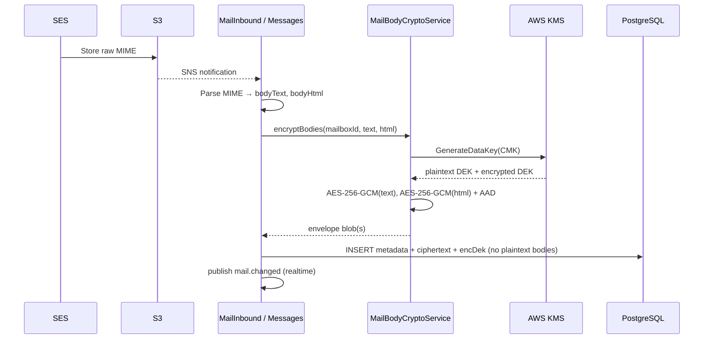
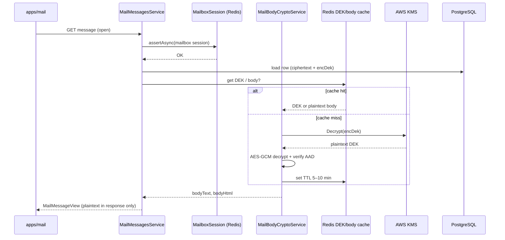

# Document 2: Technical Implementation Plan

**Service:** Rukny Mail  
**Document ID:** `TIP-MAIL-ENC-001`  
**Document Version:** `1.0`  
**Status:** `Draft — Pending Review`  
**Classification:** Internal — Confidential  
**Parent CRD:** [Document 1 — CRD-MAIL-ENC-001](./01-change-request-document.md)  
**Related docs:** Document 3 (Migration Plan), Document 4 (Risk Assessment), Document 5 (Timeline & Resources), Document 6 (Communication Plan)

---

## 1. Architecture Changes

### 1.1 Design Goals (Locked from CRD)

| Goal | Implementation choice |
|------|------------------------|
| Encrypt message bodies at rest | AES-256-GCM via AWS KMS envelope encryption |
| Keep list/search usable | Metadata + `snippet` remain plaintext; **lazy decrypt on open only** |
| No master keys in DB | CMK lives in AWS KMS; only encrypted DEKs stored with ciphertext |
| Gate plaintext in app memory | Decrypt only after MailApp ACL + Redis mailbox session |
| Phased rollout | Per-`MailApp` feature flag (see §3.5, Document 3) |

### 1.2 Current Architecture (Before)

```text
                    ┌─────────────┐
  SES Inbound ─────►│ S3 raw MIME │
                    └──────┬──────┘
                           │ SNS webhook
                           ▼
┌──────────┐    ┌─────────────────────┐    ┌──────────────────┐
│ apps/mail│───►│ apps/api Mail domain│───►│ PostgreSQL       │
│ webmail  │◄───│ messages/inbound/SES│◄───│ bodyText/bodyHtml│
└──────────┘    └─────────┬───────────┘    │ (PLAINTEXT)      │
                          │                └──────────────────┘
                    ┌─────▼─────┐
                    │ Redis     │
                    │ mbx sess  │
                    └───────────┘
```

**Problem:** Application and DB operators with SQL access can read full bodies.

### 1.3 Target Architecture (After)

```text
                    ┌─────────────┐
  SES Inbound ─────►│ S3 raw MIME │  (+ SSE-KMS recommended)
                    └──────┬──────┘
                           │ SNS webhook
                           ▼
┌──────────┐    ┌──────────────────────────┐     ┌────────────────────────────┐
│ apps/mail│───►│ apps/api Mail domain     │────►│ PostgreSQL                 │
│ webmail  │◄───│ + MailBodyCryptoService  │◄────│ metadata + snippet         │
└──────────┘    │ + envelope encrypt/decrypt│     │ bodyCiphertext / bodyEnc*  │
                └──────────┬───────────────┘     └────────────────────────────┘
                     │     │
           ┌─────────▼─┐ ┌─▼──────────────┐
           │ Redis     │ │ AWS KMS (CMK)  │
           │ session + │ │ GenerateDataKey│
           │ DEK cache │ │ Decrypt (DEK)  │
           │ (TTL)     │ └────────────────┘
           └───────────┘
```

**Optional later (same crypto envelope):** large bodies / attachments as S3 objects with SSE-KMS; Postgres holds pointer + encrypted DEK metadata.

### 1.4 Component-Level Changes

| Layer | Change |
|-------|--------|
| **Database** | Add ciphertext / envelope columns; deprecate plaintext `bodyText`/`bodyHtml` after migration (Document 3) |
| **API — crypto** | New `MailBodyCryptoService` (encrypt, decrypt, rewrap) |
| **API — ingest** | `MailInboundService.storeInboundMessage` encrypts before `prisma.mailMessage.create` |
| **API — send** | `MailMessagesService.send` encrypts before persist |
| **API — read** | `getOne` / export decrypt; `list` returns metadata + snippet only (no body decrypt) |
| **API — flags** | Extend `MailFeatureFlags` / per-app flag for encryption enablement |
| **Redis** | Short-TTL cache for unwrapped DEK (and optionally decrypted body) keyed by message/mailbox |
| **KMS** | CMK in `eu-north-1`, IAM on API task role, CloudTrail |
| **S3** | Align raw MIME bucket SSE-KMS; reserved path for encrypted attachment objects |
| **Webmail** | No UX change if API `toView()` still returns plaintext bodies after authorized decrypt |
| **Backups** | Post-cutover backups contain ciphertext; restore requires KMS |

### 1.5 Data Flow — Encryption (Write / Ingest)



### 1.6 Data Flow — Decryption (Read / Open)



**Note:** List endpoints must **not** call decrypt for every row. Reader card uses `getMailMessage` (existing pattern in `mail-inbox-shell.tsx`).

---

## 2. Database Schema Changes

### 2.1 Current Schema (Relevant Excerpt)

Source: `apps/api/prisma/schema.prisma` → model `MailMessage` / table `mail_messages`

| Column | Type | Today |
|--------|------|--------|
| `bodyText` | `Text?` | Plaintext |
| `bodyHtml` | `Text?` | Plaintext |
| `snippet` | `String?` | Plaintext preview (≤ ~200 chars) |
| `rawS3Key` | `String?` | Pointer to inbound MIME in S3 |

Metadata (`subject`, addresses, `folder`, flags, auth verdicts, etc.) unchanged in v1.

### 2.2 Target Schema

**Recommended approach:** store one **envelope JSON/bytea** per body field (or a single combined envelope), plus crypto metadata. Keep plaintext columns nullable during migration only.

#### 2.2.1 Proposed Prisma fields (illustrative)

```prisma
model MailMessage {
  // ... existing metadata fields unchanged ...

  /// Legacy plaintext — nullable during migration; NULL after cutover
  bodyText String? @db.Text
  bodyHtml String? @db.Text

  /// Encryption state: NONE | ENCRYPTED | MIGRATING
  bodyCryptoStatus MailBodyCryptoStatus @default(NONE)
  /// Envelope format version (e.g. 1 = AES-256-GCM + KMS DEK)
  bodyCryptoVersion Int?
  /// KMS key id / ARN used to wrap the DEK (rotation tracking)
  bodyKmsKeyId String?
  /// Base64 (or Bytes) KMS-encrypted data key
  bodyEncryptedDek Bytes?
  /// AES-GCM ciphertext for bodyText (includes nonce+tag per encoding convention)
  bodyTextCiphertext Bytes?
  /// AES-GCM ciphertext for bodyHtml
  bodyHtmlCiphertext Bytes?

  snippet String?
  rawS3Key String?
  // ...
}

enum MailBodyCryptoStatus {
  NONE
  ENCRYPTED
  MIGRATING
}
```

**Encoding convention (lock in implementation):**

| Element | Convention |
|---------|------------|
| Ciphertext blob | `nonce (12 bytes) \|\| ciphertext \|\| authTag (16 bytes)` **or** separate columns — pick one and document in code |
| AAD | UTF-8 string: `mailMessage:{messageId}:bodyText` / `...:bodyHtml` + `mailboxId` |
| Empty body | Store empty ciphertext or explicit null with status `ENCRYPTED` and empty payload — define once |

#### 2.2.2 Attachment readiness (in scope as hooks)

Reserve (may ship empty / unused until attachments land):

```prisma
// Future model sketch — do not leave plaintext-by-default
model MailAttachment {
  id           String @id @default(uuid())
  messageId    String
  filename     String
  contentType  String
  sizeBytes    Int
  s3Key        String
  cryptoStatus MailBodyCryptoStatus
  encryptedDek Bytes?
  kmsKeyId     String?
  // ...
}
```

### 2.3 Migration Script Requirements

Full procedure in **Document 3**. Schema migration requirements:

1. **Additive migration first:** add crypto columns + enum; do not drop plaintext yet.
2. **Backfill job:** encrypt rows where `bodyCryptoStatus = NONE` and plaintext present → write ciphertext → set `ENCRYPTED` → null plaintext (or dual-read window).
3. **Verification:** row counts, checksum sample (hash of plaintext before encrypt vs decrypt round-trip), null-plaintext audit.
4. **Drop migration (final):** remove reliance on `bodyText`/`bodyHtml` plaintext in app; optionally drop columns in a later release after soak.

### 2.4 Rollback Script Requirements

| Phase | Rollback action |
|-------|-----------------|
| Pre-cutover (dual-read) | Disable feature flag; continue serving plaintext columns |
| Post-encrypt, plaintext still present | Revert flag; ignore ciphertext |
| Post-plaintext-nulling | Restore from pre-migration backup **or** decrypt-all job writing plaintext back (requires KMS) — see Document 3 |
| Schema | Down migration drops crypto columns only if no production dependency |

**Hard rule:** Never run irreversible plaintext wipe without verified backup + decrypt verification report.

### 2.5 Index Changes

| Index | Change |
|-------|--------|
| Existing `[mailboxId, folder, createdAt]`, `[mailboxId, folder, isRead]`, etc. | **No change** (metadata) |
| Ciphertext columns | **Do not** btree-index large bytea blobs |
| Optional | Partial index / filter on `bodyCryptoStatus` for migration progress queries only |

---

## 3. Application Code Changes

### 3.1 Email Receiving Flow (Encrypt on Ingest)

**Primary module:** `apps/api/src/domain/mail/mail-inbound.service.ts`

1. Existing: SNS → S3 get → `simpleParser` → resolve mailbox → classify → create.
2. **New:** Before `prisma.mailMessage.create`:
   - If encryption enabled for owning `MailApp`: call `MailBodyCryptoService.encryptPair(...)`.
   - Persist ciphertext fields; set `bodyCryptoStatus = ENCRYPTED`; leave plaintext null (or dual-write during Phase A).
3. Storage quota (`mail-storage.util.ts`): decide whether `utf8StorageBytes` uses **plaintext length** (fair quota) or ciphertext length — **recommend count plaintext UTF-8 bytes before encrypt** for stable billing UX.
4. Realtime publish unchanged (event should not include body).

### 3.2 Email Display Flow (Decrypt on Read)

**Primary module:** `apps/api/src/domain/mail/mail-messages.service.ts`

| Method | Behavior |
|--------|----------|
| `list()` | Return metadata + `snippet` only; **do not decrypt** bodies; omit or null body fields in list DTO if needed for perf |
| `getOne()` | Assert mailbox session → load row → decrypt if `ENCRYPTED` → `toView()` with plaintext bodies for UI |
| `counts()` / `update()` / `remove()` | No body decrypt required |

**Frontend:** `apps/mail/components/inbox/mail-inbox-shell.tsx`, `mail-html-body.tsx`, `lib/mail-messages-client.ts` — expect same `MailMessageView` shape after decrypt; handle `BODY_DECRYPT_FAILED` error state.

### 3.3 Email Search Flow (Metadata-Only)

- Keep current behavior: API list + client filter; **no full-text decrypt search** in v1 (CRD §3.2 / §4.3).
- `snippet` + `subject` + `fromAddress` remain searchable metadata.
- Document limitation for enterprise FAQ (Document 6).

### 3.4 Email Export / Download Flow

- Any future or existing export/log path that materializes bodies must call the same decrypt helper under ACL + session.
- `listLogs()` and admin tooling must **not** dump bodies by default.
- Raw MIME download from S3 (if exposed later) is a separate sensitivity path (SSE-KMS + authz).

### 3.5 Feature Flag

Extend existing pattern in `mail-feature-flags.ts` **and/or** per-app DB/config flag:

| Flag | Purpose |
|------|---------|
| `MAIL_BODY_ENCRYPTION_ENABLED` (env global kill switch) | Hard off in emergency |
| Per-`MailApp` `bodyEncryptionEnabled` (recommended) | Phased rollout (Document 3) |

### 3.6 Code Modules Affected (Checklist)

#### Create (new)

| Path | Role |
|------|------|
| `apps/api/src/domain/mail/crypto/mail-body-crypto.service.ts` | Envelope encrypt/decrypt, AAD, versioning |
| `apps/api/src/domain/mail/crypto/mail-body-crypto.types.ts` | Envelope types, status enums mapping |
| `apps/api/src/domain/mail/crypto/mail-kms.client.ts` | Thin AWS KMS SDK wrapper |
| `apps/api/src/domain/mail/crypto/mail-body-crypto.service.spec.ts` | Unit tests |
| `apps/api/src/domain/mail/crypto/mail-body-migration.job.ts` (or CLI) | Backfill worker (Document 3) |

#### Modify (existing)

| Path | Role |
|------|------|
| `apps/api/prisma/schema.prisma` | Columns + enum |
| `apps/api/src/domain/mail/mail.module.ts` | Register crypto providers |
| `apps/api/src/domain/mail/mail-inbound.service.ts` | Encrypt on store |
| `apps/api/src/domain/mail/mail-messages.service.ts` | Decrypt on get; list without bodies |
| `apps/api/src/domain/mail/mail-messages.controller.ts` | Error mapping if needed |
| `apps/api/src/domain/mail/dto/mail-message.dto.ts` | Additive fields if exposed |
| `apps/api/src/domain/mail/mail-storage.util.ts` | Quota accounting policy |
| `apps/api/src/domain/mail/mail-feature-flags.ts` | Global flag |
| `apps/api/src/domain/mail/mail-apps.service.ts` / DTO | Per-app enablement |
| `apps/api/src/domain/mail/mail-ses.service.ts` / `mail-raw-mime.util.ts` | Ensure send path does not re-persist plaintext unexpectedly |
| `apps/api/src/domain/mail/mail-auto-reply.service.ts` / `mail-forwarder.service.ts` | If they read bodies, use decrypt helper |
| `apps/mail/lib/mail-messages-client.ts` | Types / error codes if additive |
| Infra / env templates | `MAIL_KMS_KEY_ID`, flag env vars |

#### Tests to extend

| Path | Role |
|------|------|
| `mail-messages.service.spec.ts` | List no KMS; getOne decrypt; authz |
| `mail-inbound` tests (add if missing) | Encrypt on ingest |
| New crypto unit + integration tests | Round-trip, bad AAD, wrong mailbox |

---

## 4. Key Management Implementation

### 4.1 AWS KMS Setup

| Item | Spec |
|------|------|
| Region | `eu-north-1` (Stockholm) |
| Key type | Customer Managed Key (CMK), symmetric |
| Key alias | e.g. `alias/rukny-mail-body-encryption` |
| Rotation | Enable **automatic annual rotation** on CMK |
| Usage | `GenerateDataKey`, `Decrypt`, `Encrypt` (rewrap if needed) |
| Logging | CloudTrail data events for KMS (account policy) |

**IAM (API task role) — least privilege example:**

- `kms:GenerateDataKey`, `kms:Decrypt`, `kms:DescribeKey` on the Mail body CMK ARN only  
- Deny from roles that only need DB ops / analytics  

**Key policy:** Trust account root + API role; optional break-glass admin role with dual control (Document 4).

### 4.2 Envelope + Optional HKDF Strategy

**v1 recommended (simpler, meets CRD):**

1. Per message (or per body field): `GenerateDataKey` → encrypt body with DEK → store `encryptedDek` + ciphertext.  
2. AAD binds ciphertext to `mailboxId` + `messageId` + field name.

**Optional hierarchy (if Security prefers fewer KMS GenerateDataKey calls):**

1. Mailbox-scoped key: KMS-wrapped mailbox DEK stored on `MailMailbox` (encrypted blob only).  
2. Per-message keys derived via **HKDF-SHA256** with info/context = `mailboxId || messageId || "body"`.  
3. Plaintext mailbox DEK cached in Redis TTL; **never** store plaintext DEK in PostgreSQL.

**Decision for implementation kickoff:** Default to **per-message KMS data key** unless load tests show KMS cost/latency pressure; then adopt mailbox-scoped + HKDF (Document 4 residual / perf mitigation).

### 4.3 Key Caching Strategy (Redis)

| Cache entry | Key pattern (example) | TTL | Contents |
|-------------|----------------------|-----|----------|
| Unwrapped DEK | `mail:body-dek:{messageId}` | **5–10 min** | DEK bytes (memory-only Redis; no disk persistence preferred) |
| Decrypted body (optional) | `mail:body-pt:{messageId}` | **5–10 min** | text/html — **higher sensitivity**; prefer DEK-only cache first |
| Negative cache | short TTL on decrypt fail | 30–60s | Avoid KMS stampede |

**Rules:**

- Cache only after successful mailbox session path.  
- Evict on mailbox session end / lock if feasible.  
- Redis AUTH + TLS in production; do not treat Redis as durable secret store.

### 4.4 Key Rotation Procedure (Annual)

1. KMS automatic CMK rotation rotates backing key material; existing `encryptedDek` blobs remain decryptable by KMS.  
2. Application stores `bodyKmsKeyId` for observability.  
3. Optional **rewrap job** (not always required with AWS auto-rotation): decrypt DEK with old key material via KMS, re-encrypt DEK under current key, rewrite `bodyEncryptedDek`.  
4. Schedule annual tabletop: revoke test, decrypt sample, verify CloudTrail.

### 4.5 Key Backup and Recovery

| Asset | Backup approach |
|-------|-----------------|
| CMK | AWS-managed; enable deletion window (e.g. 30 days); multi-person delete prevention |
| Ciphertext + encDek | Standard PostgreSQL backups / PITR |
| Recovery | Restore DB → API uses KMS to unwrap DEKs → decrypt |
| Break-glass | Documented dual-control IAM; no offline plaintext master key file in v1 |

**Failure mode:** Lost CMK ⇒ **permanent loss** of body plaintext. Mitigate with KMS HA, strict deletion controls, and tested restore drills (Document 3 / 5).

---

## 5. Infrastructure Changes

### 5.1 AWS KMS

- Create CMK + alias in Stockholm.  
- Key policy + IAM for API role.  
- CloudTrail + metric alarms: `Throttle`, elevated `Decrypt` error rates, unusual principal decrypt volume.

### 5.2 PostgreSQL

- Apply additive migration in maintenance window / online DDL as supported.  
- Monitor table bloat / storage (+≤10% target from CRD).  
- **Do not** rely on pgcrypto column encryption as primary control (app-level envelope is source of truth).  
- Restrict who can `SELECT` from `mail_messages` in ops roles (defense in depth; Document 1 layer 1).

### 5.3 Redis

- Confirm TTL eviction works; memory limits for DEK cache.  
- Prefer Redis without durable AOF for DEK cache DB index, or dedicate a cache-only instance.  
- Mailbox session keys remain as today (`MailMailboxSessionService`).

### 5.4 S3

- Enable **SSE-KMS** on `MAIL_S3_BUCKET_RAW` (align CMK or dedicated S3 CMK).  
- Lifecycle policies unchanged unless cost review suggests transitions.  
- Future attachments: private objects + KMS + app-level DEK envelope metadata in DB.

### 5.5 Monitoring and Alerting

| Signal | Alert condition |
|--------|-----------------|
| Encrypt failure rate | &gt; 1% of writes over 5 min |
| Decrypt failure rate | &gt; 1% of opens over 5 min |
| KMS latency p95 | Breach budget impacting &gt;50ms decrypt SLO |
| List endpoint p95 | &gt;5% regression vs baseline |
| Migration job lag | Backfill progress stalled |
| Plaintext residual | Nightly scanner finds non-null plaintext where status=ENCRYPTED |

---

## 6. Performance Optimization

### 6.1 Caching Strategy

- Primary: cache **unwrapped DEK** in Redis (TTL 5–10 min).  
- Secondary (optional): cache decrypted body for hot reads; disable if memory/privacy review rejects.  
- List view: **zero** decrypt / **zero** KMS.

### 6.2 Lazy Decryption

- Decrypt only in `getOne`, reply/compose quote fetch, export, auto-reply/forward paths that need content.  
- Snippet generated at **write time** from plaintext before encrypt (so list stays fast).

### 6.3 Batch Decryption

- Migration worker and bulk export: batch with concurrency limit (e.g. 10–50) + KMS rate awareness.  
- Connection / SDK client reuse (single KMS client per process).

### 6.4 KMS Call Efficiency

- Reuse AWS SDK client; avoid per-request client construction.  
- Consider mailbox-scoped DEK if `GenerateDataKey` becomes hotspot (see §4.2).  
- Soft circuit breaker: on KMS outage, fail closed for writes when encryption required; reads return controlled errors.

### 6.5 Load Testing Requirements

| Scenario | Target |
|----------|--------|
| Concurrent open-message decrypts | Scale toward **10,000 concurrent users** mix (mostly list + intermittent open) |
| Decrypt p95 | **&lt; 50 ms** excluding pathological cold start |
| List p95 regression | **≤ 5%** |
| Soak | Migration backfill under production-like write load in staging |

Deliverables: baseline report before change + post-change report (Document 3 / 5 milestones).

---

## 7. Security Implementation Notes

1. **Fail closed on write** when flag enabled: never silently store plaintext on encrypt error.  
2. **AAD binding** prevents swapping ciphertext between rows/mailboxes.  
3. **Log redaction:** scrub `bodyText`/`bodyHtml` from Nest logs, Sentry payloads, and Prisma query logging in prod.  
4. **Admin SQL** still sees ciphertext only after cutover — success criterion in CRD §5.  
5. Do **not** market as end-to-end encryption (Document 6); server decrypts for webmail.

---

## 8. Design Decisions (Locked for v1)

> Locked in Phase 1 tracker: [`phase-1-planning-tracker.md`](./phase-1-planning-tracker.md).  
> Countersignature required at Gate G1. Do not start Phase 2 coding until G1 is signed.

| ID | Question | **Locked choice (v1)** |
|----|----------|------------------------|
| OD-1 | Per-message DEK vs mailbox-scoped + HKDF | **Per-message KMS DEK** (revisit HKDF only if load tests fail) |
| OD-2 | Bodies in Postgres vs S3 ciphertext | **PostgreSQL ciphertext columns** |
| OD-3 | Cache decrypted bodies in Redis? | **No — DEK-only cache** (TTL 5–10 min) |
| OD-4 | Encrypt or shorten `snippet`? | **Keep plaintext snippet** (RES-01) |
| OD-5 | Dual-write duration | **Until Document 3 validation passes**, then P5 null plaintext |

---

## 9. Cross-References

| Topic | Document |
|-------|----------|
| Business justification & success criteria | [Document 1 — CRD](./01-change-request-document.md) |
| Phased migration, rollback, UAT, deploy | Document 3 |
| Risk register & residual risks | Document 4 |
| Timeline, FTE, budget | Document 5 |
| Customer/internal messaging | Document 6 |

---

**End of Document 2 — Technical Implementation Plan (TIP-MAIL-ENC-001)**
